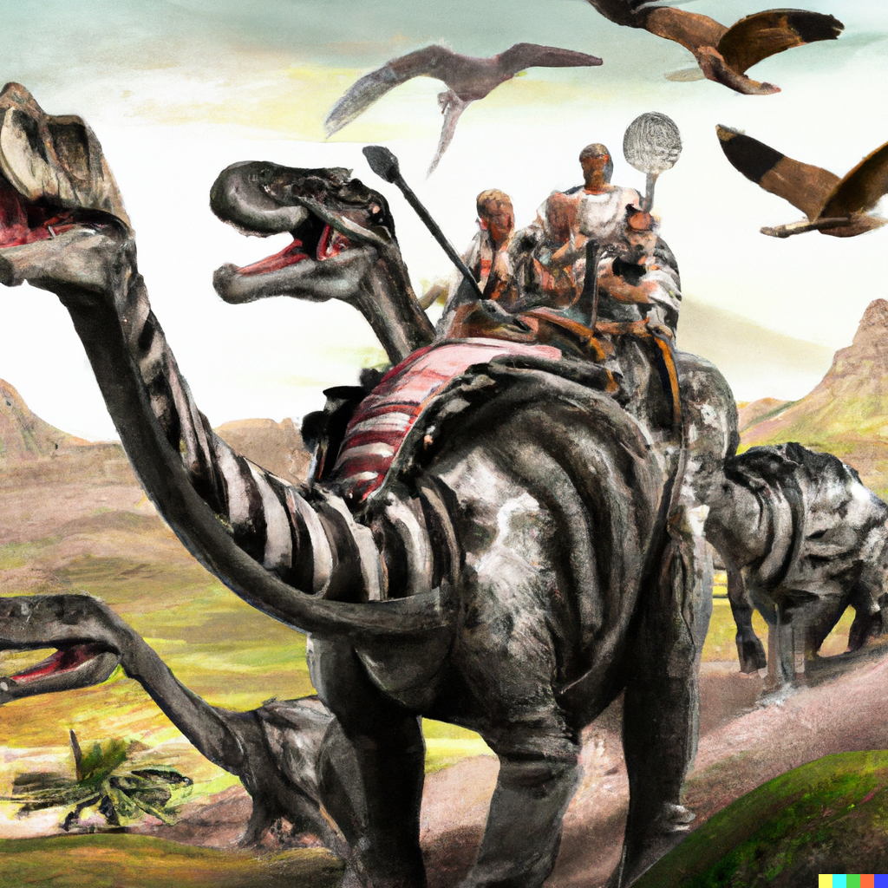

# Barbaria

An uncounted variety of intelligent, tool-using races live in or under the skies, seas, and jungles of **Mundus**. They often war and trade with the [Populi](populi.md).

- [Aarakocra]
- [Aasimar]
- [Bugbear]
- [Deep Gnomes]
- [Duergar]
- [Firbolg]
- [Goblin]
- [Goliath]
- [Hobgoblin]
- [Lizardfolk]
- [Minotaur]
- [Orc]
- [Sea Elves]
- [Shifter]
- [Tabaxi]

[Aarakocra]: https://www.dndbeyond.com/races/1026377-aarakocra
[Aasimar]: https://www.dndbeyond.com/races/1026378-aasimar
[Bugbear]: https://www.dndbeyond.com/races/1026380-bugbear
[Deep Gnomes]: https://www.dndbeyond.com/races/1026383-deep-gnome
[Duergar]: https://www.dndbeyond.com/races/1026384-duergar
[Firbolg]: https://www.dndbeyond.com/races/1026387-firbolg
[Goblin]: https://www.dndbeyond.com/races/1026391-goblin
[Goliath]: https://www.dndbeyond.com/races/1026392-goliath
[Hobgoblin]: https://www.dndbeyond.com/races/1026393-hobgoblin
[Lizardfolk]: https://www.dndbeyond.com/races/1026396-lizardfolk
[Minotaur]: https://www.dndbeyond.com/races/1026397-minotaur
[Orc]: https://www.dndbeyond.com/races/1026398-orc
[Sea Elves]: https://www.dndbeyond.com/races/1026400-sea-elf
[Shifter]: https://www.dndbeyond.com/races/1026402-shifter
[Tabaxi]: https://www.dndbeyond.com/races/1026403-tabaxi
