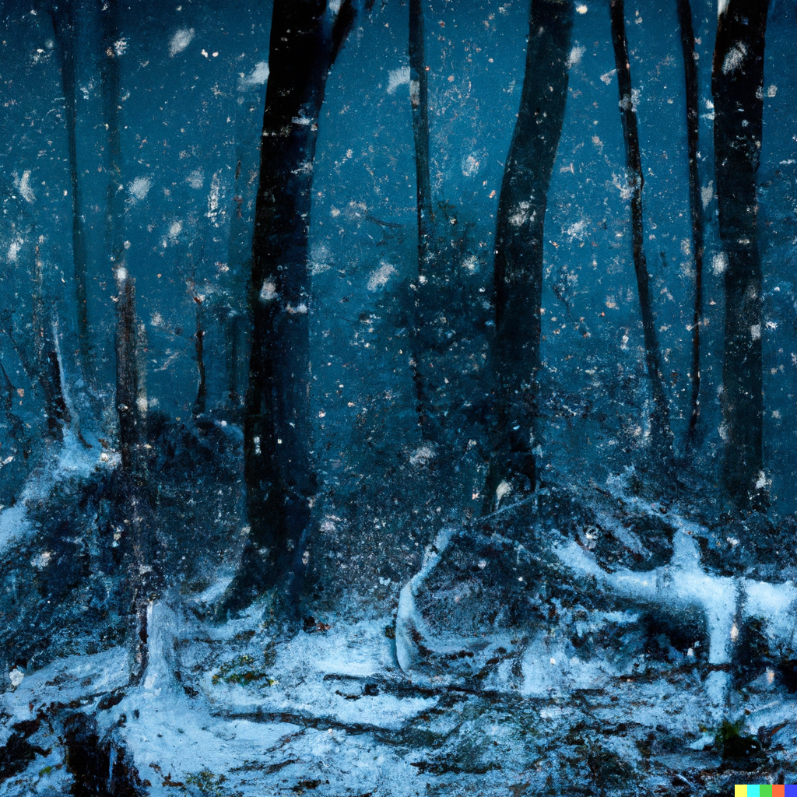

# Climate

The air is thicker, and the climate is hot and wet during *Summerday*, and cold and wet at *Winternight*.

*Autumnset* and *Springrise* are the most temperate, pleasant climes.

Winds are gentle to non-existent in the plains, increasingly stronger with higher altitudes. When the air smells rotten, becomes extremely dry, and turns greenish-yellow, almost everything finds shelter from the *Acid Rains*.

Weather by season can be generated from [Donjon's Random Weather Generator].

[Donjon's Random Weather Generator]: https://donjon.bin.sh/d20/weather/
