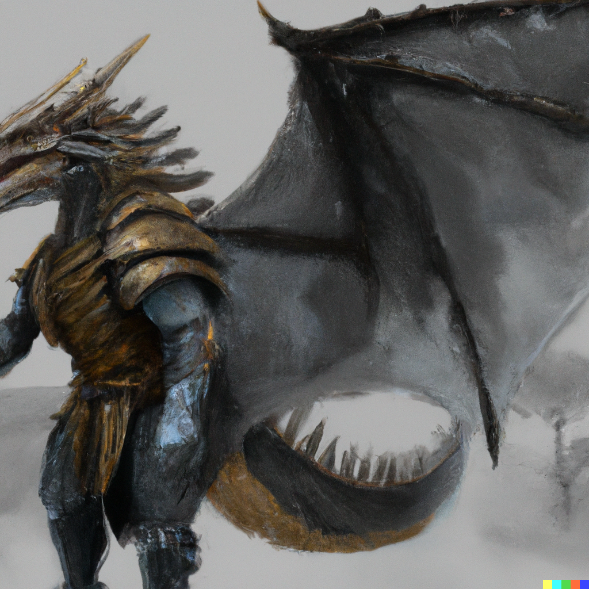

# Dragonborn

The [Dragonborn] are a mysterious and sundered people, found living in small conclaves amongst the [Elves](elves.md), [Humans](humans.md), [Dwarves](dwarves.md), and sometimes [Halflings](halflings.md).

Any equipment they have, excepting magic items, must be specially made for their anatomy.

Their relation to the mighty [Dracos](dragons.md) is a matter of much speculation but little knowledge.

[Dragonborn]: https://www.dndbeyond.com/races/16-dragonborn
