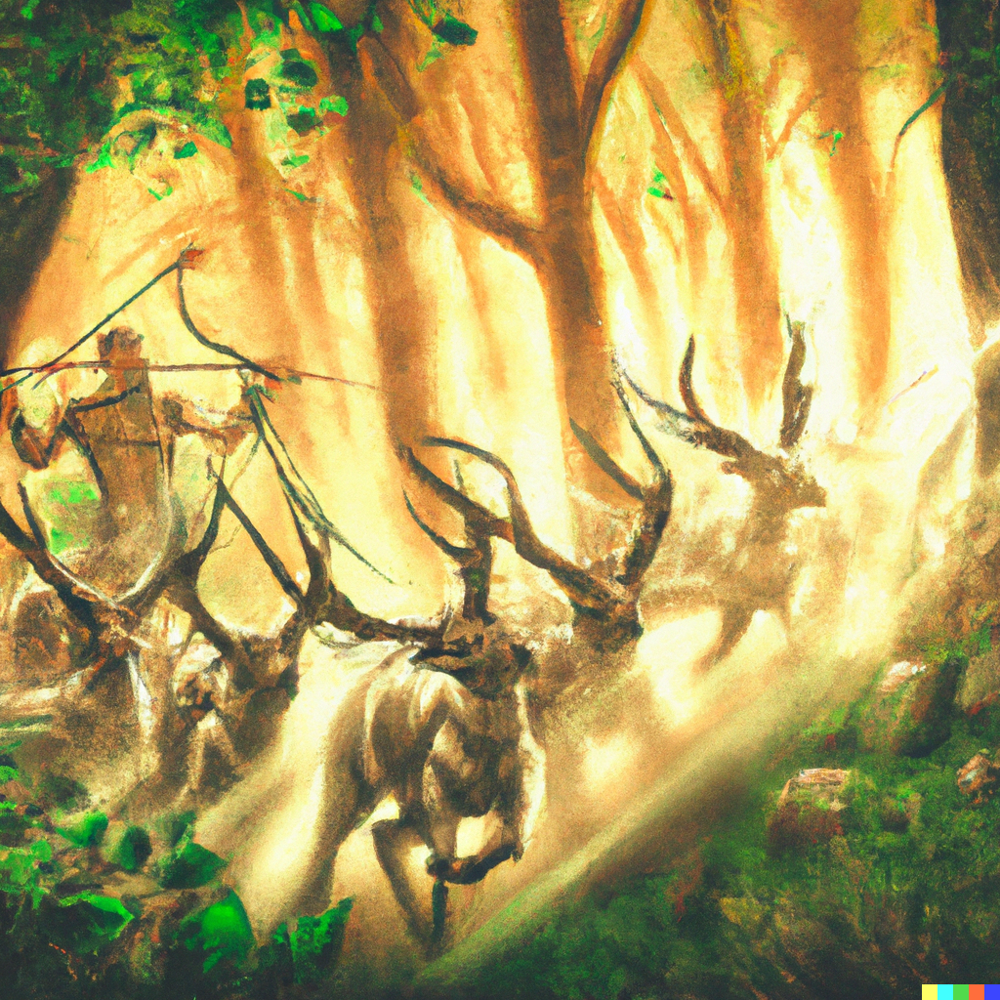

# Fey

The *Fey* are a group of ancient, powerful, other-worldly **Beings** that left their mark upon the world and races of **Mundus**. Much speculation but little fact surrounds them. Some [Barbaria](barbaria.md) worship them.

Some *Fey* live upon **Mundus**, entering and leaving during *Springrise*.

- [Centaurs]
- [Changelings]
- [Eladrin]
- [Fairy]
- [Harengon]
- [Satyr]

[Centaurs]: https://www.dndbeyond.com/races/1026381-centaur
[Changelings]: https://www.dndbeyond.com/races/1026382-changeling
[Eladrin]: https://www.dndbeyond.com/races/1026386-eladrin
[Fairy]: https://www.dndbeyond.com/races/814913-fairy
[Harengon]: https://www.dndbeyond.com/races/814914-harengon
[Satyr]: https://www.dndbeyond.com/races/1026399-satyr

