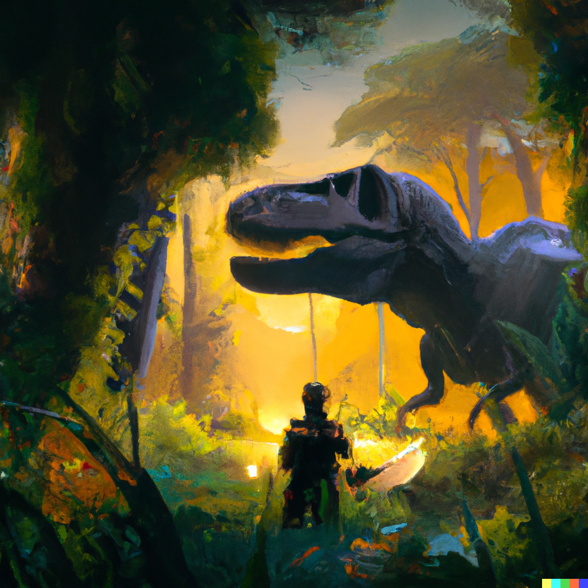

# Flora and Fauna

There is a tremendous variety of flora and fauna. Land animals tend towards gigantism, and *Oceanus* contains vast denizens in its mysterious depths. Tremendous flocks of avian and other creatures stretch for miles and continously wheel about the skies, often unseen through the *Enclouding* but discerned by their tremendous racket. Plants and Animals both have strange and mysterious abilities, and are often harvested or hunted for their magic.

The jungles of *Ishtar* resemble the Pacific Northwest, with giant colonies of Sequoias that grow on the plateaus and mountain slopes. The jungles of *Aphrodite* have quintuple canopies of rubbery and flexible plants which die or go dormant during Autumn and Winter, only to rise again during Spring and Summer.