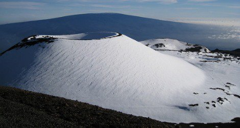

# Geography

The majority of terrain is flat plains with crinkle ridges and basaltic rock, weathered by sudden and common flash floods (in *Summer*) and avalanches of snow (in *Winter*).
Mountain ranges are jagged, marked by broken escarpments, sharp caldera, and intense winds that can strip flesh from bone.

There are three known continents:

- **Ishtar** is the northermost and most hospitable
- *Aphrodite* is the larger and more dangerous, straddling the equator
- *Lada* is the unexplored southern continent

Countless islands lie between.

There are large chains of volcanoes throughout, the tallest is Maxwell on **Ishtar**, but the largest is Theia on *Aphrodite*. These shield volcanos are hundreds of miles across, and these lands are criss-crossed with lava tubes and vents, making overland travel across (and even over) dangerous.

There are few large permanent rivers on each continent, which often change their course during the *Summer* snow-melts.