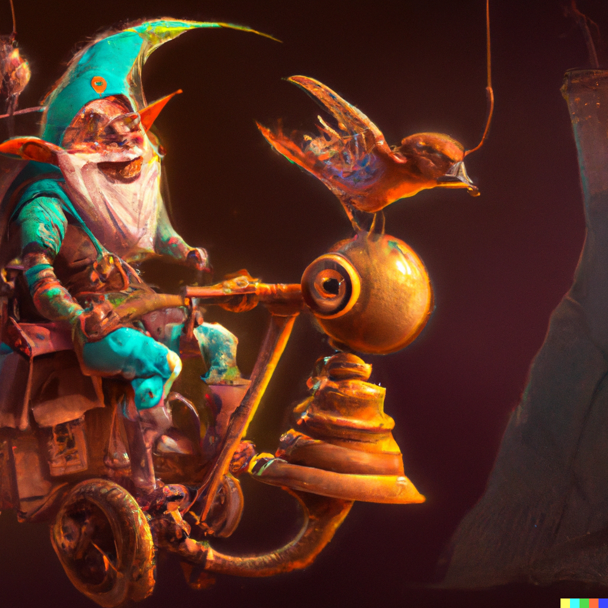

# Gnomes

[Gnomes] often live near the same [Mines](mines.md) as the [Dwarves].

Unlike the [Dwarves], Gnomes have an affinity for magic and are rumored, like the [Elves](elves.md), to be Touched by the [Fey](fey.md).

It is rumored they have their own Capital in *Lada*.

[Gnomes]: https://www.dndbeyond.com/races/18-gnome
[Dwarves]: dwarves.md
