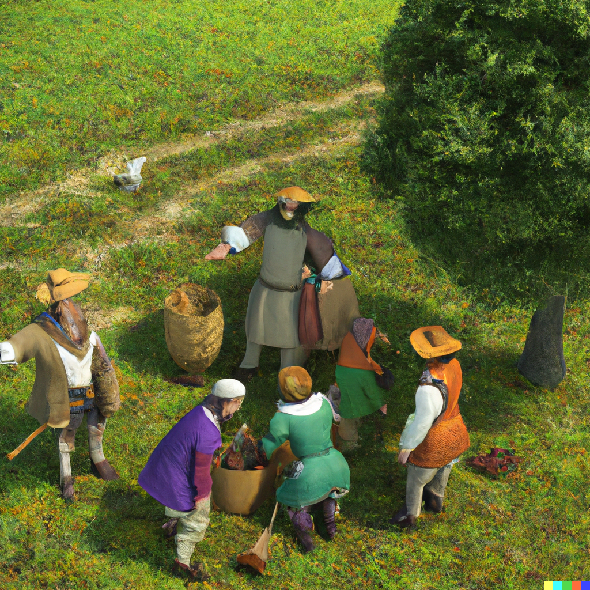
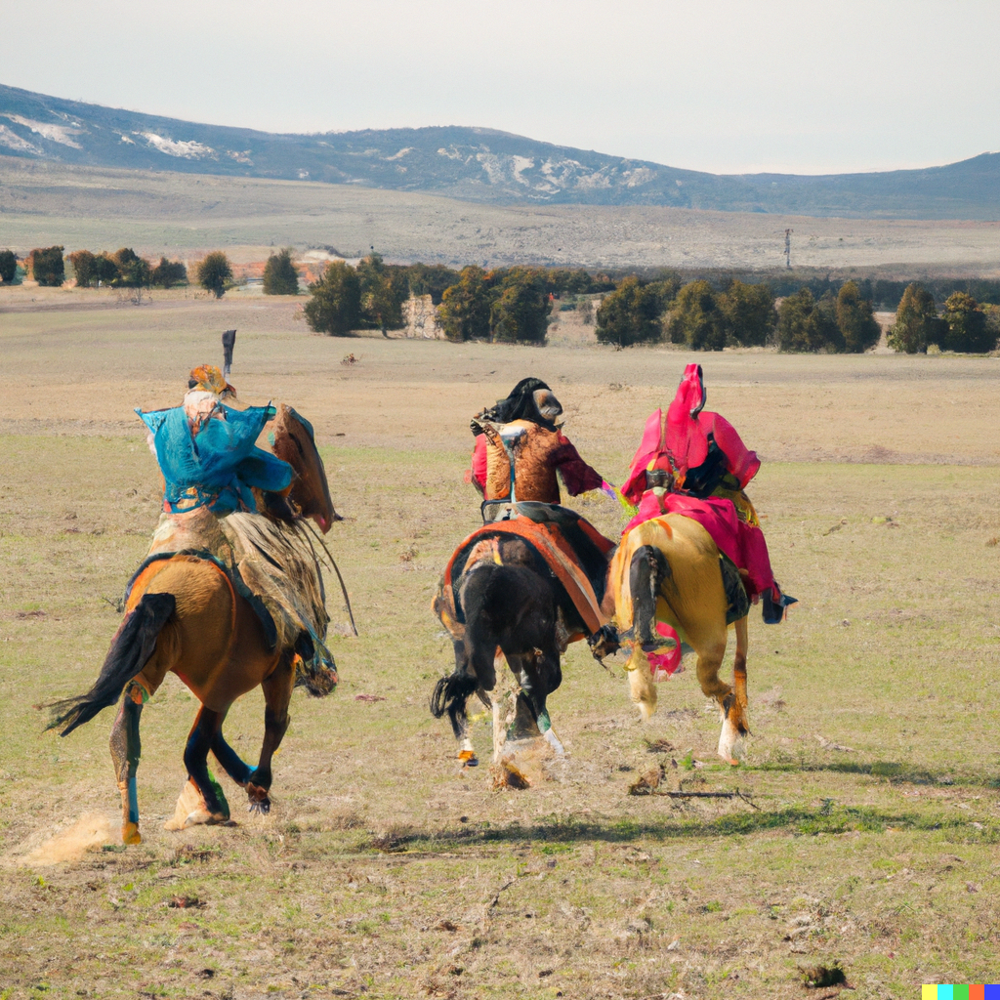

# Humans

[Humans] come in the widest variety of shapes, colors, and sizes. They tend towards two types:

- Civilized [Humans] live in the [Urbs](urbs.md), ruled by the *Magisterium*, which communes with their particular [Urb](urbs.md) and guards their secrets jealously. Each Urb is a society to itself and various *Urban Leagues* have risen and fallen throughout human history.

- The *Barbarians* live on the open plains, tending vast herds on their giant *Thunderbeasts*. Each tribe is a society unto its own, warring, trading, or both with other tribes and, occasionally, Civilized [Humans]. They sometimes exchange food and exotic items for
[Artifacts](artifacts.md) produced by [Civilization](civilization.md).

[Humans]: https://www.dndbeyond.com/races/1-human
