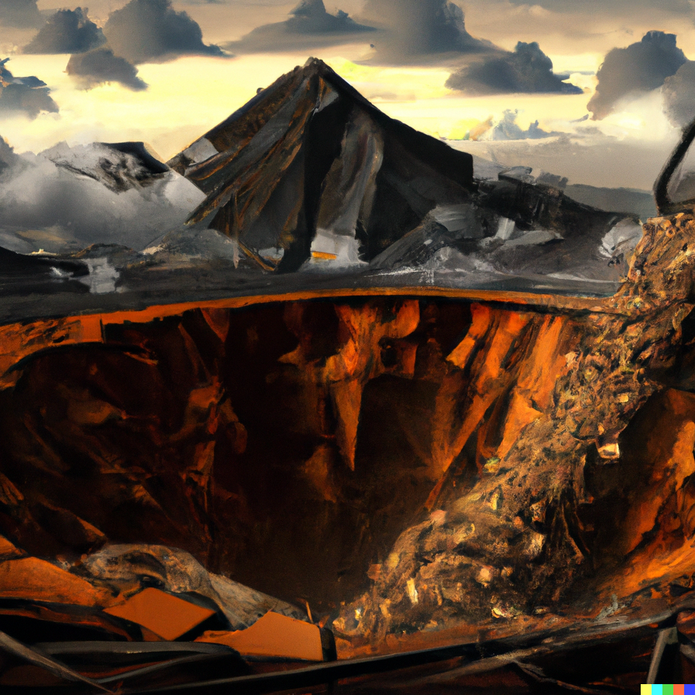

# Mines

The surface of **Mundus** is dotted with enormous, open-air mines miles across and many more deep.

Gigantic tracks have ground out all flora surrounding these vast pits, and many [Urbs](background/urbs.md) make yearly voyages.

Sometimes these *Urbs* will winter next to the *Mine* for mutual protection.
