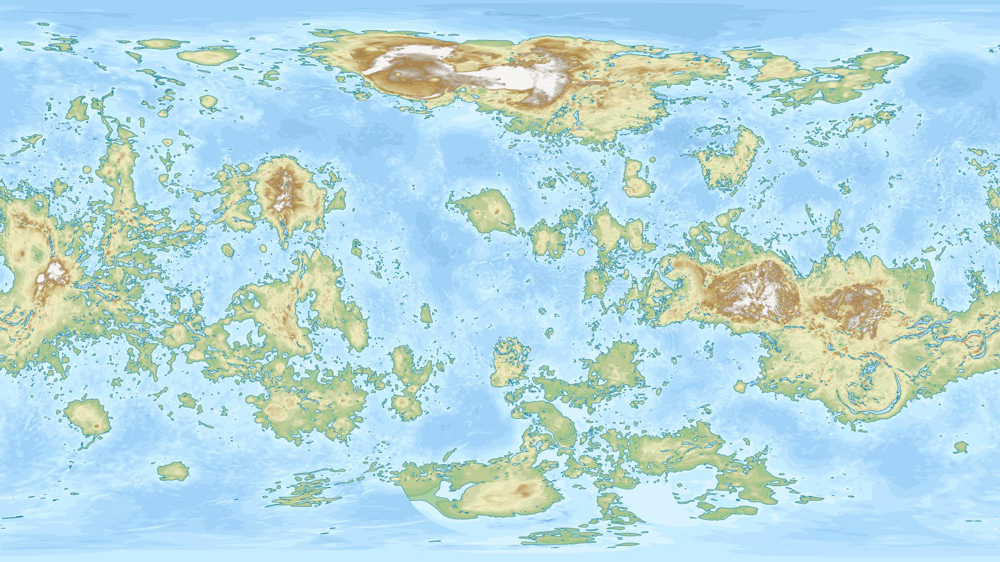

# Oceanography

[comment]: <> (Credit for image to <https://ahstat.github.io>)

*Oceanum* spans the entire world. Although the winds are comparitively mild at sea level compared to the tempests at altitude, they gather force for thousands of miles, and along with the tremendous ocean-crossing waves, make sailing upon the surface a hazardous affair. The skies above *Oceanum* are often no better, with great turbulent masses of clouds tossing even the largest *Castela* about. The only regular travelers across *Oceanus* are the mysterious *Submersible Urbs*.