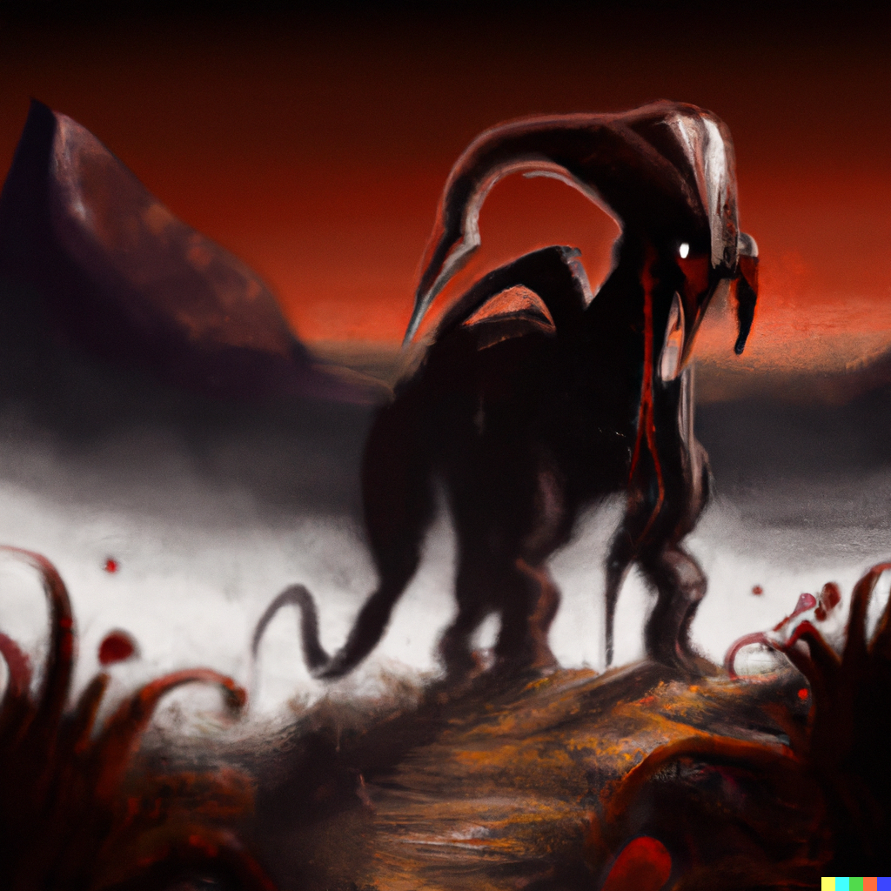

# Old Ones

The *Old Ones* are a group of utterly inimical **Beings** that seem to have little relationship to the natural order of things.

Near them, the laws of Nature and Magic become warped and hostile to anything nearby, which are often twisted to accomodate this *outre* existence.

They often enter or leave **Mundus** during *Autumnset*, when paths to **The Shadowfell** lie open. 

Other races also arrive via **The Shadowfell**.

- [Kenku]
- [Shadar-Kai]
- [Yuan-Ti]

[Kenku]: https://www.dndbeyond.com/races/1026394-kenku
[Shadar-Kai]: https://www.dndbeyond.com/races/1026401-shadar-kai
[Yuan-Ti]: https://www.dndbeyond.com/races/1026407-yuan-ti
