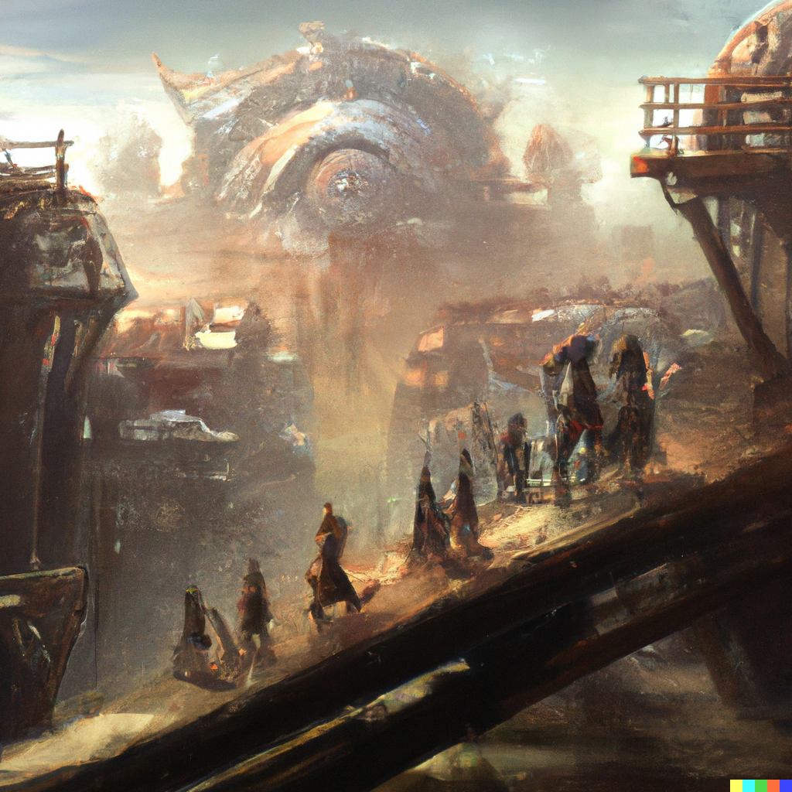

# Populi

The land and skies are rife with predators natural and otherwise that, in addition to the hazardous weather, dictates that the *Populi* live in sturdy, defensible, and sometimes mobile [Artifacts](artifacts.md) of unknown design.

The distinction between [Barbaria](barbaria.md) and [Populi](populi.md) is often a matter of debate between *Magi*, but the following are the most commonly accepted members.

- [Dragonborn](dragon-born.md)
- [Dwarves](dwarves.md)
- [Elves](elves.md)
- [Half-Elves](half-elves.md)
- [Half-Orcs](half-orcs.md)
- [Halflings](halflings.md)
- [Humans](halflings.md)
- [Gnomes](gnomes.md)
- [Tiefling](otherkin.md)
