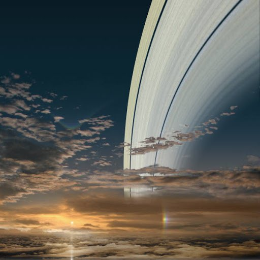

# Sky and Seasons

The day and night cycle on Mundus is tied to the seasons.

*Summer* lasts for ~1400 hours, during which time the *Sun* never sets and can be felt but not seen through the *Enclouding*, the constant daytime overcast.

*Winter* is ~1400 hours of darkness, with lots of snowfall and no sunlight. Most animals migrate or hibernate. When the clouds dissipate, the *Arch* spans from horizon to horizon providing perpetual twilight.

The *Arch* is thickest in the higher latitudes of *Ishtar*, although reports of distant traders say it is thin in the skies of *Aphrodite*. The *Vigils* are a grouping of bright stars which move across the night sky in intricate patterns.

*Spring* and *Autumn* see clear skies and weather, but last a little over 20 hours each. The *Sun* rises in the West during *Spring* and sets in the East during *Autumn*, and the *Arch* can be most clearly seen.

The air is thicker and the climate is hotter and wetter. Winds are gentle to non-existent in the plains, increasingly stronger with higher altitudes. When the air smells rotten, becomes extremely dry, and turns greenish-yellow, almost everything finds shelter from the *Acid Rains*.