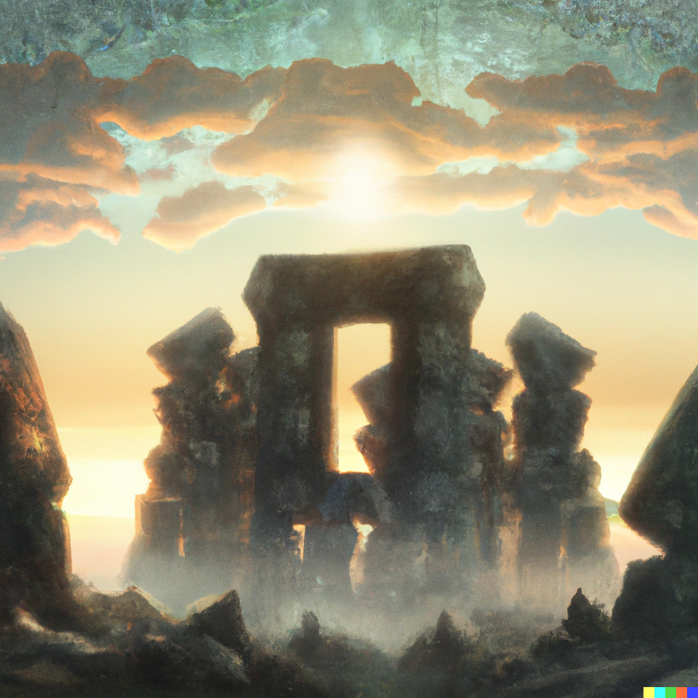

# Stonehenge

>Amidst the rolling hills of green,  
Where ancient mysteries lie unseen,  
Stands a circle of stones so grand,  
A monument of an unknown hand.

>Stonehenge, they call it, a wonder of old,  
A place where stories and legends unfold,  
Whispers of magic, of gods and kings,  
Of druids, and rituals, and sacred things.

>In the hours of Springrise, a new life begins,  
As nature awakens from her winterly sins,  
And Stonehenge, too, seems to come alive,  
As if a resurrection of times gone by.

>The sun rises high, and the air is crisp,  
The stones stand tall, as if in a mystic tryst,  
The morning dew glistens on the green,  
As if a sign of a sacred dream.

>Amidst this magic, a sense of hope,  
Of new beginnings, a way to cope,  
As if the stones themselves proclaim,  
The promise of life, the end of the game.

>So, on this day of resurrection and spring,  
Let us gather at Stonehenge and sing,  
Songs of joy, of hope, and of love,  
And let the stones bless us from above.
