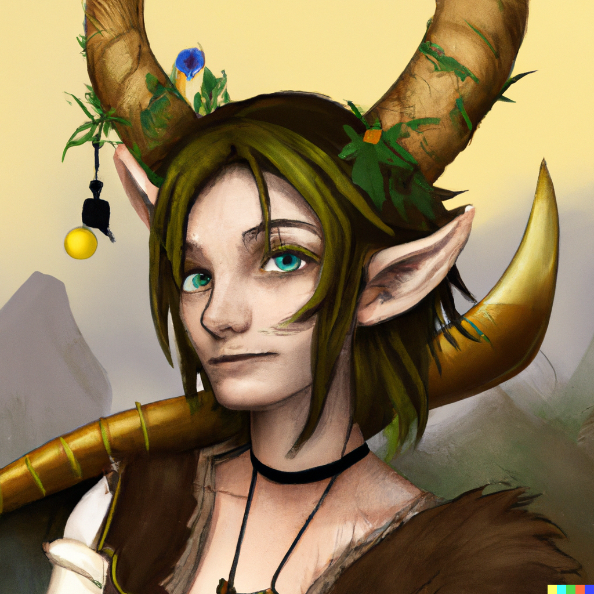

# Tiefling

[Tiefling] are [Human] crossed with strange bloodlines.

They have few common traits or characteristics, even when compared amongst themselves.

Even amongst the most tolerant [Human] societies, they are viewed with suspicion.

However, the exploits of certain [Tiefling] heroes saved **[Neverwinter]** and **Waterdeep** in the past, and on the basis
of that acclaim Tieflings have been accepted into society, especially amongst the lower classes.

Tieflings have no known social structure of their own -- at least, on **Mundus**.

[Tiefling]: https://www.dndbeyond.com/races/7-tiefling
[Human]: humans.md
[Neverwinter]: neverwinter.md
