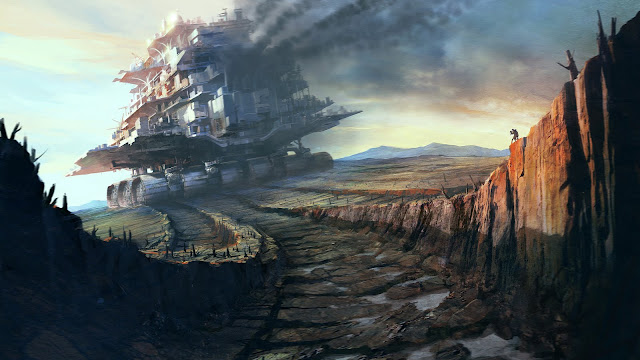

# Urbs

Gigantic cities of metal which rove the land, and sometimes [Oceanus](ocean.md), the *Urbs* ingest great quantities of ore and other substances, often from [Mines](mines.md), which they can manufacture into [Artifacts](artifacts.md).

These manufacturing processes seem intrinsic to the *Urb* itself; the [Artificers Guild](../game/artificer.md) seem mainly to ensure continued functionality of the machinery.

Some whisper the [Artificers](../game/artificer.md) themselves have little understanding of the inner workings of the Urbs, but such rumors are firmly put down by the *Crusaders* of the *Magisterium*.

*Urbs* range in size from merely gigantic rovers to mile-long structures with as many as seven tiers. The typical *Urb* moves at a stately walking pace, and the clanking of their gigantic treads can be heard for miles.

Inhabitants usually live in sturdy wooden and stone structures that are built upon the metal foundations of the *Urb*, which produces anchor points upon demand by an [Artificer](../game/artificer.md). Some say these *Urban* folk have a near-permanent deafened condition.
