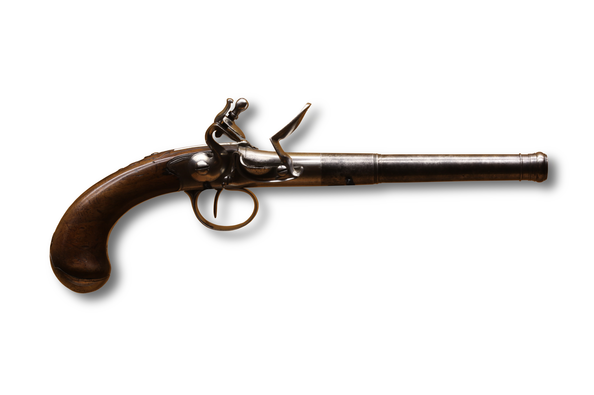

# Firearms

*Image Credit: Rama, Cc-by-sa-2.0-fr*

The most common firearms found on **Mundus** are *Muskets* and *Pistols*, but [other types](../background/artifacts.md) have been discovered.

[Elves](../background/elves.md) disdain the use of *Firearms*, but [Artificers](artificer.md) in the [Urbs](../background/urbs.md)
and [Mines](../background/mines.md) commonly manufacture them, with the *Protectors* and *Iron Guard* being notable users
throughout their ranks.

## Common Types

| Type     | Cost    | Damage                     | Weight  | Properties                                                |
| -------- | ------- | -------------------------- | ------- | --------------------------------------------------------- |
| Pistol   | 250 gp  | 2d8 piercing               | 3 lbs.  | Ammunition (range 30/90), Loading                         |
| Quattour | 1000 gp | 2d8 piercing per barrel    | 5 lbs.  | Ammunition (range 30/90), Loading, 4 barrels              |
| Musket   | 500 gp  | 2d12 piercing              | 7 lbs.  | Ammunition (range 40/120), Loading, two-handed            |
| Shotgun  | 750 gp  | 3d8 bludgeoning per barrel | 10 lbs. | Ammunition (range 30/90), Loading, two-handed, 2 barrels  |
| Octo     | 2000 gp | 2d12 piercing per barrel   | 15 lbs. | Ammunition (range 40/120), loading, two-handed, 8 barrels |
| Bullets  | 3 gp    |             -              | 1 lb.   | 10 rounds + powder                                        |
| Shot     | 2 gp    |             -              | 1 lb.   | 10 shots + powder                                         |

## Use

A *Pistol* or *Musket* discharges one lead ball per round.

Shotguns discharge a number of pellets per round.

The *Quattour* and *Octo* may discharge all their barrels in a single round. In this instance, the firer receives *Disadvantage* unless they possess
the [Gunner Feat]. Success produces d4/d8 hits.

## Reloading

Firearms require 10 rounds to reload per barrel. A person with *Proficiency* in Firearms can reload a barrel in 5 rounds.
Someone with the [Gunner Feat] can reload a barrel as an [Action] and fire as a Bonus Action.

An [Artificer](artificer.md) that [Infuses] a *Firearm* with [Repeating Shot] can reload and fire up to two shotgun barrels or four single shot barrels
per round. In this case, the +1 bonus to attack and damage rolls does not apply. The ammunition is assembled from components in the possession of the
[Artificer](artificer.md) (e.g. ball and powder).

## Armor Effects

[Heavy Armor] provides [Damage Resistance] against *Firearms* listed in the table above.

[Medium Armor] provides [Damage Resistance] against the *Shotgun* in the table above.

[Repeating Shot]: https://www.dndbeyond.com/sources/tcoe/artificer#RepeatingShot
[Gunner Feat]: https://www.dndbeyond.com/feats/gunner
[Infuses]: https://www.dndbeyond.com/sources/tcoe/artificer#ArtificerInfusions
[Heavy Armor]: https://www.dndbeyond.com/sources/basic-rules/equipment#HeavyArmor
[Medium Armor]: https://www.dndbeyond.com/sources/basic-rules/equipment#MediumArmor
[Damage Resistance]: https://www.dndbeyond.com/sources/basic-rules/combat#DamageResistanceandVulnerability
[Action]: https://www.dndbeyond.com/sources/basic-rules/combat#ActionsinCombat
