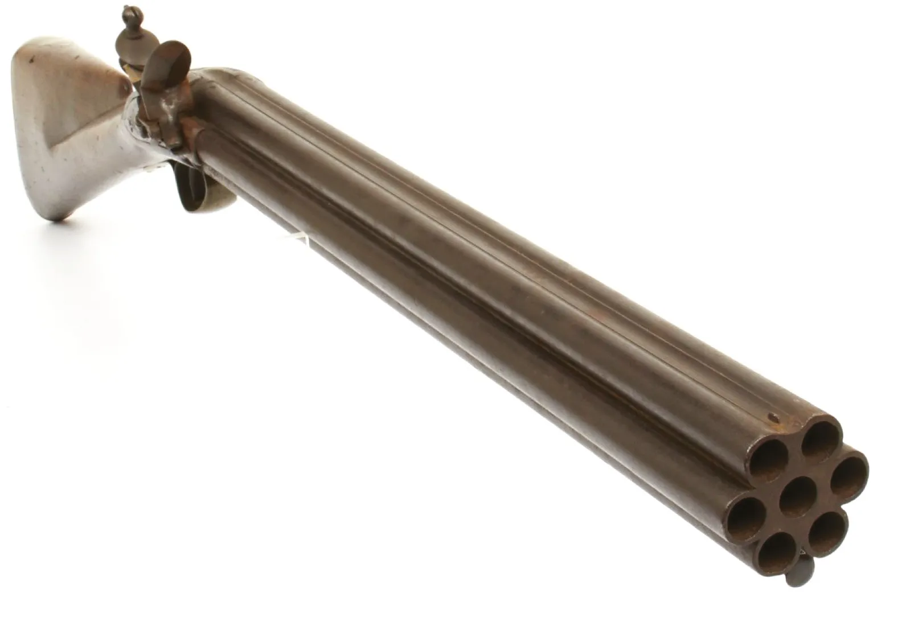

# Firearms

*Image Credit: Wikimedia Commons*

The most common firearms found on **Mundus** are *Muskets* and *Pistols*, but [other types](../background/artifacts.md) have been discovered.

[Elves](../background/elves.md) disdain the use of *Firearms*, but [Artificers](artificer.md) in the [Urbs](../background/urbs.md)
and [Mines](../background/mines.md) commonly manufacture them, with the *Crusaders* and *Steel Guard* being notable users
throughout their ranks.

## Common Types

| Type     | Cost    | Damage                     | Weight  | Properties                                                |
| -------- | ------- | -------------------------- | ------- | --------------------------------------------------------- |
| Pistol   | 250 gp  | 2d8 piercing               | 3 lbs.  | Ammunition (range 30/90), loading                         |
| Quattour | 1000 gp | 2d6 piercing per barrel    | 5 lbs.  | Ammunition (range 30/90), reload (4 shots)                |
| Musket   | 500 gp  | 2d10 piercing              | 7 lbs.  | Ammunition (range 40/120), loading, two-handed            |
| Shotgun  | 750 gp  | 3d6 bludgeoning per barrel | 10 lbs. | Ammunition (range 30/90), reload (2 shots), two-handed,   |
| Sept     | 1500 gp | 2d8 piercing per barrel    | 13 lbs. | Ammunition (range 40/120), reload (7 shots), two-handed   |
| Bullets  | 3 gp    |             -              | 1 lb.   | 10 rounds + powder                                        |
| Shot     | 2 gp    |             -              | 1 lb.   | 10 shots + powder                                         |

## Use

A *Pistol* or *Musket* discharges one lead ball per barrel.

Shotguns discharge a number of pellets per barrel.

The *Quattour* and *Sept* may discharge all barrels in a single round. In this instance, the firer receives *Disadvantage* unless they possess
the [Gunner Feat]. Success produces d4/d6 hits.

## Reloading

Firearms require 10 rounds to reload per barrel. A person with *Proficiency* in Firearms can reload a barrel in 5 rounds.
Someone with the [Gunner Feat] can reload a barrel as an [Action] and fire as a Bonus Action.

An [Artificer](artificer.md) that [Infuses] a *Firearm* with [Repeating Shot] can reload and fire one barrel
per round. The ammunition is assembled from components in the possession of the [Artificer](artificer.md) (e.g. ball and powder).

## Armor Effects

[Heavy Armor] (or it's equivalent) provides [Damage Resistance] against *Firearms* listed in the table above.

[Medium Armor] (or it's equivalent) provides [Damage Resistance] against the *Shotgun* in the table above.

[Repeating Shot]: https://www.dndbeyond.com/sources/tcoe/artificer#RepeatingShot
[Gunner Feat]: https://www.dndbeyond.com/feats/gunner
[Infuses]: https://www.dndbeyond.com/sources/tcoe/artificer#ArtificerInfusions
[Heavy Armor]: https://www.dndbeyond.com/sources/basic-rules/equipment#HeavyArmor
[Medium Armor]: https://www.dndbeyond.com/sources/basic-rules/equipment#MediumArmor
[Damage Resistance]: https://www.dndbeyond.com/sources/basic-rules/combat#DamageResistanceandVulnerability
[Action]: https://www.dndbeyond.com/sources/basic-rules/combat#ActionsinCombat
