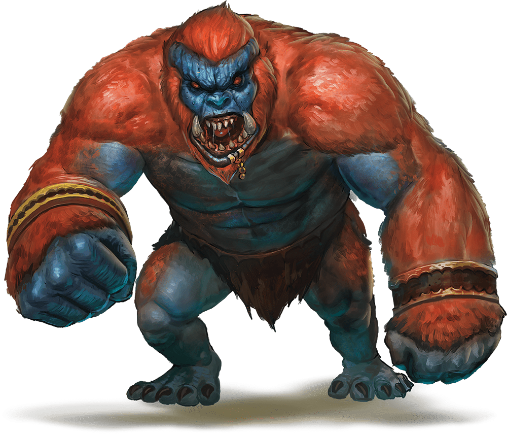

# Eighteenth Session

## Lost in the Underdark

### Dramatis Personae

- *Actias Aureus*, an 8th-level Tiefling Warlock
- *Benjamin*, a 9th-level Wood Elf Ranger
- *Calmul Rhoqiroth*, a 9th-level Dragonborn Artificer
- *CoralKing*, a 9th-level Gnome Monk
- *Geral Bryn*, a 9th-level Human Fighter
- *Orky*, a 9th-level Half-Elf Paladin
- *Steve*, a 9th-level Halfling Rogue
- *Tasbros*, a 9th-level Sky Elf Sorcerer
- *Tysnera*, a 9th-level Sky Elf Wizard
- *Viker*, a 9th-level Eladrin Druid
- *Wulrif*, a 9th-level Human Warlock

### Summerday +756 hours

#### From the journal of Dame Orky

The Tentacle Rod was given to *Wulrif*.  *Benjamin* told us there are Fiends near by, within a mile. We continue in a random direction, because we have no idea where we are going. I stumble forward into a cavern of 7 giant Gricks and 10 small ones.

Round 1

1. *CoralKing* moves up and uses his Staff of Striking and an unarmed strike on the closest small Grick, doing 53 HP damage, slaughtering it!
2. *Actias* uses his Sunblade twice and his Dancing Sword once.
3. *Calmul* does 5 HP damage, killing a small one. Then, he commands his Steel Defender to attack another small one, doing 12 HP damage.
4. *Steve* attacks a small Grick, doing 22 HP damage, killing it.
5. *Tysnera* casts Fireball, avoiding Orky. She kills all of the small Gricks, with 30 HP damage each.
6. *Viker* moves through the party to attack some Gricks.
7. *Benjamin* moves up and shoots one of the Gricks
8. *Geral* moves up and attacks, doing 14 HP damage killing it. He hits a second one for 10 HP.
9. A Grick attempts to hit me, but misses. *Geral* reacts to hit that Grick. Another one hits her for 36 HP damage. They hit *Geral* for 11 HP damage. One attacks *CoralKing* for 51HP damage and its tail attacks *Geral*, missing.
10. *Tasbros* casts Vitriolic Sphere for 26 damage, doing 13 damage to *Geral* and Orky. *CoralKing* gets 0 damage.
*Wulrif* Hexes and hits a Grick with an Eldritch Blast, doing 37 damage, killing it.
11. I get my clumsy ass up and cast Thunderous Smite. I attempt to swing my blade, but I'm too dizzy from a mild concussion and miss.

Round 2

1. *CoralKing* uses 3 unarmed strikes, doing 12 HP damage.
2. *Actias* hits one for 6 HP damage.
3. *Calmul* uses Branding Smite and misses.
4. *Steve* runs up and stabs a Grick for 24 HP damage, killing it.
5. *Tysnera* casts Firebolt and does 9 HP damage.
6. *Viker* uses Healing Word on *CoralKing*, doing 14 HP healing.
7. *Benjamin* shoots one of the Gricks and does 23 HP damage, killing it.
8. *Geral* moves toward the last remaining Grick and hits it for 10 HP damage.
9. It hits back with its tentacles, doing 28 HP damage to *Geral*.
10. *Tasbros* casts Chromatic Orb on the remaining Grick, level 1, for 18HP lightning damage and kills it!

We explore and scavenge and we find clusters of skulls and bones. In the manure, we find gems and *Wulrif* cleans them. Thirteen gems worth 500 hp each! *Wulrif* takes 5, *Geral* takes 1 and I hand over 4 more to pay for the militia.

A Pearl of Power is also found and given to *Tysnera*. A Rod of the Pact Keeper +1 is handed over to *Wulrif*. A Stone of Good Luck is taken by *Tasbros*. A +1 Light Hammer is found by me.

#### 7,000 XP

We continue along this cavern and discover 4 exit tunnels. *Viker* turns into a Bat and explores all 4 holes. One of the tunnels she discovers a trail worn with boots and lined with mushrooms. The other 3 look used by animals only and she almost flies into a spiderweb in one! Our tracker investigates the tracks in the trail tunnel and sees they were used by Duergar recently because he finds the bodies. *CoralKing* grabs their clothing and we follow their trail toward their origin. We decide to go down the trail-looking tunnel after *Benjamin*. *Wulrif* puts a Minor Illusion on us so we look like Duergar. A dim light from the mushrooms lights our path until we finally hear water and see a large black lake. *Wulrif* sees a raft on the shore. All of a sudden, we are attacked by invisible things.

Round 1

1. *Benjamin* swings randomly around him in a panic and doesn’t hit anything.
2. *Steve* holds his action.
3. *Actias* moves a bit and casts Blur on himself.
4. *Calmul* holds his action.
5. *Geral* dodges.
6. *Viker* holds her action.
7. *CoralKing* dodges.
8. *Wulrif* casts Detect Thoughts.
9. *Tasbros* casts a Wall of Fire on the right side of our single-file group.
10. All of a sudden, 3 large money-looking creatures each jump out on either side of us the moment they attack. So, 6 total. I immediately detect them as Fiends. They attack *Wulrif*, doing 20 HP damage and he gets knocked prone. The 3 that jumped through the Wall of Fire get 9 HP damage each. *Tasbros* uses luck to avoid getting knocked down but gets hit for 30 HP damage. *Calmul* gets attacked for 24 damage and knocked down. *Tysnera* gets attacked next but lifts her shield in time to dodge. I get hit for 6 HP damage.
11. I cast Protection from Evil.
12. Viker Summons a Scorpion to fight for us.
13. *Tysnera* Summons a Shadowspawn to fight for us.

Round 2

1. *Benjamin* wants to know their weakness.
2. *Steve* uses his crossbow to hit one of the monkey-Fiends.
3. *Actias* uses his Hexblade to Curse one of the middle monkey-Fiends. He does 29 HP damage.
4. *Calmul* stands up, casts Branding Smite, and hits with 15 HP damage.
5. *Geral* moves forward, uses Commander's Strike on me to hit it and I do 16 HP damage.
6. *Viker* uses her Scorpion to attack the weakest monkey-Fiend.
7. *CoralKing* uses one unarmed strike and one Stunning Strike for 18 HP damage.
8. *Wulrif* stands up and spends 6 spell points to cast Polymorph to turn himself into a Giant Ape. He punches the attacking monkey-Fiend in the face, doing 17 HP damage.
9. *Tasbros* casts Haste on *Wulrif*.
10. A monkey-Fiend attacks *Wulrif* for 14 HP damage. Another attacks *Tysnera* and *Geral* reacts by hitting it and actually kills it. Another one attacks *CoralKing* for 12 HP damage. I get hit for 7 HP damage.
11. I cast Thunderous Smite and hit a Troll for 23 HP damage.
12. *Tysnera* casts Evard's Black Tentacles that entangles all of the Trolls for damage.

Round 3

1. *Benjamin* does 16 HP damage.
2. *Steve* hits the monkey-Fiend *Wulrif* was fighting for 8 HP damage.
3. *Actias* uses the Bonus Action of the Dancing Blade to do 19HP damage. His Sunblade does 28 HP damage. He also does 11 HP damage.
4. *Calmul* does something?
5. *Geral* uses Commander's Strike on me to hit one of them for 10 damage. *Geral* hits one too.
6. *Viker* Teleports and hits one of the monkey-Fiends, killing it. It's remains disperse in a stinky cloud. Her scorpion does enough damage to evaporate another one.
7. *CoralKing* moves just out of the way of Evard's Black Tentacles to attack one of the 3 remaining Trolls. He does 16 HP damage on each of 2 hits.
8. *Wulrif* gets up, turns around and smacks a Troll, killing it hard.
9. *Tasbros* kills one with 63 HP damage of Cloudkill. This prevents literally anyone but our enemies from seeing.
10. The Shadowspawn hits one of the remaining Trolls.
11. The entangled one gets out of the tentacles, still taking 13 HP damage on the way, and moves toward *Wulrif*. It attacks him and knocks him down, doing 20 HP damage.
12. The other one attacks *Actias* twice and gets 5 HP damage.
13. I hit one of the trolls for some 27 HP damage.
14. *Tysnera* holds her action

Round 4

1. *Benjamin* moves his Bane onto another Troll and shoots it.
2. *Actias* hits one for 22 HP damage, killing it!

We draw our attention back to the strange raft by the lake. We notice it has some kind of device on it's side that trails into the water.

#### 1,500 XP

