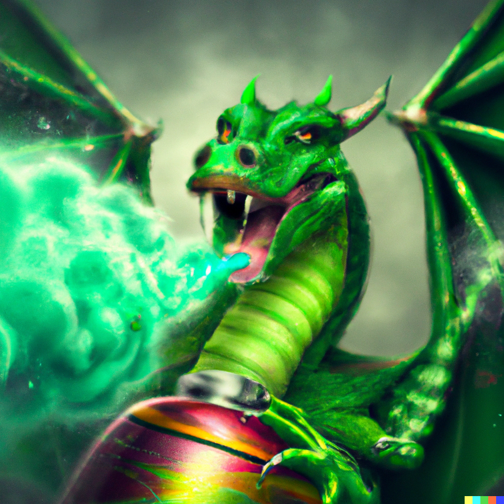
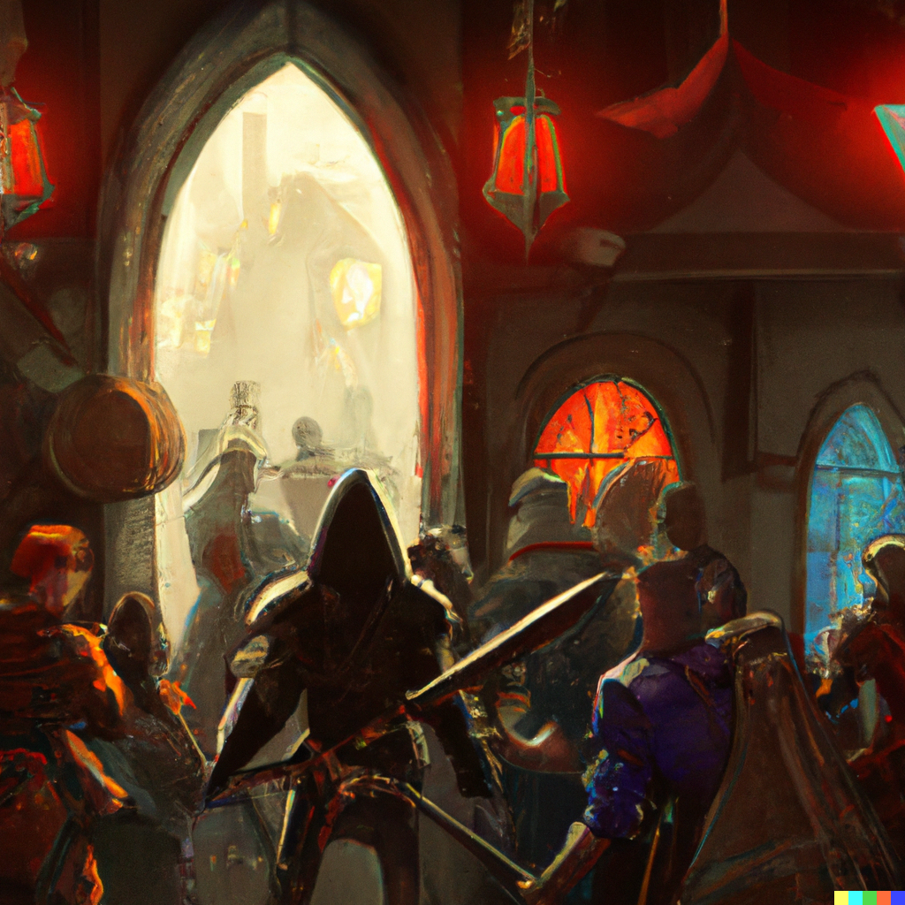

# Eighth Session

## Unfinished Business

### Summerday +318 hours

### Dramatis Personae

- *Actias Aureus*, a 5th-level Tiefling Warlock
- *Benjamin*, a 5th-level Elf Ranger
- *Calmul Rhoqiroth*, a 5th-level Dragonkin Artificer
- *CoralKing*, a 5th-level Gnome Monk
- *Geral Bryn*, a 5th-level Human Fighter
- *Orky*, a 5th-level Half-Elf Paladin
- *Steve*, a 5th-level Halfling Rogue
- *Tasbros*, a 5th-level Elf Sorcerer
- *Tysnera*, a 5th-level Elf Wizard
- *Viker*, a 5th-level Elf Druid
- *Wulrif*, a 5th-level Human Warlock

#### From the journal of Dame Orky

The group decides to search the castle, starting with the Southwest corner. We find some Shortbow arrows and ragged bedrolls that stink. In a large room we find many weapons (Morningstars, Longswords), including a finely-wrought Quarterstaff.
*Actius* picks it up and it's lighter than it looks. We determine that it’s a +1 Quarterstaff, so we give it to *Actius*.

In the large main suite we find a property deed. It names *Magus Arnin* as the owner and seems to be written on brand new, faintly magical, parchment. The deed is registered in **Neverwinter**.
*Geral* rolls it up and takes it with us.

*Wulrif* and others investigate the remaining rooms. In one, *Tasbros* finds an old brazier. *Steve* pokes at the pile of coal underneath it, and *Wulrif* uses Mage Hand to rummage through it. There's a bloody cloth wrapped around a golden statue
of an elf with his wings outstretched. We detect Divination magic on it. *Wulrif* tells everyone else not to touch it, but *Actius* has already grabbed it.

> What is your question?

*Actius* hurriedly shoves the statuette into his backpack.

We investigate the centermost Northern room.

> This chamber occupies the northern tower of the castle. A stone altar stands in the middle of the room, covered with bloodstained black cloth. Golden ritual implements—a chalice, a knife, and a censer—are carefully arranged on top of the altar.
> Two archways to the south are covered with heavy curtains.

*Wulrif* uses his Mage Hand to put them in his bag. I sense great evil in this room, but neither *Benjamin* nor I detect any Undead. *Wulrif* investigates the altar further and doesn’t find anything.
*CoralKing* produces the surprising insight that the altar isn’t magic *per se*, but the traumatic events that took place there left an aura.

#### 300 XP

We all have a long rest.

Our plan is to go back to **Phandalin** to return *Gundren*, maybe head to **Tresendar Manor**, and then proceed to **Neverwinter** to claim the ruined castle.

On our way back, a young Green Dragon swoops down on us from behind, ambushing us with it's Poisonous breath weapon, doing 26 damage to everyone who succeeds their saving throws!
For those who didn’t, *Actius* and I, we take 52 damage and get knocked down. The dragon swoops around for a second pass ...

#### Round 1

We decide to scatter since we are in the middle of the plains between **Neverwinter Wood** and the **Triboar Trail**.

1. *Benjamin* runs away and shoots his Longbow, but misses. He hits with his second shot and does 10 damage.
2. *Steve* moves 25 feet in the opposite direction and shoots his Shortbow, hitting for 6 damage. He also hides, strategically. The dragon needs a 22 to spot him.
3. *CoralKing* runs towards *Benjamin* and holds his action until the Dragon is within range.
4. *Actius* critically fails his death saving throw.
5. The Dragon swoops in and attacks *Tasbros*, luckily missing with a bite and claw attack, doing 9 HP damage with the other claw. It breathes in deeply ...
6. *Viker* summons her Unicorn spirit totem and casts Cure Wounds on *Actius*, bringing him back from the brink of death with 12 HP of healing; everyone else is healed 5 HP.
7. *Calmul* communicates with the Dragon in its native language:

> Please! I have so much to learn from you!

> Faugh! I'm merely snacking on a few elves ....

8. We have 4 Elves (*Viker*, *Tasbros*, *Tysnera*, *Benjamin*), and I'm half-elven. *Calmul* next attempts to be intimidating and fails.
9. I'm prone, so I get up and use Misty Step (2 Mana) to teleport behind a tree.
10. *Wulrif* attempts to barter with the Dragon, but it's not interested.
11. *Geral* shoots the Dragon once and uses Commander's Strike on *Benjamin*. *Geral* hits and deals 4 damage. *Benjamin* also hits and deals 18 damage!
12. *Tysnera* casts Lightning Bolt (8d6 damage!!!) and deals 26 damage! I peek out from behind my tree and silently cheer!
13. *Tasbros* casts Chromatic Orb and deals the Dragon 13 damage.

#### Round 2

1. *Benjamin* shoots his Longbow twice and hits for 18 damage. The Dragon is starting to get very mad at *Benjamin*.
2. *Steve* stealthily shoots the Dragon with his bow and rolls a critical hit on a Sneak Attack for 29 damage!
3. *CoralKing* throws his javelin at the Dragon and hits for 10 HP of damage.
4. *Actius* turns *Tysnera* invisible and runs away.
5. The Dragon puts on a burst of speed and flies 160 ft away!!!
6. *Viker* heals me for 17 HP and everyone else 5.
7. *Calmul* is beside himself.
8. I walk towards it and Command the Dragon to halt. It ignores me.
9. *Wulrif* pursues the Dragon, attempting to hit it with Eldritch Blast and failing.
10. *Geral* gives *Actius* 4 temporary hit points.
11. *Tysnera* stays invisible and recovers.
12. *Tasbros* chases the Dragon and casts Fireball. The Dragon just barely escapes the direct blast, taking 16 damage.

#### Round 3

1. *Benjamin* pursues and shoots his bow, dealing 11 damage.
2. *Steve* shoots and misses.
3. *CoralKing* recoveres his javelin.
4. *Actius* pursues with Eldritch Blast and misses.
5. The Dragon flies out of range, trailing smoke.

#### 1,000 XP

We all take a short rest.

> "We have a problem," says Viker.

We all look back and see that *Gundren* (and *Snaga*) are dead. *Gundren* was supposed to lead us to **Wave Echo Cave**. *Viker* has a Scroll of Revivify and asks if we want to use it on him. We all begrudgingly agree, so *Viker* works on that for 10 minutes.

> *Gundren* wakes up. "What happened?"

> "You lost", replies *Wulrif*.

> "Thank you for saving my life, " says Gundren, bowing. "We Dwarves always repay our debts. When we find my brothers in **Wave Echo Cave** and restart **Phandalever Mine**, you shall have 10% of the proceeds.

> "Sounds good to us", replies *Geral*.

**Phandalin** seems oddly deserted ...

There are a couple of Dwaven mercenaries outside of the bank, but otherwise no one is in sight. *Gundren* wants to go to the **Townmaster's Hall** to greet *Sildar*.

> "You have rescued my old friend", says *Sildar*. "I will pay you the reward we agreed to."

> "We also have your armor and sword", says *Geral*.

> "Indeed? That is most welcome news! The sword is an heirloom of my family, but I think that a fellow Protector might make better use of the armor than I ..."

> "What happened to the townsfolk?", I ask.

> "Ah, well, the *Redbrands* have been carrying off the folk to slavery, I fear. Held in the basement of **Tresendar Manor** until they conclude their foul business with the Hobgoblins and Bugbears."

> "We should have dispatched this grave injustice when we were here last," I say. "You have my solemn Oath that we will defeat these villains."

> "Blessings upon you! I do not know how they swell their numbers, but you should find *Farmer Alderleaf*. She is both cunning and practical, and may know something to aid in your quest."

The farm looks like it hasn’t been used in awhile, but the house looks strong. *Geral* knocks on the door, and *Qelline Alderleaf*, a Halfling, answers. She invites us in for a hearty feast. We are grateful and eat, but *CoralKing* remains hesitant and stands in the corner. She says her son, *Carp*, might know a secret way to get in the castle. Carp’s friend, *Reidoth*, is a Druid, and told her about the Undead in the Manor. He seems to have been lured away to **Thundertree** to deal with a Dragon. The Redbrands are well-equipped and led by a Wizard, *Glasstaff*.

We travel with *Carp* toward the manor but he is concerned about the noise from our heavy armor. He says if we can just get to this tunnel, we should be good from there. We take off our clanking armor. The tunnel leads to a storeroom but *Carp* says
there’s a big floating creature in there. *Wulrif* tries to get *Carp* to visualize it and then reads his mind, but Carp had fled before he'd gotten a good look at it.

*Wulrif* and *Actius* confer, saying it’s not a Death Tyrant. I think that's good news? We all discuss and decide it would be best to approach and attempt to negotiate with it, as opposed to coming in hot through the front door. The Redbrand we interrogated
had said they avoid the Beholder, so it and the Redbrands may not have aligned agendas.

We crawl through the tunnel, single file, which is skillfully constructed. We approach the Beholder, but it seems quite mad, rambling gibberish and strange tongues.

> "What are you doing here?" it says, finally, in Common.

> "We're just passing through to get to the Wizard," says *Geral*.

> "I don't care but don't touch the Precious!"

> "What's the Precious?"

> "The thing I must guard since my summoning. But I don't want to guard it. I don't have to guard it if it's gone, so maybe you could take it and I could leave this place! Except then I'd have to kill you all. Will you take it?" it asks eagerly.

> "Can you give it to us?", asks *Wulrif*.

> "I would if I could, but **my** Wizard won't let me."

> "Maybe you're hungry?" asks *Actius*.

> "Oh, no, I make my own food. Are you hungry?"

Ten stuffed turkeys with all the fixings on plates materialize in front of us.

> "That's not my kind of food ..." It conjures a pile of something foul-smelling and wriggling, proceeding to slurp the things down with great gusto.

*Wulrif* studies it really intently. Suddenly, he gives a shriek as if his mind has suddenly grasped things never meant for Human understanding. *Wulrif* begins greedily grubbing down the same nauseous slush as the Beholder.

> "Ah, now you understand something of what really nourishes us!" It nods sagaciously.

> "Ugh, *Wulrif*, what are you doing!?" exclaims *Geral*. He manages to pull *Wulrif* away from his feast, the mad light fading from *Wulrif's* eyes.

*I think we lost Tysnera and Tasbros here.*

We are in a crevice which is unusually cold, and it’s a 20 foot climb into the basement of the manor. *Actius* casts Mold Earth to make a very convenient ramp for us to walk up.
Topside, the crevice is spanned by two narrow wooden bridges. *Viker* transforms into a mouse and heads West, finding a room with 8 Redbrands.
She goes into the room across the hall and sees 12 Redbrands, eating. One of them throws a dagger at her in disgust. *Viker* skitters away and reports back. We confer.

I'm going to block the middle of the hallway to control how many can attack us at once. *Actius* makes the hallway behind us difficult terrain to hopefully slow the others down.
*CoralKing* stays at the rear of the party to defend us from that direction.

#### First Round

1. *Viker* casts Moonbeam (what is a Moon?) on the spot where the first Redbrand appears. Ghostly flames envelop him, screaming, as he takes 14 damage.
2. *Calmul's* Musket misfires and dumps black powder everywhere.
3. *Wulrif* Hexes and Eldritch Blasts the Redbrand. He goes down.
4. *CoralKing* holds his action.
5. *Geral* holds his attack.
6. I hold my attack.
7. *Actius* holds.
8. Another Redbrand runs out into the Moonbeam; he goes down. A very loud alarm rings throughout the whole manor. Another Redbrand comes out of the room, and I slice him in half. Yet another Redbrand gets flamed by *Viker's* Moonbeam.
9. Half of the Redbrands start to come out the back hallway, so *CoralKing* moves to face them. A Redbrand shoots and hits him for 4 HP damage.
10. *Geral* shoots and crits the guy over my shoulder.
11. *Actius* backs up to come help *CoralKing*.

#### Second Round

1. *Viker* maintains concentration on Moonbeam.
2. *Calmul* repairs his Musket.
3. *Wulrif* backs up to get a better view of both streams of Redbrands, over one of the bridges. It collapses and he falls down into the chasm, taking 4HP damage.
4. *CoralKing* moves back to get in a more strategic position and holds his action.
5. A Fireball goes off! But everyone makes their saving throws, only taking 16 damage.
6. *Geral* holds his action.
7. I hold my action.
8. *Actius* forks his Eldritch Blast. He lands both and does 20 damage! That Redbrand goes down, as does the one coming at *CoralKing*.
9. *CoralKing* hits the new approaching Redbrand in front of him, doing 6 damage.

#### Third Round

1. *Viker* moves through the hallway to move her Moonbeam into the room with most of the Redbrands. One of them takes an opportunity attack as she moves by and crits her with 12 damage. She manages to maintain her Moonbeam.
2. *Calmul* shoots a Redbrand and deals 5 damage.
3. *Wulrif* seems to be talking again with the Beholder in the chasm.
4. *CoralKing* Flurries 3 hits, but they all miss. Then he and Actius make Wisdom saving throws, succeeding. Something was trying to paralyze them.
5. *Geral* moves up to protect *Viker* and hits a Redbrand for 8 damage. He uses an Action Surge and hits for another 8 HP.
6. I move to protect *Viker* and hold my action.
7. *Actius* splits his Eldritch Blast to hit 2 Redbrands. He misses one but hits another for 7 damage, knocking him down. He retreats across the remaining bridge and finds a **HUGE** new group of Redbrands,
   including the Wizard, lurking just around the corner!
8. *Actius* immediately gets hit by 2 swords, taking 12 damage total. *CoralKing* takes 15 damage from a volley of arrows and Fades Away. *Calmul* takes more arrows for 13 HP. *Actius* does a quick Rebuke on one of the archers, doing 7 damage.

#### Fourth Round

1. *Viker* moves her Moonbeam and kills a Redbrand. She uses a Bonus action to say a Healing Word on *Calmul* for 9 HP.

The players have decided to take a pause here and take up the fight again next week.

