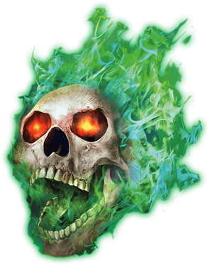
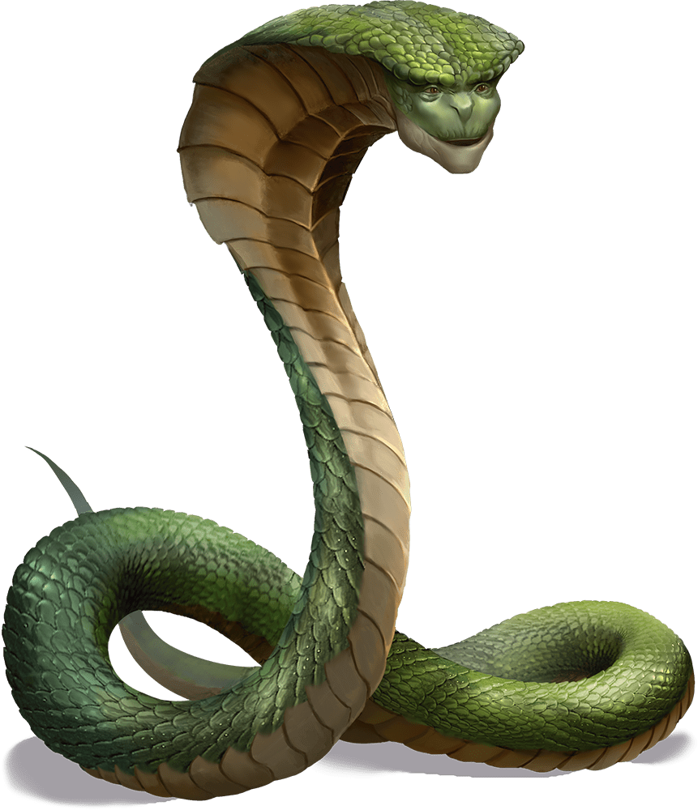

# Eleventh Session

## Undead and Guardians

### Summerday +363 hours

### Dramatis Personae

- *Actias Aureus*, a 5th-level Tiefling Warlock
- *Benjamin*, a 6th-level Elf Ranger
- *Calmul Rhoqiroth*, a 5th-level Dragonborn Artificer
- *CoralKing*, a 6th-level Gnome Monk
- *Geral Bryn*, a 5th-level Human Fighter
- *Orky*, a 6th-level Half-Elf Paladin
- *Steve*, a 6th-level Halfling Rogue
- *Tasbros*, a 5th-level Elf Sorcerer
- *Tysnera*, a 5th-level Elf Wizard
- *Viker*, a 6th-level Eladrin Druid
- *Wulrif*, a 5th-level Human Warlock

#### From the journal of Dame Orky

> Six cracked marble pillars line the walls of this hall, at the north end of which stands a nine-foot-tall statue of a dwarf seated on a throne, a mighty stone warhammer across his lap. Large emeralds gleam in the statue’s eyes.

We have tied and gagged the Wizard and the Drow. *Gundren* brings in a shield for us that has an eye on it, which turns out to be a Shield of Alertness.
*Geral* takes it.

*Tysnera* casts Ritual Identify on the objects. *Wulrif* shuts the door and locks it, I guard it. *Wulrif* hears a voice in his head “Can you take the gag off? You don’t have to worry about me.” He angrily casts a cantrip on the prisoner and tells him to speak out loud. He rips out the gag. The Drow threatens us to talk to him now or he will hunt us down and kill us, then haunt us forever. *Wulrif* puts the gag back on. *Actias* uses Mage Hand to retrieve a key from around the Drow's neck.

*Actias* and *Wulrif* investigate the statue and find the emeralds are fake. *Tasbros* casts Detect Magic and finds Abjuration magic on the statue. *Geral* asks *Gundren* if the statue is made by dwarfs. He confirms that it is and that the gems are fake. *Gundren* walks over to the table to read the notes on it. He finds a Potion of Healing and *Viker* takes it. *Gundren* thinks *Sildar* would want the two hostages returned to **Phandalin** to stand trial.

*Gundren* starts walking towards the second door that seems to be locked. “Does anyone have a key?” *Wulrif* exclaims that he found a key just now and walks over to unlock the door but hesitates as we need to explore the room further.

*Wulrif* decides to interrogate *Iarno* about *Gundren*’s brother. *Wulrif* tells him to speak or we will cut his hand off. He finally concedes that his brother is in the other room. *Viker* turns into a fly to investigate. She sees a bound dwarf in there with some other stuff. She returns and relays the information to us.

I, *Tasbros*, and *Tysnera* go clear the rest of the room. We find maps of the cave and vague directions of where the spell forge is. We find a bunch of treasure and a mug. We give the treasure to *Gundren* to hold onto until we get back.

Everyone else opens the door and *Gundren* rushes in to the dwarf. He needs to be healed so we give the potion to him. *Gundren* told us about a room full of Undead with one door. He tells us of a cellar we can retreat to for protection. We start figuring out where the Undead are and sense we are probably being closed in on. We strategize about which way to move through the caves toward the spell forge.

We march on through the bugbear room we cleared earlier…

> A blast furnace and a mechanical bellows powered by a waterwheel dominate this large chamber. The furnace is cold and dark, but heaps of coal are piled nearby, along with carts full of unrefined ore. The waterwheel sits in a ten-foot-wide channel cut into the floor of the room, but the channel is dry. Passages exit to the west, south, and east. The empty channel exits to the north and east.
>
> More than a dozen withered corpses are scattered around the room. These slain Dwarves and orcs are still wearing the remnants of their armor. Floating above them is a skull engulfed in green flame. A rotting eyeball creature rises to attack, as do the fallen warriors.

<!-- markdownlint-disable MD033 -->

Round 1

1. *Benjamin* shoots the skull with his bow. He damages it.
2. The flaming skull shoots a Fireball but *Wulrif* uses Counterspell and stops it.
3. *Geral* tells our Ranger to shoot the fire skull again and does 18 points of damage.
4. *Tysnera* uses magic missile on the flaming skill. Unusually, the magic missiles bounce off.
5. A Fireball comes out and we all make Saving Throws, 19 HP damage on success. So, *Tasbros* fails and takes 35 HP damage.
6. *Actias* casts Hellish Rebuke on the Flaming Skull. He casts Eldritch Blast on the Flaming Skull twice and drops it. He moves to target the black, mysterious cloud.
7. *Steve* shoots the Beholder and does 15 damage.
8. *Viker* uses her Unicorn Spirit Totem which gives 6 HP to everyone. She heals *Tysnera* 16.
9. CoralKing runs through the pack and attacks the nearest large Undead with 3 attacks. 2 hits and does 20 damage.
10. *Tasbros* uses Fireball and does 34 damage to everything in the room. It kills 8 of the small Undead.
11. *Wulrif* misses an attack.
12. The enemies move in and attack *Geral* twice. They try to hit me twice but miss twice. They hit CoralKing a lot. He uses Fade Away to avoid further damage. He still takes 10 HP more damage.
13. I hit for 38 damage.
14. The Beholder can see me, but I make my Saving Throw against Paralysis.
15. Calmul shoots at the damaged Undead and does enough damage to drop it! His Steel Defender attacks now and bites one of the Undead.

Round 2

1. *Benjamin* shot the beholder thing for 20+ damage.
2. *Geral* asks *Benjamin* to hit the beholder thing again for 15 damage and it goes down!
3. *Tysnera* uses Fireball, sparing CoralKing, and does 29 damage, but doesn’t drop anything.
4. There is a Lightning Bolt that comes out of nowhere, but *Wulrif* miraculously manages to Counterspell it.
5. *Actias* moves up and casts bane on 4 Undead.
6. *Steve* uses a Sneak Attack on the Undead Calmul’s fox bit. He does 22 damage.
7. *Viker* heals everyone 6 HP.
8. CoralKing runs up to the Wizard, while invisible, and rolls a crit! He uses his magic Ki points and does 16 damage. He hits twice again and does 18 damage. The Wizard gets wrecked and disappears!
9. *Tasbros* uses Scorching Ray and hits 1 Undead. He does 8 damage.
10. *Wulrif* uses Eldritch Blast on an Undead and does 32 damage.
11. The Undead shoves *Geral* back, and everyone behind him. *Tasbros* gets pushed down. I get attacked, but Calmul’s Defender protects me. The Undead attack the Defender and destroy it.
12. I hit one for 19 and drop it. Then I smite the one in front of me and do 35 to drop it.
13. Calmul's musket misfires.

Round 3

1. *Benjamin* shoots for 17 HP.
2. *Geral* steps forward and attacks an Undead twice and shamelessly fails. He’s tired.
3. *Tysnera* casts something and knocks 2 Undead over.
4. *Actias* uses Eldritch Blast and drops one of them prone.
5. *Steve* hides.
6. *Viker* heals everyone for 6HP and then CoralKing for 17.
7. CoralKing does 6 damage on one Undead.
8. *Tasbros* casts Mind Sliver and fails.
9. *Wulrif* blasts the hexed Undead by 28 HP and drops it.
10. An Undead tries to push me back and but I'm too strong. Another hits *Geral* twice and gets 29 damage.
11. I hit one Undead for 19 damage.
12. Calmul shoots one and does 8 damage, shoots again for 6 damage.

Round 4

1. *Benjamin* does 24 damage on the most damaged Undead.
2. *Geral* shoots the damaged one again and does 20 damage, dropping it! *Geral* uses a bonus action to heal himself.
3. *Tysnera* casts Firebolt and fails; she is also tired.
4. *Actias* casts Phantasmal Force, but the Undead are immune to it.
5. *Steve* hits one of the Undead for 31 damage.
6. *Viker* heals *Geral* for 26 HP
7. CoralKing runs up behind one of the Undead and hits one for 21 damage.
8. *Tasbros* hits the damaged Undead with a Firebolt for 14 damage.
9. *Wulrif* transports behind one of the Undead, shoving it into a wall. He drops it.
10. The last Undead attacks *Geral* and hits him for 35 HP.
11. I hit the remaining Undead for 19 damage.
12. Calmul shoots at the last one and misses.

Round 5

1. *Benjamin* shoots at the last one twice and hits it for 27 damage, killing it!

Benjamin casts Healing Spirit and
*Viker* heals *Geral* and everyone else. We find nothing else in this room beside exits and magic in the northeast corner. Calmul heals his Steel Defender. We decide to attune the staffs we have, using a short rest. We exit this room via the northeast corridor.
<!-- markdownlint-disable MD033 -->

> "Welcome," says a voice belonging to a large, hooded, snakelike creature with a strangely friendly face.
>
> "Thank you," says Tysnera. She senses its nature. "We are tired and in need of rest -- will you protect us?"
>
> "Yes, of course," it replies. "Congratulations on defeating all of those Undead. Well, most of them anyway -- the vengeful spirit of the Wizard will be back in a few cycles."
>
> Gundren steps forward. "We have the deed to Phandelver Mine." He presents an ornately written scroll from the **Neverwinter Archives**.
>
> "I care not for such things, only that the hearts of those who would wield the power of the **Spell Forge** are true." Its head sways from side to side as it examines the party in minute detail. "You must leave at once," it says to *Wulrif*.
>
> Wulrif doesn't argue.
>
> "You need the combined knowledge of an Artificer and a Wizard," it continues.
>
> "We have," replies *Geral*.
>
> "Those that use the **Spell Forge**, I must lay a Geas upon them. On their heads be it if a weapon made in the **Spell Forge** is used for evil purposes."
>
> "I accept," says Tysnera.
>
> *Calmul* makes a strange growling noise in his throat.
>
> "I do not," he finally says.
>
> "Then you must also leave," replies the Guardian.
>
> "Now," it says once *Calmul* has gone, "let me teach you the secrets of the **Spell Forge**. I have but a few centuries."
>
> Tysnera and the Guardian confer at length while the rest of the party takes a long rest.

*Tysnera* learns that the **Spell Forge** can bind the following spells to weapons permanently:

- [Alarm]
- [Branding Smite]
- [Continual Flame]
- [Magic Weapon]
- [Thunder Wave]
- [True Strike]

*Geral* is singled out and asked to bring this mine back into operation and protect the mine. He is asking to be replaced for a short period of time. *Geral* said he needs to arrange a small militia to do that and agrees.

Steve found some magic guantlets on the corpse of a Dwarf, which *Tysnera* identifies as Gauntlets of Ogre Power. *Geral* takes them.

#### 5,000 XP

[Alarm]: https://www.dndbeyond.com/spells/alarm
[Branding Smite]: https://www.dndbeyond.com/sources/basic-rules/spells#BrandingSmite
[Continual Flame]: https://www.dndbeyond.com/sources/basic-rules/spells#ContinualFlame
[Magic Weapon]: https://www.dndbeyond.com/sources/basic-rules/spells#MagicWeapon
[Thunder Wave]: https://www.dndbeyond.com/sources/basic-rules/spells#Thunderwave
[True Strike]: https://www.dndbeyond.com/sources/basic-rules/spells#TrueStrike
