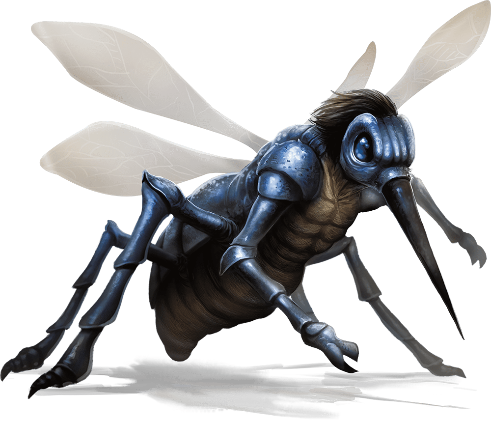

# Fifteenth Session

## A Plague of Demons

### Dramatis Personae

- *Actias Aureus*, a 6th-level Tiefling Warlock
- *Benjamin*, an 8th-level Elf Ranger
- *Calmul Rhoqiroth*, an 8th-level Dragonborn Artificer
- *CoralKing*, a 7th-level Gnome Monk
- *Geral Bryn*, an 8th-level Human Fighter
- *Orky*, a 7th-level Half-Elf Paladin
- *Steve*, an 8th-level Halfling Rogue
- *Tasbros*, an 8th-level Elf Sorcerer
- *Tysnera*, an 8th-level Elf Wizard
- *Viker*, an 8th-level Eladrin Druid
- *Wulrif*, a 7th-level Human Warlock

### Summerday +492 hours

#### From the journal of Dame Orky

Round 5 – I get 4 HP

1. *Wulrif* critically hit the emerging creature using Eldritch Blast which pushes him back 10 ft and deals 10 hp damage. The shamans also slink backward. The creature rushes out the front gate at *Wulrif*. *Calmul* does 6 damage on something?
2. *Steve* shoots at the creature with his crossbow but misses.
3. *Geral* hits the Ogre that’s in front of him. He does 6 HP damage.
4. Some magic spears now start circling around *Wulrif* and he dodges all of them.
5. I hit the frog creature for 27 damage.
6. *Tasbros* uses ray of frost on the frog and does 5 damage.
7. *Calmul* shoots the creature and it appears to do no damage.
8. *CoralKing* actively dodges
9. The Ogre in close proximity misses an attack. 2 others move in on *CoralKing*. 6 Ogres run into the chapel. A bunch of others run out the front gate. They hit *Geral* for 15 HP damage.
10. *Viker* uses her ray of disruption on the frog creature. She then Teleports out.
11. *Tysnera* uses her Fireball in a pile of creatures inside the northwest center of the courtyard. She hit 5 Ogres that made their saves and get hit 15 HP each. It takes out
12. *Benjamin* finds the creature is a Fiend and is resistant to magic, Cold, Fire, Lightning; Bludgeoning, Piercing, and Slashing from non-magical attacks; and immune to poison.
13. *Actias* attacks the frog creature twice and does 17 + 16 radiant damage.
14. All of the Orcs sprint into the cathedral, except the ones in the turrets.

Round 6 – I get 4 HP

1. *Wulrif* makes his saving throw for poisoning. He hits the frog creature for 6 HP damage.
2. *Steve* is not hidden from the frog creature, unknowingly. He shoots at the Ogre behind me and does 22 damage.
3. The creature attacks *Wulrif* for 16 HP.
4. *Geral* uses his sword to attack the Ogre in front of him. He does 18 damage and kills it!
5. *Wulrif* gets hit by 2 of the magic spears.
6. I do 60 HP damage on the Fiend and it disappears.
7. *Tasbros* uses ray of frost on the Ogre and does 18 damage.
8. *Calmul* hits a crit on the Ogre and does 28 damage. He is knocked prone.
9. *CoralKing* strikes the Ogre in front of him for 20 HP damage.
10. The Ogres attack our friends and I hit one for 17 damage on an opportunity of attack. *Wulrif* cracks one of the Ogres for 6 HP damage too. One of them attacks me for 9 HP damage.
11. *Viker* hits an Ogre for 18 damage and Teleports away
12. *Tysnera* uses her Magic Missile wand on the 3 Ogres in front of her and the boys. She does 8 HP damage each.
13. *Benjamin* takes out one of the Ogres and does 12 HP damage on another one.
14. *Actias* hits one of the Ogres for 31 HP damage total.

Round 7 – I get 4 HP

1. *Wulrif* disengages and holds his action.
2. *Steve* hits one of the Ogres for 20 HP damage.
3. *Geral* hits the Ogre in front of him again for 11 HP damage.
4. 4 spears attack *Wulrif* for 22 HP damage.
5. I take out the 2 other Ogres in front of the gate.
6. *Tasbros* casts a level 3 Fireball and it fails.
7. *Calmul* moves
8. *CoralKing* attacks the Ogre in front of him and does 19 HP damage.
9. The Ogres in front of the boys attack both of them and hits *Geral* for 25 and *CoralKing* for 13 HP damage.
10. *Viker* uses cure wounds to heal *Wulrif* for 25 HP.
11. *Tysnera* does 12 damage to one Ogre and takes it down.
12. *Benjamin* is going to use hail of thorns on an Ogre by the boys. He does 21HP damage?
13. *Actias*  moves closer to the wall and hits for 7 HP damage using an Eldritch Blast.
14. The 2 remaining Ogres turn to run into the cathedral. *CoralKing* hits one for 6 HP on their way. As the last one disappeared, the spears attacking *Wulrif* disappeared too.

We spend the shadowspawn into the cathedral and it dissipates. *Actias* uses arcana to see if he can discern anything about the darkness. He doesn’t do well and sees that its magical darkness. The darkness seems to bulge out of the cathedral and a voice says “congrats, you got rid of some of my servants.” We say we are only there for the rock. He said “well, we have uses for that rock. However, there are other magic things you can earn.” This cathedral doesn’t seem to be consecrated and that’s the opposite of how a cathedral should be. It’s not keeping Undead away and etc.

I use divine sense and I can sense that there were 4 Fiends, and now there are 5. Clearly the ward stone has been reversed and is useless to us in its current state. So, we ask about the swords and the voice tells us 1 is a rod and is in an ancient dwarven fortress overrun by Undead. Another sword is in a burial mound. A woodland staff in the shape of a tree is in the depths of the forest. A pair of gloves is in the bowels of **[Neverwinter]**.

#### 15,000 XP

We see a little girl with black hair and she asks us “so, are you going to take the offer from the demon?” We say no, she tells us the weapons are probably cursed.  She tells us her people are trapped in there with her. Her name is *Chiyo* and said her people were misled by promises and told lies. She tells us they are summoning more creatures every cycle, there are 5 in there currently. There are shadow demons, Glabrezu which is the main one talking to us. 2 beasts (Hezrous), 2 Chasmes, and 4 Shadow Demons, and 4 corrupted shamans. She said if we go in to attack them, her people will attack them from behind. Her mate is the leader, the one we talked to first. He is being coerced by the shamans. She estimates we are outnumbered. We learn that Glabrezu emits darkness at will. *Wulrif* attempts to read her mind and fails. She shows us her true form, as an Oni, which are lawful. The ward stone is under the altar, using an active gate to call their own kind, Fiends.

*Actias* is lighting up his sun blade, we take formation and move into the courtyard. We don’t see anything yet.

Round 1

1. *Steve* hides and holds his action
2. *CoralKing* holds his action
3. This giant, deafeningly loud, bug flies toward us and *Actias* and *Wulrif* both fall unconscious. The proboscis enters *Actias* and he drops the sun blade. He loses 30 HP and decreases his maximum HP by 30. It’s draining his blood. They are both unconscious for 10 minutes.

<!-- markdownlint-disable MD029 -->
4. *Wulrif* is unconscious
5. Now the Glabrezu charges forward toward *Geral* and misses an attack. Now the shamans attack *Geral* with magic spears and do 11 HP damage.
6. I cast Thunderous Smite and hits the giant bug twice for 40 HP of damage.
7. *CoralKing* hits it for 22 HP damage and uses Stunning Strike and fails.
8. *Geral* has *CoralKing* hit the creature again and he misses.
9. *Calmul* casts heroism on me and uses Arc Angel to shoot something, dealing 5 HP damage.
10. *Tasbros* uses ray of frost on the bug and does double damage, killing it!
11. Everyone in the front: *CoralKing*, *Geral*, *Benjamin*, *Viker*, and I makes saving throws. Everyone made it!
12. *Viker* casts moonbeam on the frog creature and it blinks away. It still takes half damage, 8 HP.
13. *Benjamin* casts hail of thorns and does damage
14. *Tysnera* casts banishment and the creature disappears!
15. We all make our wisdom saving throws! But it attacks us 3 times, hitting me with 20 HP.

Round 2 – I get 4 HP

1. *Steve*
2. *CoralKing* does 20 HP damage
3. We hear scuffles in the darkness.
4. I use Vow of Enmity and attack the fat winged Fiend once for 20 HP.
5. *Geral* asks me to hit it again and I does 32 damage.
6. *Tasbros* uses Confusion and it fails
7. The Oni, which brought the bird Fiend down, finally delivers the killing blow to it.
8. I am is stunned.
9. *Viker* uses lightning bolt for 30 HP damage. She casts Daylight, 60 ft radius. Now, she enters the cathedral and sees the 4 shamans, the fat winged creature, the lobster goat creature, and the Oni and Ork who are fighting things in the back room. She moves her moonbeam onto the lobster goat creature and does 14 HP damage.
10. *Benjamin* moves into the cathedral and shoots hail of thorns, which fails, doing 12 HP damage. Then, he shoots the fat winged creature and does 14 HP damage.
11. *Tysnera* casts lightning bolt and does 19 HP damage to the fat winged creature. It does 37 HP damage to an Ork shaman, taking him out.
12. The fat winged creature leaves the cathedral to attack *Steve* and Tasbros by the front gate. Tasbros is afraid and runs away, in his turn. It attacks *Steve* and does 24 HP damage.

Round 3 – I get 4 HP

1. *Steve* stays hidden
2. *CoralKing* shoots 2 darts at the fat winged creature and he does 5 HP damage.
3. The shamans are fighting with the Oni and Ork and I need to make a saving throw. I make it and am no longer stunned.
4. *Geral* tells the Oni to hit the lobster goat creature. She hits and does 19 HP damage. Then, *Geral* shoots his bow at it and misses.
5. *Calmul* stabs the fat winged creature and does 9 HP damage.
6. Tasbros is running away, frightened. He casts milf’s meteors on the fat winged creature, doing 3 HP damage.
7. The Oni does 34 HP damage on her first hit and 19 HP on the second one. The Ork attacks the shaman with his Greataxe, twice. *Viker*’s moonbeam does 17 HP damage. The lobster goat creature does 8 HP damage to the Oni.
8. *Viker* attempts to hit the fat winged creature but fails.
9. *Benjamin* shoots at the lobster goat creature and misses.
10. *Tysnera* casts lightning bolt. *Calmul* gets hit twice for 33 HP damage.

Round 4 – I get 4 HP

1. *Steve* does 23 HP damage on the fat winged creature, taking it out!
2. *CoralKing* runs closer to the lobster goat creature and dodges.
3. The shamans hit the Ork but he's OK.
4. I move, Teleport to the lobster goat, and hits it twice for 48 HP damage.
5. *Geral* moves up and does 7 HP damage, I do 18 damage, exactly knocking it down.
6. *Calmul* moves forward.
7. Tasbros moves forward and holds his action

The Oni yells “wait!” and seems to heal herself. The Ork seems to imply the shamans are his friends and instructs the other Orcs to halt and not attack.

We ask for the stone and she agrees. *Geral* invites her to stay with us in our town through the winter and he said he will hire her and her people to protect the forge. The Oni instructs us to stay in the light so we don’t have to face the 4 shadow demons lurking in the dark. 3 shamans, 1 Ork chief, 16 Ogres (4 chain brutes), and 23 Orcs remain to work in the forge.

#### 5,000 XP

[Neverwinter]: ../background/neverwinter.md
