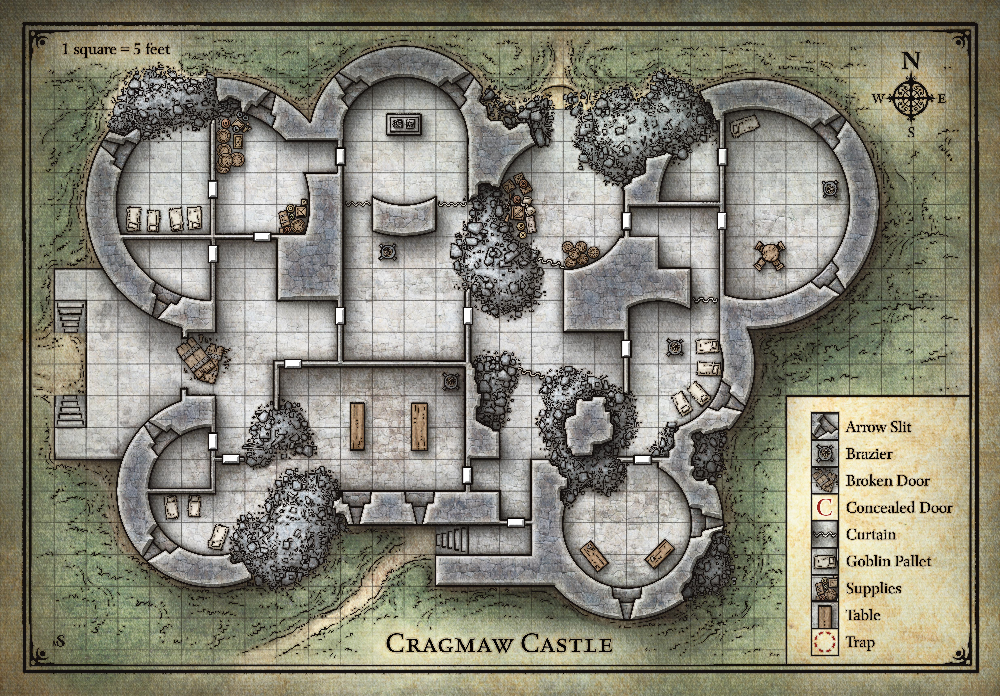

# Fifth Session

## Return to Phandalin

### Dramatis Personae

- Actias Aureus, a 4th-level Otherkin Warlock
- Benjamin, a 4th-level Elf Ranger
- Calmul Rhoqiroth, a 4th-level Dragonkin Artificer
- CoralKing, a 4th-level Gnome Monk
- Geral Bryn, a 4th-level Human Fighter
- Orky, a 4th-level Half-Elf Paladin
- Steve, a 4th-level Halfling Rogue
- Tasbros, a 4th-level Elf Sorcerer
- Tysnera, a 4th-level Elf Wizard
- Viker, a 4th-level Elf Druid
- Wulrif, a 4th-level Human Warlock

*Viker* revives *CoralKing*, who immediately wants to get his ring back (the **Precious**).

*Benjamin* uses *Primeval Awareness* to try to track the *Clockwork Horrors*, but they are something beyond his understanding.
He does sense a Dragon flying North of the party just before it moves out of range.

*Tasbros* thinks the *Clockwork Horrors* are some kind of Construct, and *Calmul* agrees.

The great tracks of the *Urb* once again provides shelter as the party marches for two rest periods back to *Phandalin*.
They greet Sister Garaele at the *Shrine of Luck* and tell her Agatha's answer.
*Sister Garaele* is grateful and offers her healing and more potions.
She can't regenerate *CoralKing's* finger, but *Qelline Alderleaf*, a local farmer, might know a Druid who can.

The group heads back to the *Townmaster's Hall*, where they meet *Harbin Wester*, and retrieve the Goblin from the gaol.
*Geral* makes the Goblin swear allegiance as his armor bearer, and names him *Snaga*. The party gives *Harbin* the Orc tusks, for which he pays 5gp per pair, 50gp total.
*Calmul* and *Geral* spot the firearms carried by *Harbin's* Dwarven mercenaries, and note that they don't seem to protect anyone else in the town.
Harbin talks about the *Redbrand Ruffians*, who recently arrived and began beating up and killing townfolk.

#### 300 XPs

The party heads to the *Phandalin Miner's Exchange*, meeting the proprietor, *Halla Thorton*. A shrewd, sharp-looking human woman, she tells them more about the *Redbrands*,
and offers 100gp for the death of their leader, some mage who recently arrived. *Wulfric* senses an ulterior motive, though.
*Halla* notes that many *Redbrands* hang out at the *Sleeping Giant Inn*, and but their leader is almost always at *Tresendar Manor*. *Halla* thinks there might be two dozen *Redbrands*.

The party carefully reconnoiters the *Tresendar Manor*, preparing to set a trap near the Sleeping Giant. By chance, four *Redbrands* emerge from the *Sleeping Giant*, triggering the ambush.

It's any easy fight for the party, and the *Redbrands* are quickly overwhelmed. A *Redbrand* is captured and interrogated, and the party discovers that:

- The leader of the *Redbrands* is a human wizard known as *Glasstaff*. Arcana knowledge by *Tysnera* notes that is likely a *Staff of Defense*.
- Someone called the *Black Spider* hired the *Redbrands* to frighten off adventurers and intimidate the locals. The *Black Spider* sent Bugbears to reinforce the *Redbrands*.
- Underneath the manor contains a hideous "eye monster", which the *Redbrands* avoid.
- The *Redbrands* have captive townsfolk "near the old crypt", guarded by skeletons.

Benjamin uses *Primeval Awareness* again to discern that there is some sort of Aberration underneath the manor, as well as a large group of undead.

The party returns to the *Phandalin Miner's Exchange*, deciding to pass on assaulting *Tresendar Manor*. *Wulrif* discerns that *Halla* is interested in taking over the *Redbrands*.

They encounter *Sindar Hallwinter*, who seems to be the new Townmaster.

> "What happened to Harbin, you ask? As soon as he saw me, that fool scurried off with his guards back to his bank. Good riddance, I say!
> He didn't have the fortitude to do what needs to be done around here. But how goes the search for Gundren? Have you found Cragmaw Castle?
> I'll pay you 500gp for the rescue of Gundren Rockseeker.

The party finds this a more appealing quest, given *Snaga* knows the location.

*Snaga* does, indeed, lead them right to the castle after a full 8 hours march.

The party scouts cautiously.

*Viker* shapeshifts into a field mouse and hops into Steve's pocket and *Actius* turns *Steve* invisible. Benjamin follows stealthily and the three of them take up station by the front entrance to the West.

The rest of the party carefully moves into the Southern entrance. *Calmul* *Infuses* *Orky's* Chain Mail and Greatsword.

*Actius* uses *Mold Earth* to collapse the South Wall, exposing the Hobgoblins inside!

#### 400 XPs

