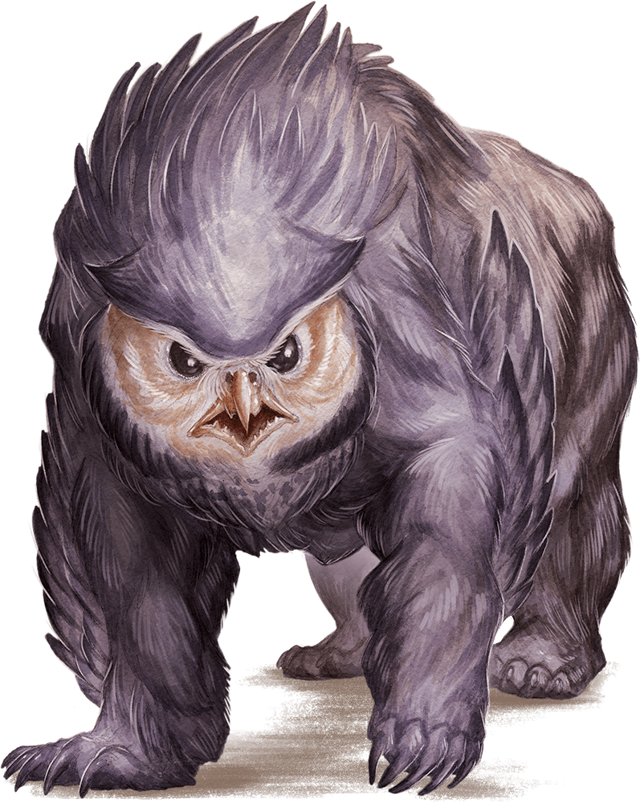

# First Session

## Goblins on the Triboar Trail

### Springrise

### Dramatis Personae

- *Benjamin*, a 1st-level Elf Ranger
- *CoralKing*, a 1st-level Gnome Monk
- *Geral Bryn*, a 1st-level Human Fighter
- *Orky*, a 1st-level Half-Elf Paladin
- *Steve*, a 1st-level Halfling Rogue
- *Tasbros*, a 1st-level Elf Sorcerer
- *Tysnera*, a 1st-level Elf Wizard
- *Wulrif*, a 1st-level Human Warlock

*Springrise* casts its rays over the **Sword Coast** as [Neverwinter](../background/urbs.md) makes its way along the **High Road** to spend *Summerday* at **Biscayne Bay**, awaiting the arrival of **Waterdeep**, the largest known Submersible Urb.

The *Magisterium* declares *Springrise* as the majority of the inhabitants of **Neverwinter** exchange their musty and clamorous dwellings for the
warmth of the surrounding lands. Gaily colored tents and trade booths dot the surrounding countryside, patrolled by the *Crusaders* astride their
clanking beasts.

> A Dwarf named *Gundren Rockseeker* asks you to bring a wagon-load of provisions to the Summerday settlement of **Phandalin**, 20 hours travel Southwest of your current location.
*Gundren* was clearly excited and more than a little secretive about his reasons for the trip, saying only that he and his brothers had found "something big", and that he'd pay you
ten gold pieces each to escort his supplies to **Barthen's Provisions**, a trading post in **Phandalin**.
He then set out ahead of you on horse, along with a warrior escort named *Sildar Hallwinter*, claiming he needed to arrive early to "take care of business".
> You've spent the last 8 hours following the broad **High Road** South, and you've just recently veered east along the **Triboar Trail**. You've encountered no trouble so far, but the wilderness is always dangerous and full of predators.

Character introductions were made.

The party encountered two dead horses along the trail. Despite *Geral*'s warning, the party went to investigate and were ambushed by Goblins.

*Geral* leapt forward to save *CoralKing*, *Benjamin*, and *Wulrif* and *Orky*'s charge broke the back of Goblin resistance.

The remainder disengaged and slunk back into the woods, firing desultory arrows at *Orky* to no effect.

*Benjamin* determined the Goblins to have numbered a dozen, and they dragged someone away. Empty satchels and a map case were found near the dead horses.

#### 300 XPs

A further 8 hours travel along the **Triboar Trail**, and *Benjamin* discovered a Goblin lair in a cave hidden in the woods a scant two bowshots from the trail.
Concealed in natural surroundings, *Benjamin* observed the Goblins taking a bound human into the cave. From there, any other travelers along the **Triboar Trail** are sure to come under assault.

The party crept to the cave entrance, leaving *Geral* and *Tysnera* to guard the oxen team and wagon full of the provisions they were hired to deliver.

The party ambushed two guards at the cave entrance, and then slew three wolves just inside the cave in a filthy den.

Before they could go further, *Tysnera* arrived bearing the news that the wagon caravan was under attack by a foul beast.

Returning, the party encountered an Owlbear, which had dispatched *Geral* and was ravaging the remains of the oxen team.

The Owlbear was defeated and *Geral* revived from near death. The remains of four oxen were scattered amongst the beast's feeding frenzy, and *Benjamin* eventually retrieved the remaining four.

The party must decide what to do next.

#### 500 XPs

<!-- markdownlint-disable MD033 -->

