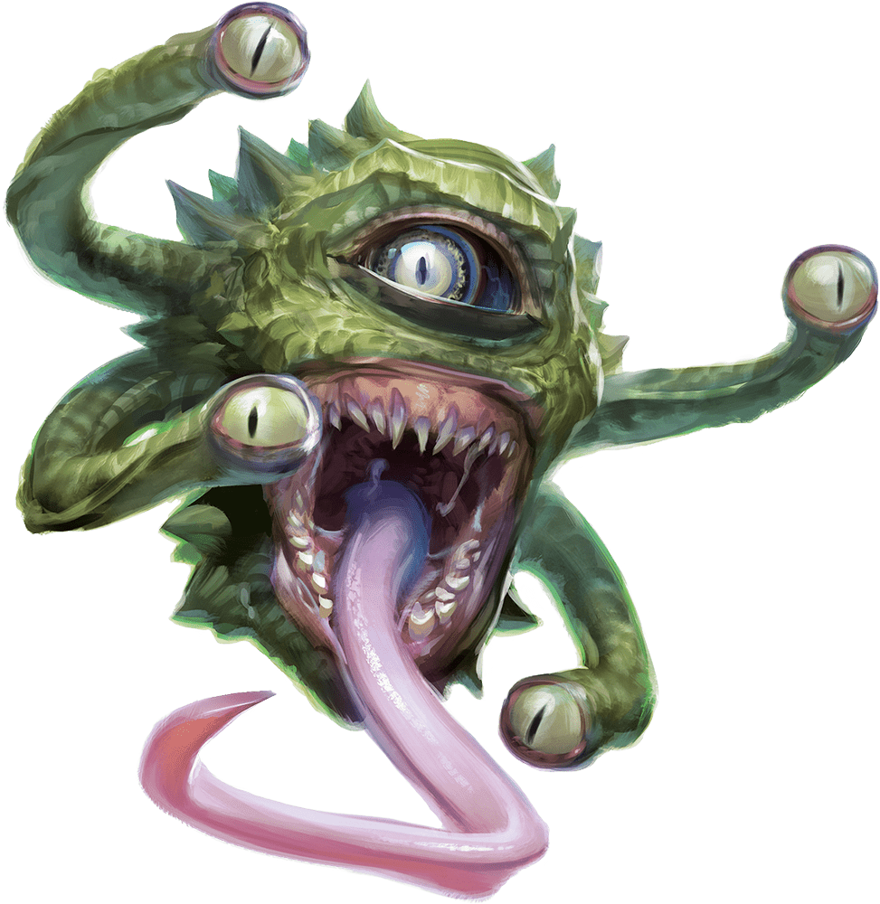

# Fourteenth Session

## Buried Treasure

### Dramatis Personae

- *Benjamin*, an 8th-level Elf Ranger
- *Calmul Rhoqiroth*, an 8th-level Dragonborn Artificer
- *CoralKing*, a 7th-level Gnome Monk
- *Geral Bryn*, an 8th-level Human Fighter
- *Orky*, a 7th-level Half-Elf Paladin
- *Steve*, an 8th-level Halfling Rogue
- *Tasbros*, an 8th-level Elf Sorcerer
- *Tysnera*, an 8th-level Elf Wizard
- *Viker*, an 8th-level Eladrin Druid
- *Wulrif*, a 7th-level Human Warlock

### Summerday +420 hours

#### From the journal of Dame Orky

We ride back in the crawler with a hundred Dwarves. They thank us and want to throw a big feast in our honor. There’s an award ceremony where they make *Benjamin* a Scout and is given a quiver with magic arrows. *CoralKing* is made a Mystic. *Calmul* is made an honorary Smith. *Geral* is awarded the title of Thane. I am named a Champion. *Steve* is made a Spy. *Tysnera* and *Tasbros* are made War Mages. *Viker* is made a Guardian. *Wulrif* and *Actias* are made Mystics. We are all given a +1 Cloak of Protection with the *Rockseeker Clan* symbols.

We are headed to Phandalin to deliver *Iarno Glasstaff* to *Sildar* and deal with the demi-Beholder again. As we walk along the path, 2 dinosaurs jump out as us and they look hungry. *Benjamin* speaks with the dinosaurs. He convinced them to go eat the brontosaurus instead. We finally make it to Phandalin.

We head to the Townmaster’s Hall first to deliver *Iarno*. *Sildar* throws him in jail. He reminds us that we are in midsummer and used to have a ward stone to protect them from the Undead during Winternight. However, it has been befouled? And doesn’t work. Usually a whole church blesses a ward stone, so not an easy thing to obtain. They are usually 200+ lbs so we would need a wagon to haul it. Alternatively, there’s another haunted mine fortress 15 miles south of here called **Axeholm** that we can take instead. **Savra's Cathedral** is where we can go to recover an unused ward stone.

*Sildar* also reminds us that there are a ton of Dragons that have been flying around lately. A Dragon-laying sword can be found nearby where a famous hero slayed a Dragon.

We decide to head to **Tresendar Manor** to recover the magic armor in the basement, then get the Dragon-slaying sword. We walk into the basement and see the Spectator.

Round 1

1. *Benjamin* investigates to learn the creature’s weaknesses. He returns to report that it has no weaknesses and it floats 20 ft above the ground. So, outside of melee range. It cannot be knocked prone.
2. *Steve* hides
3. *Calmul* enhances my weapon. It deals an extra 1d4 poison damage for an extra minute. He casts heroism on me too which gives me temporary hp every round.
4. *CoralKing* moves behind the creature and holds his action but uses patient defense.
5. The creature psychically attacks *CoralKing* but he resists it. I get paralyzed. *Geral* survives the attack as well. *Tasbros* takes 16 hp of damage.
6. *Geral* orders *Steve* to shoot his bow. For his second attack, *Geral* hits?
7. *Wulrif* Hexes it and it rebounds, hexing *Wulrif*. His 2 Eldritch Blasts miss, rebound, and miss *Wulrif*.
8. *Viker* goes up to it and uses her boots of spring to jump up and hit it with her mace, then Teleports before she lands. She does 4 HP damage.
9. *Tysnera* throws a dagger at it and does 4 HP damage.
10. *Tasbros* moves back a little, uses his crossbow to shoot it ,and misses.
11. *Actias* creates a magical crossbow and shoots it, killing it.

The spectator dissipates and a tiny one appears, attracted to **Wulrif*'s* magic.

<!-- markdownlint-disable MD033 -->

> A questing tendril of thought caresses *Wulrif*’s mind. He allows it to develop.
>
> You are powerful?
>
> Yes, he replies.
>
> You will become more powerful?
>
> Yes.
>
> You seek the truth of my home?
>
> Yes.
>
> You will take care of me?
>
> Yes.
>
> Then I will serve, provided all those conditions remain true.
>
> A wobble in his vision, and now he sees a huge cloaked figure below him, gazing up at him with two tiny, sharp eyes. He floats downwards, closer, as a strange appendage ending in five tentacles produces a morsel. He looks into his own smiling face ….

*Wulrif* grabs it and puts it in his bag and begins feeding it. I make a max saving throw and recovers her movement.

*Tasbros* uses move earth to dig, and we see a life-size statue. He detects magic and sees the sword hilt is magic and the tomb. He uses mage hand to lift the sword and it can’t do anything. Me and *Geral* climb up to the statue and I feel a question in my mind, "Am I trustworthy?" I say "Yes" and the sword drops and I grab it. It’s like a Lightsaber. It’s called a Sun Blade and I humbly pass it to *Actias* to use. *Tasbros* uses knock to open the tomb. He sees a body covered in dwarven-made armor. I take it.

We then head to the Cathedral. *Geral* stops by the Townmaster first and wants to know where the gnome mercenaries came from. They came from **Gnomengarde** and get paid 60 gp each Summerday and 120 gp each Winternight. **Gnomengarde** is 15 miles southeast of **Phandalin**. *Benjamin* has Animal Handling so he can use a mule to haul a cart. We do all of that and move along. We see a Dragon in the distance but make it to the Cathedral without trouble. *Steve* goes ahead and scouts the premises, detecting 2 dozen Orcs and 2 dozen Ogres in the courtyard and guard towers. 4 Orcs are in each guard tower (adding 16 to the total) and Ogres are in the courtyard. He has no idea how many more are inside the actual building.

*CoralKing* approaches the Cathedral using *Wulrif*’s megaphone saying he wants the ward stone. An Ogre approaches asking him to repeat it. *CoralKing* said he wants the ward stone or else. It says “what’s a warthumb?” *CoralKing* said “give us the ward stone or else”. He said “what do you mean ‘or else’ I will crush you.” A smaller Ork approaches and inquires the same. *CoralKing* repeats that we want the ward stone and they respond that they have no idea what we are talking about. They said they have heard of our group and they outnumber us. He tells them about **Axeholm** where they can relocate. They said they just encountered a Dragon and arrived here shortly before, they are not moving. *CoralKing* asks them if we can come in and take a look to identify it.

*Viker* steps up and suggests she transfigure into a fly and flies in to find the stone. She sees 4 Orc spellcasters at the altar chanting around this big glowing rock. This dark figure, avoiding the light, starts to approach *Viker*. So, she books it back out. One of the Orc spellcasters turns around and shoots her with 4 Magic Missiles. They do 8 HP damage. *Viker* makes it back out.

Once *CoralKing* hears about this, he snaps his fingers and we immediately head in to destroy the group.

Round 1

1. *Wulrif* deals 21 damage using Eldritch Blast to the Ork that was speaking to *CoralKing*
2. *Steve* uses a sneak attack with his crossbow and misses.
3. *Geral* asks *Steve* to hit again and does 27 HP of damage.
4. I cast Thunderous Smite and attack the Ork with my greatsword. I hit and does 25 HP damage.
5. *Tasbros* casts Melf's Minute Meteors around the gate tower and hits the Ork for 11 and the Ogre for 11 HP damage.
6. *Calmul* casts heroism on me, giving 4 temporary HP each turn and Immunity to being frightened.
7. *CoralKing* attacks the Ork for 7 damage, taking it down.
8. The Ogre grabs the Ork and runs into the Cathedral. The creatures on the grounds start to move in toward the gate.
9. *Viker* uses call lightning on an Ogre she can see, doing 18 damage.
10. *Tysnera* uses summon shadowspawn and holds her action?
11. *Benjamin* shoots at the guard towers and hits one of the Orcs. He does 16 damage, dropping it. He then drops another one!
12. *Actias* moves forward toward the castle and casts Armor of Agathys.
13. The creatures move in toward the gate again.

Round 2 – I get 4 temporary HP

1. *Wulrif* casts sickening radiance just inside of the guard tower, where the hoard of creatures is the most dense. It gives all creatures within 30 ft radiation poisoning.
2. *Geral* shoots his bow at something, but misses.
3. I take a Vow of Enmity, moves toward a hole in the wall and holds my action, waiting for an opportunity of attack.
4. *Tasbros* moves a little closer and casts a web on the creatures in the northwestern guard tower.
5. *Calmul* shoots the Orcs in the northeastern tower and does 9 HP damage.
6. *CoralKing* moves near me and holds his action
7. The Ogres are not affected by the sickening radiance. 2 move to attack me and *CoralKing*, within range and provoke attacks of opportunity. *CoralKing* gets hit for 9 damage. Others start to move out of the gate and meet *Actias*, *Calmul*’s companion, and the shadowspawn. I attack and hit twice doing 35 damage.
8. *Viker* casts lightning bolts and hits doing 27 HP damage, wiping out the Ogre in front of me.
9. *Tysnera* uses her wand of magic missiles on the 3 Ogres at the front of the gate. She does 7 HP damage. Her shadowspawn hits an Ogre and does 7 HP damage.
10. *Benjamin* hits twice and does 16 damage and 15 damage, taking out 2 Orcs.
11. *Actias* casts booming blade and attacks, doing 10 damage.
12. 14 Orcs take 12 HP damage from the sickening radiance.

Round 3 – I get 4 temporary HP

1. *Wulrif* casts shatter to hit 4 Orcs and they get 19 damage each. 4 drop dead!
2. *Steve* sneak attacks and hits an Ogre for 20 damage. He hides again.
3. *Geral* asks me to hit the Ogre in front of me, and I does 21 damage.
4. I hit the Ogre again on my turn and drop it.
5. *Tasbros* uses magic missiles on the 3 gate Ogres, doing 15 HP damage. Then, Chromatic Orb (fire damage) doing 48 damage, killing him. He narrowly avoids being turned into a sheep by chaotic magic.
6. *Calmul* shoots at an Ork on the northwest guard tower doing 25 damage, killing it.
7. *CoralKing* works his way through this blown out wall and attacks an Ork, killing it.
8. One Ogre is killed from the sickening radiance.
9. *Viker* does 16 hp damage to an Ogre.
10. *Tysnera* uses magic missile on the remaining Ogre at the gate, doing 6 hp damage.
11. *Benjamin* hits 2 Orcs in the guard tower.
12. *Actias* attacks the gate Ork with his Sunblade, doing 26 hp damage.
13. The rest of the Orcs and Ogres dash forward. 3 flank and attack *CoralKing*, doing 26 damage.

Round 4 – I get 4 temporary HP

1. *Wulrif* is hiding
2. *Steve* hits the Ork in front of the gate. He does 26 damage.
3. *Geral* dashes and action surges behind *CoralKing*, attacking an Ork, killing it.
4. I move forward and hold my action.
5. *Tasbros* uses a meteor splash and kills 2 or 3 Orcs. He uses a second level fiery Chromatic Orb and hits an Orc and Ogre. He does 19 damage. The Orc is killed.
6. *Calmul* shoots the remaining Ork in the guard tower, doing 22 damage, killing it!
7. *CoralKing* hits the Orc to his right and kills it with ease. He moves back through the hole in the wall to join me. He also uses Patient Defense.
8. The Ogres see the green cloud of radiation and run back around the back of the grounds and try to come around the other side.
9. *Viker* heals *CoralKing* for 16 HP. She moves up and holds her action until a creature comes into view.
10. *Tysnera* moves up and uses cure wounds on *CoralKing*, healing him 1 HP.
11. *Benjamin* moves up next to *Viker* and holds his action until something comes into view.
12. *Actias* also moves within range of the hole in the wall and holds his action.
13. Some of the creatures run backward toward the east side of the wall again. Now the sickening radiance suddenly disappears. *Benjamin* hits an Ork for 26 HP. The Orcs attempt to hit *Geral* and *CoralKing*, but miss. Suddenly, a Hezrou appears from the chapel with 4 Ork shamans flanking him.

XP will be awarded next session since we are stopping in the middle of an encounter.
