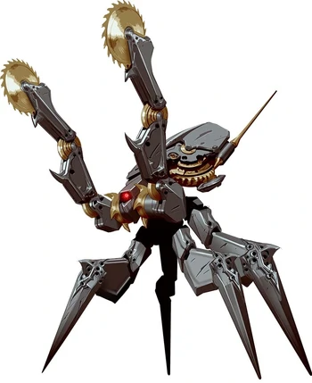
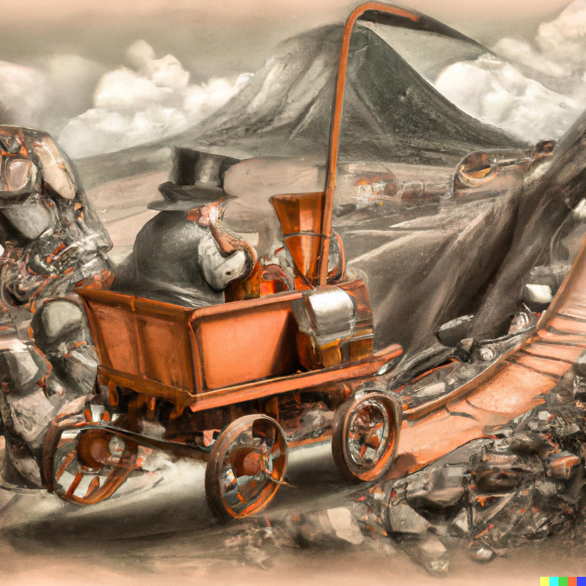
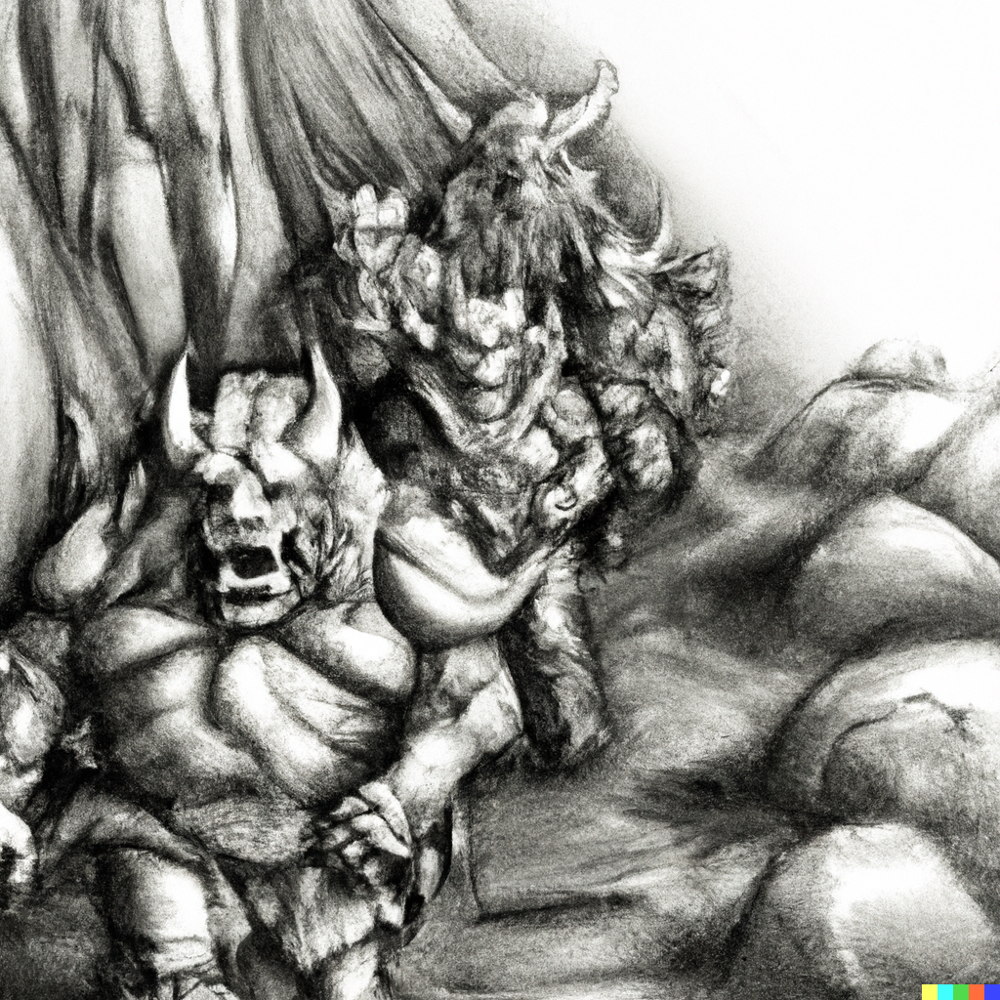
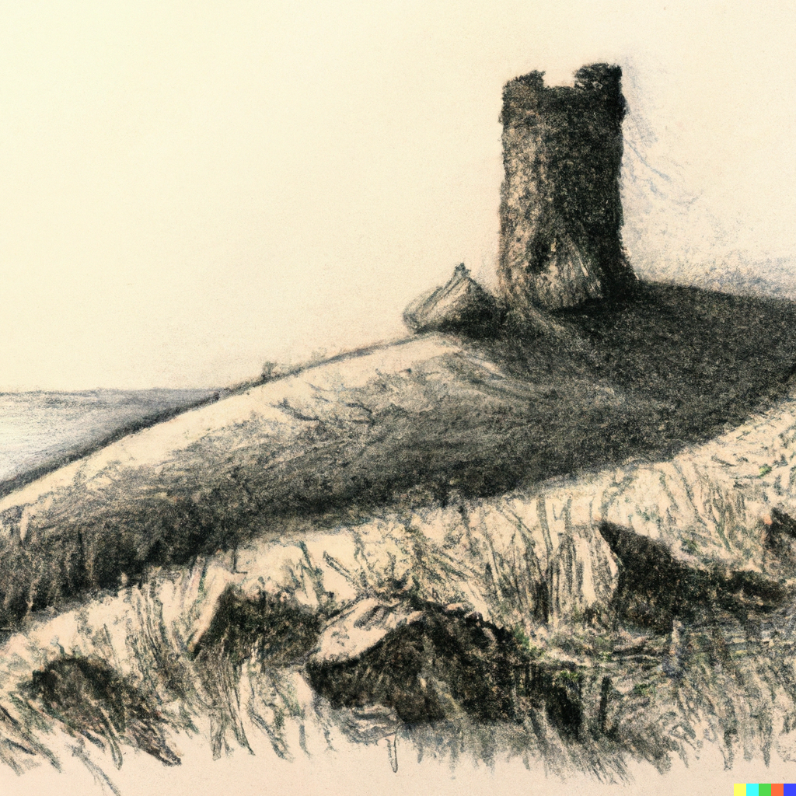

# Fourth Session

## Orcs, the Tower of Endymion, and a mystery

### Summerday +128 hours

### Dramatis Personae

- Actias Aureus, a 3rd-level Otherkin Warlock
- Benjamin, a 3nd-level Elf Ranger
- Calmul Rhoqiroth, a 3rd-level Dragonkin Bard
- CoralKing, a 3rd-level Gnome Monk
- Geral Bryn, a 3rd-level Human Fighter
- Orky, a 3rd-level Half-Elf Paladin
- Steve, a 3rd-level Halfling Rogue
- Tasbros, a 3rd-level Elf Sorcerer
- Tysnera, a 3rd-level Elf Wizard
- Viker, a 3rd-level Elf Druid
- Wulrif, a 3rd-level Human Warlock

In the aftermath of the battle with the pack of Allosaurs, the party camped between the tread marks of a passing *Urb* on the *Triboar Trail*, reasoning the deep indentations
and broken ground would provide a more defensible camp site. While resting they saw a curious sight: strange, whirring clockwork automatons marching single file out of the
forest over to the bodies of the Allosaurs. Ignoring the party entirely, the strange machines proceeded to render the bodies into small pieces.

The sights and sounds were unpleasant to say the least, so the party moved a bit further along the trail of the Urb. The rest period was otherwise uneventful, the light
from the *Enclouding* giving a dreamlike quality while everyone meditated and healed.

Midway through the next 8-hour march, the *Urban* trail turns North into the forest, a vast scar of sawn-down trees and torn-up earth rent between the giant Sequoias.

The group continues East, reaching the ruins of Conyberry.

> The forest grows dark and still as the trail winds deeper into the trees. Heavy vines and thick layers of moss drape the branches,
> and the air is noticeably colder than it was in the ruined village. Rounding a bend in the trail, you see a screen made from the warped
> branches of trees standing close together, woven into a domelike shelter in the shadows. A low doorway leads inside.

The adventurers enter.

> The air grows cold, and a powerful feeling of dread grips you. A cold, pale light flickers in the air, rapidly taking on the form of a
> female elf, her hair and robes waving in a spectral wind. She might have been beautiful once, but a hateful expression twists her features now.
> “Foolish mortals,” she snarls. “What do you want here? Do you not know it is death to seek me out?”

> "We have brought you a gift," replies *Wulrif*. He offers her *Garaele's* *Silver Comb*.

> The ghostly figure smiles with cold amusement. “Very well,” she says. “I know that you seek many things. Ask me one question, and I will give you an answer.”

> "Where is Bojangle's spellbook?" asks *Wulrif*.

> "I traded that to a Necromancer named Tsernoth from the city of Iriaebor, let's see, more than a hundred years ago. I do not know what happened to it after that."

*Agatha* disappears.

After some consultation, the party decides to head South to look at the *Old Owl Well*, a point of interest on the map. The ground gets steeper and the wind picks up.

They encounter an old dwarf riding a horseless carriage.

> "Hallooooo!" he yells, seemingly friendly.

> "Hello", replies *Orky*.

After establishing that he is a Miner around these parts, the party asks a few questions.

On the strange mechanical scavengers:

> "Oh, avoid the *Clockwork Horrors* if you can."

> "But what do they want?"

> "No one knows, but best not to get in their way if you can help it."

> "What's *Old Owl Well*?"

> "Oh, an ancient tower. Be careful, there's *Undead* been spotted around there."

After a few more shouts the party continues, finally making camp on a hillside as the wind picks up.

And that's when the Orc war-band attacks!

The party isn't surprised, but the Orcs have the high ground and the wind makes archery difficult.

There are ten Orcs, with a fearsome War-Chief and, as it becomes apparent, a Shaman. The Shaman casts buffs on the attacking group
which rushes downhill at the party. *Geral*, *Orky*, and *CoralKing* move to block.

*Benjamin* and *Steve* shoot arrows with limited success. The unusual resistance of the Orcs to
*Hexes* and such from *Wulrif* and *Actias* indicates that the Shaman has countered some of their spells. *Tasbros* and *Tysnera* get in some
damaging spell strikes. But it is the center that is held by *Geral*, *Orky*, and *CoralKing*, who absorb the brunt of the warband's attacks.

*CoralKing* goes down no less than three times, revived by *Viker* and *Calmul* before finally falling. His stand gives
*Orky* and *Geral* time to deal with the Shaman and the other Orcs, until only the War-Chief is left. The War-Chief's death strike is a mighty blow
which nearly takes *Geral* with him.

*Viker* heals *CoralKing* just before he takes the long dirt nap to join his ancestors.

Battered, the party rests, taking suitable trophies from the Orcs.

Again, two *Clockwork Horrors* arrive and the party leaves them to their grisly task. During the Long Rest, *Benjamin*
sees three leave.

> As you crest a low ridge, you spy the crumbling ruins of an old watchtower standing amid the rugged hills.
> The place is so old that the walls are only mounds of rubble enclosing a courtyard of sorts, adjacent to the broken stump of an old tower.
> A colorful tent has been set up in the middle of the courtyard, but no one is in sight.

*Actias* casts *Invisibility* on *Steve*, who stealthily reconnoiters.

A few minutes later, a quite visible *Steve* walks stiffly back, in some sort of magical grip by a bald, tatooed, red-robed Mage. Twelve *Zombies*
lurk nearby, but do not attack.

> "What is the meaning of this?" asks the Mage.

*Wulrif* seems to be the de-facto spokesperson of the group.

> "We were looking for the *Old Owl Well*."

> "Indeed, you have found it." An odd gleam in his eyes. "Have you spoken to Agatha?"

> "Well, yes."

> "I have a question of her I would bade you ask, and a gift to offer." A strange metal box floats over.

> "What is inside the box?"

> "Probably best you don't know," says the Mage with a chilling smile. "I can offer you this ring as a reward."

Viker goes into a brief trance, then nods and whispers:

> *"It's a Ring of Protection."*

The party consults briefly.

> "We accept."

*Steve* the Halfling walks over of his own accord, unharmed.

The party treks back down the foothills, surprisingly not encountering anything unusual. Another four hours travel brings them to *Agatha's* lair.

A wave of cold, and *Agatha* looks at the party, curiously.

> "We have a gift, and a question."

*Agatha* gestures and the curiously heavy metal box floats over, lid opening.

> "Acceptable. What is your question?"

> "What is the name of the tower at *Old Owl Well*?

> *Agatha* seems to think a moment. "The Tower of Endymion." She vanishes.

Back to *Old Owl Well*. The Mage receives the answer with interest, and delivers the ring.
After consultation, the party decides that *CoralKing* shall be it's bearer.

But the next rest period brings a strange clicking sound, and the appearance of three *Clockwork Horrors*. Ignoring the rest of the party, they make a beeline for *CoralKing*.

The things have mechanical saws and pincers, and return fire with *Lightning Bolts* when *Benjamin* hits them, harmlessly, with
his arrows. No weapon the party has seems to have the least effect on them. *CoralKing* struggles, but is astonishingly quickly subdued.
They cut off the ring (and *CoralKing's* finger), then retreat back the way they came. *Actias* sends an *Eldritch Blast* at them, narrowly dodging
return *Lightning Bolts*.

The party looks at each other haplessly, then go to heal *CoralKing*.

#### 1000 XPs

