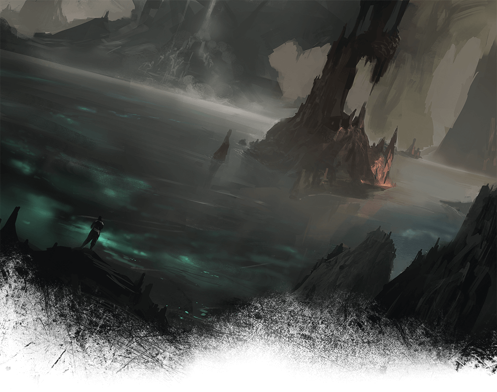
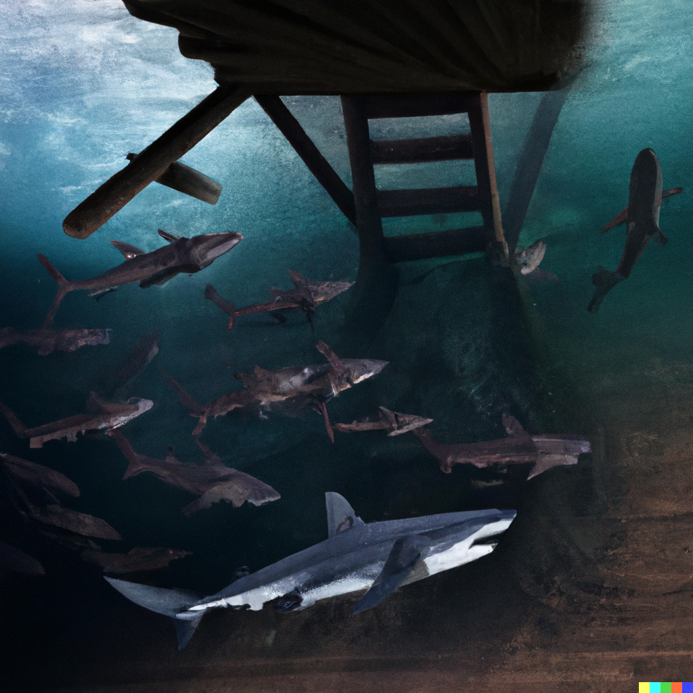

# Nineteenth Session

## Jaws of the Underdark

### Dramatis Personae

- *Actias Aureus*, a 9th-level Tiefling Warlock
- *Benjamin*, a 10th-level Wood Elf Ranger
- *CoralKing*, a 10th-level Gnome Monk
- *Orky*, a 10th-level Half-Elf Paladin
- *Steve*, a 10th-level Halfling Rogue
- *Tasbros*, a 10th-level Sky Elf Sorcerer
- *Tysnera*, a 10th-level Sky Elf Wizard
- *Viker*, a 10th-level Eladrin Druid
- *Wulrif*, a 9th-level Human Warlock

### Summerday +780 hours

#### From the journal of Dame Orky

We're beside an underground lake of unknown size. Those of us with armor will sink and drown if we end up into the water. The raft is not big enough for all of us. It’s big enough for 3 people and has some sort of mechanism on the back of it that *Calmul* decides is a Motor. We decide to just walk along the shore to the right. Eventually we are stopped by a wall and the water runs underneath it. So, we turn around and hit a wall over time too. *Viker* decides to transform into a Bat and fly ahead to scout a way out. She flies for an hour and finds nothing. She turns left and loops around. Somehow she flies into something and gets stuck and can feel the substance moving. She transforms into a Spider and sees a Spider moving down toward her. Then, she realizes it’s trying to mate with her. She accepts the packet it offers her and it scurries away. Now she has a moment to herself and senses an entire web-way in this cavern. She transforms back into a Bat and reports to the shore.

Meanwhile, *Wulrif* inspects the land and finds a bunch of mushrooms 30-40 ft tall that are kind of like wood. He figures out that these are what the raft is made out of.

Also, *Tasbros* electrifies the water and a cooked fish flies out. Then, a bunch of butterflies and petals appear around him and flutter away.

*Viker* inspects the opposite side of the lake and finds more water, an hour out. She can’t even detect the ceiling. She catches bugs and doesn’t recognize them. They are very tasty though. She finds a plant on a stalactite and brings it back to *Wulrif* to investigate.

We tell *Viker* about the woody mushrooms and all agree to build a bigger raft. So, *Actias* uses his Sunsword to start chopping them down. We all fashion the cuttings to the smaller raft and *Calmul* thinks he can use the Motor to propel the whole raft.

So, we set out on our new raft and Motor.

Half a cycle of traveling much faster than we can row, everyone except *Calmul* sees 6 large fins circle us. They move around languidly until they are approximately 10 feet away.

Round 1

1. *CoralKing* uses Patient Defense to Dodge, then holds his action.
2. *Wulrif* Quickens his Witch Bolt and casts Eldritch Blast to hit one of the creatures, doing 54 HP damage. It twitches and the other fins get really excited.
3. I cast Protection from Evil on myself.
4. *Steve* hides and Dodges.
5. *Viker* casts Call Lightning and blasts the fin that *Wulrif* attacks, doing 24 HP damage.
6. *Benjamin* uses Hail of Thorns to shoot the fin that *Wulrif* attacked.
7. *Actias* uses his Dancing Sword and casts Eldritch Blast, doing 16 HP damage.
8. *Tysnera* holds her action.
9. The first fin approaches and knocks the raft over. Me, *Benjamin*, *Steve*, and *CoralKing* are the only ones who remained on the raft. *Tasbros* is swimming and the second fin misses him while the third one bites him, doing 22 HP damage. *Wulrif* is attacked by the fourth fin and it hits him for 31 HP damage. *Actias* gets bitten and uses Hellish Rebuke, doing 13 HP damage. *Tasbros* uses Haste on *Wulrif*. *Tysnera* is sinking ...

Round 2

1. *CoralKing* pulls *Tysnera* back into the raft.
2. *Wulrif* forks his Witch Bolt and kills the injured fin, also hitting a second one. Then he jumps off the raft and turns into a Giant Shark.
3. I take a Vow of Enmity, cast Wrathful Smite, and swing at the fin closest to me, doing a total of 35 HP damage. It is also frightened of me.
4. *Steve* tries not to look like a Halfling snack.
5. *Viker* Teleports back onto the raft and uses Call Lightning on another Giant Shark.
6. *Benjamin* finds their weaknesses are nonexistent. They are not resistant or immune to anything either. They are Beasts.
7. *Actias* uses Thunder Step to transport out of the water and back onto the raft.
8. *Tysnera* is prone and casts Banishment on 2 of the sharks who haven’t been damaged. She succeeds!
9. The frightened Shark attacks *Tasbros* for 24 HP damage. 2 Sharks hit *Wulrif* (Sharkeisha) and do 50 HP damage!
10. *Tasbros* uses Lightning Lure.

Round 3

1. *CoralKing* pulls *Tasbros* onto the raft, prone.
2. Sharkeisha attacks the Sharks in front of him and does 24 HP damage.
3. I move to the opposite corner of the raft to swing at a fin, doing 39 damage.
4. *Steve* shoots the Shark Orky just hit, doing 29 damage.
5. *Benjamin* heals Sharkeisha for 2 HP.
6. *Actias* Banes both of the remaining Sharks.
7. *Tysnera* uses Magic Missile and kills the weakened Shark.
8. A Shark attacks Sharkeisha for 13 damage.
9. *Tasbros* uses Lightning Lure and does 25 HP damage.

Round 4

1. *CoralKing* uses Walk on Water, does 20 damage to a Shark, then Teleports back.
2. Sharkeisha does 30 ish HP damage.
3. I cast cure wounds for 6 HP of healing on Sharkeisha.
4. *Viker* uses Call Lightning and kills it!
5. *Benjamin* cures Sharkeisha for a few HP.

We decide to keep traveling forward to get away from the banished Sharks eventual return. We encounter an island with some fungi and take a long rest!

*Wulrif* Detects Thoughts on the island and finds nothing. *Tysnera* tries Detect Magic and gets nothing, too.

#### 3,300 XP
