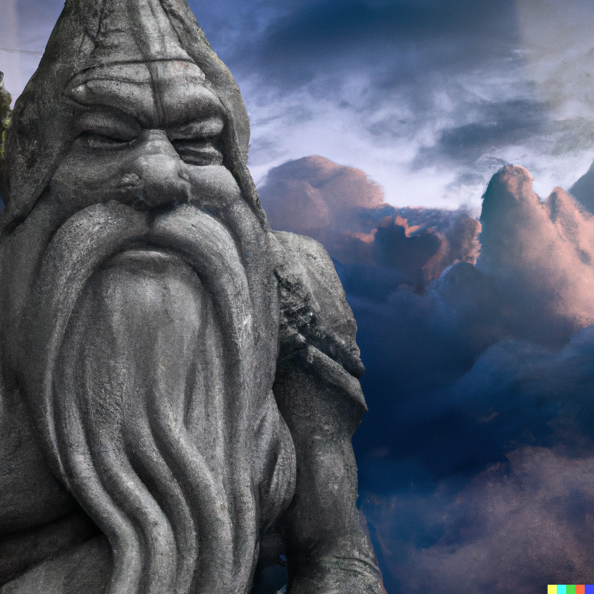

# Ninth Session

## Finishing Business

### Summerday +342 hours

### Dramatis Personae

- *Benjamin*, a 5th-level Elf Ranger
- *Calmul Rhoqiroth*, a 5th-level Dragonborn Artificer
- *CoralKing*, a 5th-level Gnome Monk
- *Geral Bryn*, a 5th-level Human Fighter
- *Orky*, a 5th-level Half-Elf Paladin
- *Steve*, a 5th-level Halfling Rogue
- *Tasbros*, a 5th-level Elf Sorcerer
- *Tysnera*, a 5th-level Elf Wizard
- *Viker*, a 5th-level Eladrin Druid
- *Wulrif*, a 5th-level Human Warlock

#### From the journal of Dame Orky

#### Fourth Round, continued

<!-- markdownlint-disable MD029 -->
2. *Benjamin* shoots his bow twice at a soldier and hits! He does 12 damage.
3. *Calmul* shoots at the archer that *Benjamin* just hit and misses.
4. *Tysnera* found her way back to the group with *Tasbros*. They walk up the ramp from the tunnel to see the battle scene. She shoots a firebolt at the same archer and misses.
5. *Wulrif* tries to spell magic and other stuff the group is not privy to
6. *CoralKing* runs down the hallway near *Viker* and dashes to safety.
7. *Geral* leaps inside the south room a few soldiers are in and screams “for the irregulars!!! Orky, that’s what I call us now!” and hits one soldier for 13 damage.
8. Orky holds her action.
9. *Wulrif* makes a sword-in-a-stone situation in front of him.
10. *Tasbros* gets out of the pit and tries to deal chromatic orb on a leather-clad man east of the fight, at the mouth of a hallway. He decides poison damage and misses his attack. He then makes everyone within 30 ft of him invisible, somehow. If anyone invisible makes an attack, the spell dissolves on that attacker.
11. The bad guys go now…
    - A bizarre spell is cast and everyone is visible again.
    - b. Geral gets attacked by 4 people in that room. 3 Hits for 15 damage total.
    - The southern enemies move west toward our group and the north enemies move east.
    - *Benjamin* gets hit once for 8 HP.
    - *Steve* gets hit for 8 HP.
    - *Benjamin* is hit twice for 8 HP.
    - *Steve* gets hit again for 14 HP.
    - *Tasbros* gets hit by a sword twice for 15 HP.
    - *Wulrif* gets hit for 8 HP, even though he’s in the pit hanging out with the Beholder.
    - *Tysnera* gets hit for 11 HP.
    - *Tasbros* dodges a hit and leans right into another one for 8 HP.
12. *Steve* hits the injured archer for 12 damage and kills him.

#### Fifth Round

1. *Benjamin* hits an archer for 13 damage.
2. *Viker* moves her moonbeam to the southern bridge, which was repaired previously. As a bonus action, she uses her unicorn totem (30 ft radius). Her moonbeam, which she dropped on a poor fool, takes 12 damage and dies.
3. *Calmul* hits someone and does some damage?
4. *Tysnera* casts a lightning bolt (100 ft long 5 ft wide) for 33 damage on every person hit. So, death.
5. *Wulrif* hears the screaming from the pit. He casts misty step to rejoin the team. He uses his bonus action to place a hex mark on someone.
6. *CoralKing* holds his action
7. *Tysnera* gets his with magic missiles and takes 10 HP damage.
8. *Geral* swings in his room again and kills the guy closest to him. He screams “*CoralKing*, I could use some help in here!” and gives him 3 temporary HP
9. *CoralKing* moves into the south room to help *Geral*. He attacks twice and once misses. He deals 8 HP damage.
10. Orky uses vow of enmity and moves to the last guy in the large room and kills him. She turns down the north hallway with the rough terrain and kills the first guy she sees too.
11. *Tasbros* casts a fireball and the enemy wizard reacts and casts a counter spell. He fails, so *Tasbros* kills scores of men, unfortunately leaving the wizard.
12. The enemies’ turn:
    - *CoralKing* skillfully bobs and weaves to take no damage on a few attacks.
    - *Geral* misses some attacks but catches one for 11 damage.
    - *Tasbros* gets hit once for 6 damage. He also gets hit again for 4 damage. The enemies are kind of pissed he roasted their friends.
13. *Steve* shoots his bow and takes out a guy on the south bridge.

#### Sixth Round

1. *Viker* is going to heal *Tasbros* for 13 damage and everyone gets 5 HP of healing. She takes a guy out.
2. *Benjamin* shoots an archer for a critical hit and kills him. He takes aim and misses a shot at another guy.
3. *Calmul* shoots at the remining 3 guys by the central pit and misses.
4. *Tysnera* casts magic missile on those 3 guys and hits them for 8 damage.
5. *Wulrif* eldritch blasts one of the guys and kills him.
6. *CoralKing* uses 3 attacks on a guy and hits all 3 for 32 damage. So, he pulverized him in front of his friends.
7. The wizard disappears!!!
8. *Geral* says “well done your highness, go again!” to allow *CoralKing* to attack again. *CoralKing* hits one critical and another hit to kill the guy. Geral does some damage on a guy.
9. Orky dashes to the south room with *Geral* and *CoralKing*
10. *Tasbros* moves to the edge of the pit and poison sprays one of the guys there. He does 9 damage.
11. The guy standing in front of Orky exclaims “I surrender M’lady!” and throws his hands up. We take him prisoner. The other guys retreated in haste.

#### 1200 XPs

- *Viker* heals *CoralKing* 15 HP and everyone else 5 HP.
- *Benjamin* uses healing spirit for everyone to walk through. 6 people can walk through it for 1d6 HP healing.
- *Benjamin* stands guard in case the magician comes back.
- *Wulrif* joins the group and turns on detect thoughts.
- The group decides what to do with our newfound prisoner and the rest of the castle.
- Orky asks the prisoner: “who else is in the castle?” He responds “no one else, our leader ran off and you slain the rest of us.” *Geral* said “What about the Undead?” He responds: “12 skeletons”. “What about the creature in the pit?” They stay away from the creature in the pit. *Tasbros*: “Who is your leader?” He responds “Iarno Glassstaff, you are much stronger than him.” *Tasbros* asks “Where is he going now?” He said “Probably the black spider.” *Wulrif* detects thoughts and it resembles a Drow.
- Orky wants to turn the soldier in to the authorities but allows input from the group. She reaches for her rope to tie him up and he interjects “I’ll turn myself in to the authorities!” and she nods in agreement. He gets up and leads us to the secret door.
- We move to the north secret door, leading to room 7, a storeroom. We see a door opposite the secret door and one to the south. We go through the one closest to us and find an armory. *Viker* detects magic back toward the pit. *Geral* finds brand new scalemail and grabs it. No platemail is detected. *Viker* and *Steve* grab crossbows. *Viker* grabs a longsword.
- We revisit the sword-in-the-stone and *Viker* casts detect magic. She sees an outline of armor buried in the dirt by the sword and an outline of the hilt of the sword. *Actias* unearths the sword and underneath it is a crypt. There is a sarcophagus in there. This is the burial place of lord Tresendar.
- *Wulrif* speaks to the beholder kin in his native language. He said he wants to be free after he kills all of us. We decide to leave him alone for now.
- We head to room 4, another series of crypts. There are 12 skeletons that rise up to face us.

#### Round 1

1. *Benjamin* hits the bow-wielding skeleton (AC 13) and hits, killing it. He attacks a second one and kills another one.
2. Orky kills two
3. *Tysnera* uses ray of frost and does 5 damage.
4. *Viker* uses ice knife, kills one, and kills another 5 within a 10 ft radius.
5. *CoralKing* moves between 2 skeletons and attacks them both at the same time. They are particularly vulnerable to blunt damage (open-handed attacks) so they get dealt double damage. He hits one for 10 damage. He uses a bonus attack to deal another 14 damage, killing it.
6. *Tasbros* uses firebolt for 19 damage, killing it.
7. *Geral* attacks the last one for 6 damage.
8. *Steve* kills the last one!

- We see the room was a crypt full of skeletons. The crypts are empty now, obviously. We see another single door, which is where the townsfolk are being held. *Wulrif* uses a cantrip to clean everyone up. *Geral* says “we assume you know how to get home?” they say “oh, yes!” he said “ok, just don’t bother the monster in the basement on your way out.”
- The double doors are a long hallway and *Steve* detects a pit trap full of spikes. We go to investigate another room *Steve* finds, that leads us to the wizard’s workshop. *Calmul* gets excited seeing a bunch of alchemy equipment (Mercury, dragonbile, and nightshade). A dwarvish book is available, *Wulrif* takes it, and it’s a journal about the history of Phandalin. A secret door is ajar that looks like the way the wizard escaped. A letter has been left, written in common, with a black spider seal on it. A chest is found at the foot of the bed, *Viker* detects magic within it. *Steve* uses his crowbar to wedge it open and nearly dodges the poison needle. There are 2 scrolls (fireball and charm person) and *Tysnera* takes them both. There are a couple of gems (ruby, 5 carnelians, paradots) 180 silver and 130 gold pieces. Those are most of the rooms other than the crevasse.
- The group decides to return to Phandalin, turns the prisoner in, and Sildar asks where Iarno is. We said he fled. We show him the letter and he figures out that Iarno betrayed him. *Wulrif* asks “Who is the black spider?” and Sildar said he doesn’t know. Iarno used to be a battle mage with Sildar. He was helping Sildar and Gundren to set up the mine in Phandalin. *Viker* asks if there was a love interest that went sour and Sildar said he doesn’t know of any.
- We take a long rest while *Wulrif* reads the letter. He finds a forge of spells that describes a magic sword “magic bringer” for Lord Tresendar. He asks about the beholder and finds that it’s a type of guardian that is bound by a ritual. When a beholder is slain, and is rebuilt, this creature is what is created.
- Gundren wants to go to Wave Echo Cave and we agree. *Wulrif* hands over the journal and recognizes it. We said we found the lord’s crypt. He said his daughter (Aliah - a wizard) probably conjured the beholder. Gundren said the sword (lightbearer) and armor is very valuable and rare.
- We hear a voice along our journey “what are you doing here?” and we look up and see a very large man (30 ft tall) on a cloud staring at us. We state our purpose to travel to Wave Echo Cave. He said if we can activate the spell forge, come back to him and he has a task for us. *Geral* asks him his name and he responds “Zeus”. We agree and move on.

- We hear a booming echo and we see a cave entrance and hear the ocean. Gundren sees a dwarf body and Gundren gasps and runs toward it. He screams “Thardon!” He turns the body over and sees tiny arrow bolts. *Wulrif* starts looking at the bolts and they are silvery but crumble in the sunlight. *Viker* detects magic boots on Thardon’s body. She attempts to pry off the boots and he said “what are you doing? That’s my brother!” She said “…is he using them?” Gundren is taken aback and looks away in hesitant approval. The boots suddenly resize (boots of striding and springing) to her feet.
- We drop down further into the cave and cannot see very far. The spell forge is a place where magic weapons are made. We are looking for that here.
- We decide to head west and it starts becoming a maze of twisty little passages with 6’ high ceilings and several collapsed passageways. We decide to head north. We see a pool with dark water to the west, the shore is full of broken shells and odor. Steps head to the east. *Viker* detects magic and she sees an outline of something in the pool at the bottom, something small and about 20’ down. *Viker* turns into an octopus and dives down. She sees a skeleton and grabs a wand of magic missiles off the body. She generously gives it to *Tasbros*.
- We head forward on the path and encounter a barricaded door. *Viker* decides to turn into a centipede and try to find what’s on the other side. She sees 10 bugbears on the other side.
- We decide to backtrack down the path and send *Steve* down the northeastern hallway with *Viker* on his back. They see a normal, narrow passageway and as we all follow behind, the whole floor and walls start to wrap around and swallow us. We figure out it’s an Ochre Jelly. It’s basically on a jellyfish’s back. Everyone is surprised except for *Benjamin*, *Viker*, and *Tysnera*. They all get attacked.

#### First Round

1. Acid damage of 12 for *Geral*, 8 for *Wulrif*, 13 for Orky, 16 for *CoralKing*, 10 damage to *Tasbros*, 8 to *Steve*, and *Calmul* was spared.
2. *Tysnera* casts firebolt
3. *Benjamin* attempts to find its weaknesses and discovers that it’s resistant to acid, immune to slashing, piercing, and lightening. It has no weaknesses.
4. *Viker* uses Shillelagh and hits for 10 damage.

Now all those who were surprised can act.

#### Second Round

1. *Tysnera* uses ray of frost (AC 8) and does 7 damage.
2. *Benjamin* hits it with his quarterstaff and does 3 damage.
3. *CoralKing* headbutts it, with his feet stuck to deal 20 damage.
4. *Viker* hits it for 13 damage.
5. The jelly goes now and hits everyone with 9 points damage. *Tysnera* gets hit again for 20 HP. 13 damage to someone and 7 to *Benjamin*. *Calmul* gets 13 points of damage.
6. *Tasbros* uses chromatic orb for 28 damage.
7. *Geral* commands *CoralKing* to hit it again. He deals 21 damage.
8. *Wulrif* kills it!

#### 800 XP
