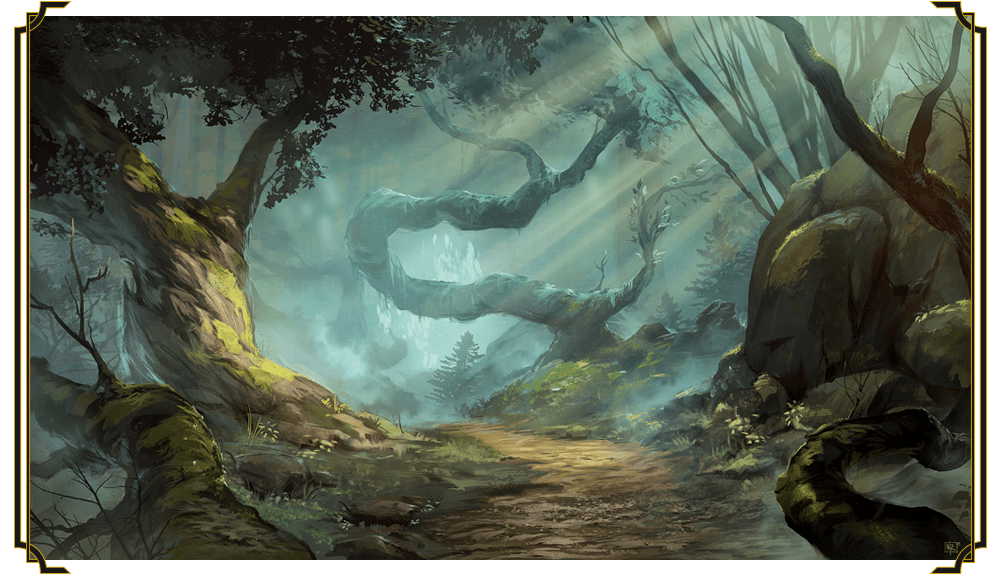

# Second Session

## 2023-01-20

### Dramatis Personae

- Actias Aureus, a 1st-level Otherkin Warlock
- Benjamin, a 2nd-level Elf Ranger
- Calmul Rhoqiroth, a 1st-level Dragonkin Bard
- CoralKing, a 2nd-level Gnome Monk
- Geral Bryn, a 2nd-level Human Fighter
- Orky, a 2nd-level Half-Elf Paladin
- Skolg, a 1st-level Otherkin Rogue
- Steve, a 2nd-level Halfling Rogue
- Wulrif, a 2nd-level Human Warlock

After determining that the goblins in the cave were going to be a persistent threat until taken care of,
the party decided to hide the wagon and oxen in a safe place and go back to the cave. *Benjamin* found
a good location off the main trail for the oxen, and *Wulrif* cast an illusion over the wagon to hide it,
with limited success.

The group set off toward the caves, only to be met by a party of a dozen goblins attempting to ambush them again.
The team succeeded in defeating the goblin raiding party, with a few goblins escaping back into the woods.
*CoralKing* detected and the party avoided two traps along the trail the goblins had set, and the party found themselves
back at the mouth of the cave.

Proceeding cautiously, the party noted the chamber that had formerly held the wolves to contain little more than bloodstains.
Careful investigation revealed a narrow chimney 20' or so up in the chamber, but the climb looked slick and difficult and
no one risked it. Moving deeper into the cave, it again branched, going upwards into a large chamber with a wooden bridge 20'
over the stream flowing down the left side of the main cave tunnel. A side branch also went upwards, but the ceiling was much
lower. While the party was deciding what to do, a huge deluge of water came roaring down the main passage, washing most of the party
nearly outside. A few desultory arrows came out of the darkness, but they had little effect.

The group decided to explore instead the side passage, but this time they made use of pickaxes and ropes that many of them had been
carrying. CoralKing stealthily climbed up the passage, finding another group of 6 goblins arguing and abusing a tied up human.

Turning the tides, the group blitzed into the room, taking down all of the goblins except one, which they kept as a prisoner.

The human prisoner turned out to be *Sildar Hallwinter*, a retired warrior and bodyguard of *Gundren Rockseeker*. He relayed that they
were both ambushed by a large band of goblins with a bugbear leader, who took Gundren someplace else.

The party turned to interrogate the captured goblin, who revealed a number of items:

- The Bugbear's name is *Klarg*, and he's the leader of the band, which numbers more than two dozen. But *Yeemik* is second in command, and know's many things of interest to the group.
- *Klarg* answers to *King Grol*, chief of the *Cragmaw tribe*, who dwells in *Cragmaw Castle*.
- *Klarg* received a messenger from *King Grol* a few days ago. Somone named the *Black Spider* was paying the *Cragmaws* to watch for the dwarf
*Gundren Rockseeker*, capture him, and send him and his effects (but most especially a map) back to *King Grol*.
- *Klarg* took *Gundren* to *Cragmaw Castle*. *Yeemik* can lead the party there.

At this point *Sildar* interrupts, saying he needs to get to Phandalin along with the supplies, because he needs to find out the whereabouts of
his friend, *Iarno Glasstaff*, who went to *Phandalin* last summer to prepare the way. He offers an additional 50 gold pieces for safe escort to *Phandalin*.

The party agrees that they need to get *Sildar* and the wagon of supplies to *Phandalin*, and then find *Gundren*.

Turning south along the *Triboar Trail*, the party, along with *Sildar* and *Yeemik*, head towards *Phandalin*.

They pass another wagon that has been torn apart, bodies littered everywhere. As they approach, the bodies rise with a groan and attack.

These strange undead puff blinding clouds of ash when hit. Worse, they seem resistant to swords, arrows, and even *Calmul*'s breath weapon.
They likewise take no notice of charms or enchantments, but *Orky* has success with her mace, *Coralking* with his headbutts, and *Geral* with a
makeshift club. *Actias* and *Wulrif*'s spells likewise affect the monsters. *Benjamin*, *Steve*, and *Skolg*,
equipped with only slashing and piercing weapons, guard *Yeemik* to ensure he doesn't run off in the confusion.
*Silmar* yells out that these are "Ash Zombies".

The Ash Zombies go down very hard, but eventually they do go down.

The party stops to rest and recuperate.

