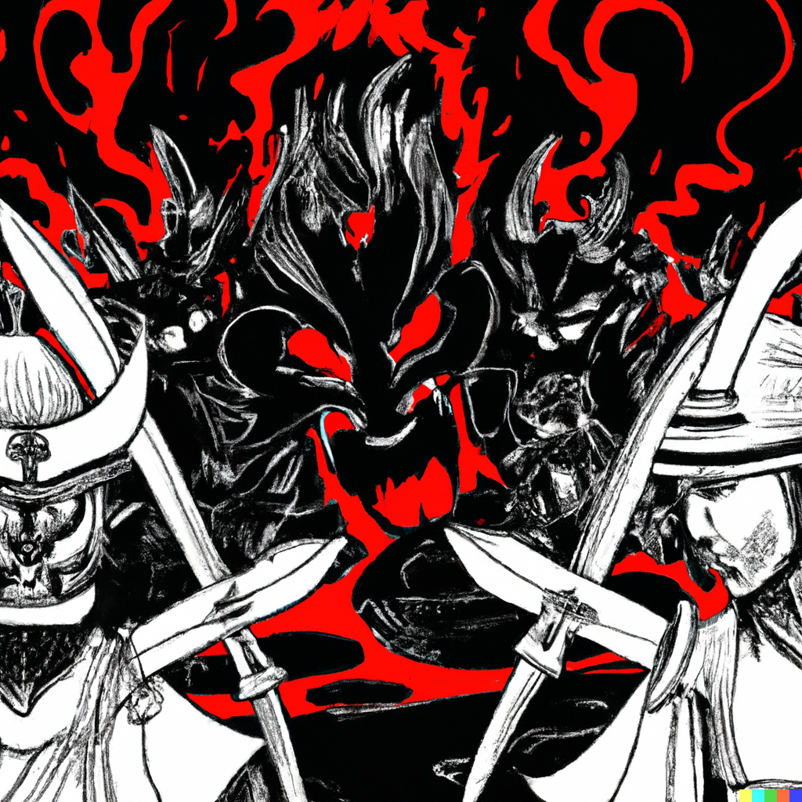
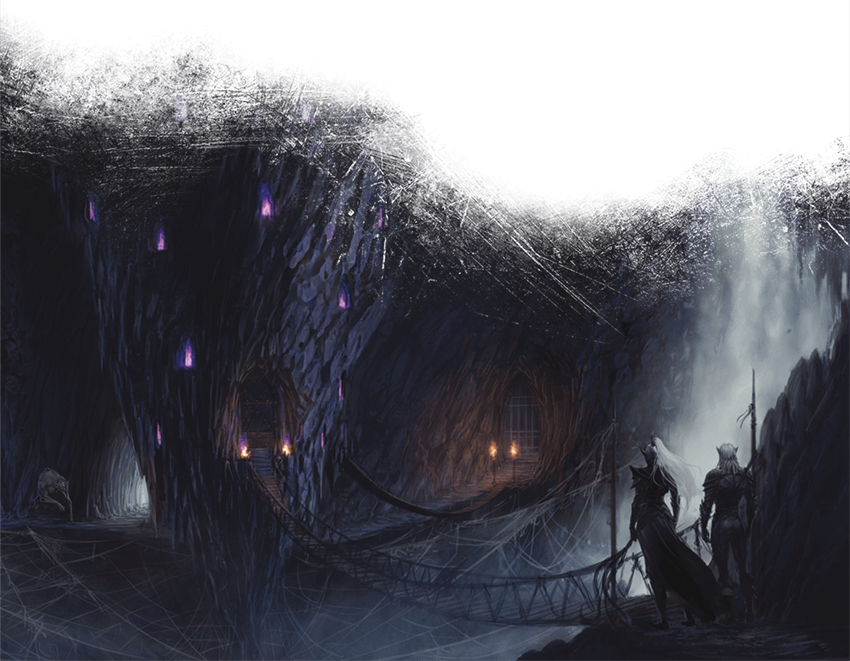

# Seventeenth Session

## Escape from Velkynvelve

### Dramatis Personae

- *Benjamin*, a 9th-level Elf Ranger
- *Calmul Rhoqiroth*, a 9th-level Dragonkin Artificer
- *CoralKing*, a 9th-level Gnome Monk
- *Geral Bryn*, a 9th-level Human Fighter
- *Orky*, a 9th-level Half-Elf Paladin
- *Steve*, a 9th-level Halfling Rogue
- *Tasbros*, a 9th-level Elf Sorcerer
- *Tysnera*, a 9th-level Elf Wizard
- *Viker*, a 9th-level Eladrin Druid
- *Wulrif*, a 9th-level Human Warlock

### Summerday +588 hours

*Calmul* watches, fascinated, as *Chiyo* manipulates the needle, tracing intricate patterns of inky blackness across *Geral's* broad back.

*Wulrif's* familiar zooms over and around the tableau, looking at the scene from many different angles.

*Chiyo's* darkness insulates them from the rest of the world.

A pattern takes shape, fantastic figures depicting battle against infernal forces.

*Geral* wakes with a start to a droning, buzzing sound. *Calmul* is snoring, his Steel Guardian marching resolute circles around the pair.

A feeling he ought to be thinking of something.

> *The rest of the party is gone*, says *Wulrif's* voice in his mind.
>
> "What has happened?"

*Gruumsh* points to a wide pit in front of the ruined Cathedral gate.

> "A Giant flew in as a little bird and taunted your companions. When they insulted it back, it summoned a Purple Worm from the Underdark and attacked.
> Your wizard banished the Worm, but by the time we could reach them, it had flung them down the Purple Wormhole and fled."
>
> "A Fire Giant?", asks *Geral*, thinking of their last enemy commanding the forces attacking the Dwarven Mining Crawler.
>
> "A Smiling One", said *Chiyo* darkly. "We know it. We sought its help against the coming of *Icewing*, but it is playing a different game.
> Something fell has happened to the Ordning."
>
> "Ordning?" asks *Geral*.
>
> "The power structure of Giants. It is complex, and seems to be changing."
>
> "Why would you seek help from Giants against a Dragon?"
>
> "Ah, you do not know of the Great War fought between Dragons and Giants in ages past. Well, that is a tale for another time --
> what are you going to do now?"

*Geral* stares hard at the Purple Wormhole.

> "My people," rumbles *Gruumsh*, "do not wish to hang about an accursed Cathedral."

Still looking, *Geral* nods. Command places a heavy burden.

* * *

Except for *Benjamin*, they never saw it coming.

One moment they were trudging along single file in the weird luminous gloom of the Underdark, then darkness cut off that vision.

*Benjamin* starts, avoiding 3 darts before taking 5 more. *Orky* feel the pricks of bolts and hears her companions slumping into unconsciousness around her.

> "Cease attacking!" A strong, silken female voice.

*Orky* clenches her gauntlets, feeling Divine Power building in her Greatsword.

The Drow Priestess locks eyes with her.

> "Surrender, or your friends will die."

She could smite this woman and a half-dozen of them back into whatever foul pit they crawled from, but then what?

The Drow Elite Guard shuffle, all weapons pointing unerringly at her.

> "Last chance -- then they become fodder for spiders."

*Orky* stares hard at the half-Drow half-Spider things. They scuttle backwards.

Finally, she nods.

They take her weapons and place magic shackles on her, but know better than to push it further. The huge spider-centaurs
come forward and, as *Orky* watches, subdued, her companions are webbed to their broad backs.

* * *

The Clan women and children march in the center of a hollow square of Ogres, who bear huge loads upon their backs, in a surprisingly disciplined formation. Two shamans break the trail and one follows, some sort of
magic making the passage of the large group both quieter and less discernible. The remaining Orcs range out widely from the group. Two of them, riding Velociraptors, pull up abruptly to *Gruumsh* and *Chiyo*, talking
excitedly while their mounts snarl and drool in anticipation. *Gruumsh* abruptly jumps up onto a raptor as its rider smoothly dismounts. *Chiyo* blurs and takes to the sky as a large black Raven. The group
comes to a halt as the Orcs run, following their leader. The dismounted Orc rider glares sullenly at *Geral*.

After a time, one of the Shamans cocks his head and then lets out a celebratory cry. The group changes direction and follows the path of the outriders.

A short march leads to the site of a Thunderbeast kill, the Velociraptor mounts already feasting. The Clan makes camp around the savage scene, the Orcs quickly erecting wooden stakes around the perimeter while
the Ogres drop their burdens and begin digging a huge firepit. A Tyrannosaur lurks off in the distance, but a black bird seems to be perched upon its snout.

Great quantities of wood are gathered and much of the meat is cooked in the baking sun. There is dancing and loud ululations that seems to pass for singing in the Clan as everyone gorges upon the kill.

Later, the Ogres tear great strips from the carcass, swelling their packs even larger.

Within a few hours, the Clan dissembles the stakes and leaves the scene.

As the group marches toward **Phandalin**, *Geral* can see the unmistakable form of the Tyrannosaur partaking in the remains.

> "You will convince the Humans to co-exist with us?" rumbles *Gruumsh*, a few hours later.
>
> "I will," replies *Geral*.
>
> "We will see," huffs *Gruumsh*, as **Tresendar Manor** comes into view.

* * *

Captured by the Drow! You wouldn’t wish this fate upon anyone, yet here you are — on a platform suspended by spiderwebs above a seemingly endless abyss, the cold, heavy weight of metal tight around your throat and wrists. You are not alone. Other prisoners are trapped in here with you, in an underground outpost far from the light of the sun. Your captors include a cruel Drow Priestess who calls herself *Mistress Ilvara* of **House Mizzrym**. Over the past several cycles, you’ve met her several times, robed in silken garments and flanked by two male Drow, one of whom has a mass of scars along one side of his face and neck. *Mistress Ilvara* likes to impress her will with scourge in hand and remind you that your life now belongs to her.

> “Welcome to **Velkynvelve**! Accept your fate, learn to obey, and you may survive.” Her words echo in your memory, even as you plot your escape.

Some of your fellow prisoners do not accept this fate. A stubborn Dwarf refuses to do the pointless work your captors assign, and is summarily thrown over the edge of the platform. He falls a hundred feet into a web and quickly beset upon by Giant Spiders, some blinking into and out of existence.

The last Dwarf in your wretched band of captives is taken up into the smaller of the three Stalagmites, doorways leading to unguessable chambers. A piercing scream, and black mist tinged with red flows out of doorway and various orifices of what is now, clearly, a vile temple of some kind.

* * *

> "Thane *Geral*!," greets *Sildar*, as *Geral* enters the Townmaster's Hall.

The two clasp forearms in the Protector's greeting of fellow soldiers.

> "I have procured the militia to protect **Phandelver Mine**, and this town," says *Geral* with a winning smile. "But you're going to have to trust me."

*Sister Garaele* and *Reidoth*, a big hulking Druid and friend of *Qelline Alderleaf* and her son *Carp* who led the party through the back way into **Tresendar Manor**, stare
impassively at *Chiyo*. *Sildar* looks back and forth between the Oni and her husband, a wary expression on his face.

> "We have the Ward Stone," says *Gruumsh* in surprisingly unaccented Common. "We took it from the Vampires we slew at the Cathedral."

*Sildar* looks at *Sister Garaele*, who nods minutely. *Reidoth's* scowl fades.

> "I had noted their infestation," he declaims, "but was busy with the Dragon."
>
> "*Icewing*?", asks *Gruumsh*.
>
> "*Venomfang*", replies *Reidoth*.
>
> "A curse upon Dragons!" roars *Gruumsh*.

*Reidoth's* craggy face relaxes into a slight smile.

> "We'll need a Bishop to re-consecrate the Ward stone", interjects *Geral* smoothly.
>
> "I will message **Neverwinter**", replies *Sister Garaele*.
>
> "And where will the Clan be housed?", asks *Sildar*. "Our farmhouses will not suffice ..."
>
> "**Tresendar Manor**", replies *Geral*.
>
> "Hmmm." *Sildar* looks thoughtful. "That could work."
>
> "My people can provide for themselves, but we want to be able to buy the things we cannot make for ourselves, from you," rumbles *Gruumsh*.
>
> "That's fair," notes *Geral*.
>
> "The **Phandalin Miner's Exchange**," says *Sildar*, stroking his chin, "the folk there are more rugged and tolerant."
>
> "I will send only my most level-headed warriors," says *Gruumsh*, "but they will not tolerate disrespect whatever I tell them."
>
> "Miners are a practical folk," says *Sildar*. "We'll keep the Dwarves away for now."
>
> "About that," says *Geral*.

* * *

**Velkynvelve** is three large stalagmites hanging from the roof of a vast cavern. Above, endless skitterings and shriekings announce the presence of huge flocks of flying creatures that somehow nest
in the unseen roof above. Below, endless spiderwebs and the spinners thereof.

In between, the prisoners huddle on a large platform made of some strange-grained wood hung between the inverse towers of **Velkynvelve**. The larger upside-down tower seems to be where *Mistress Ilvara*
and her ilk dwell. The mid-sized one appears to be barracks for the Drow soldiers, who number perhaps a score. The smallest one is the accursed temple.

White-furred and savage, Quaggoths move freely amongst the prisoners, feral eyes and teeth gleaming as they appear to consider which of the prisoners would make the tastiest meal. They climb freely around
**Velkynvelve**, seeing to unguessable tasks.

The hours pass slowly. The Drow guards play cruel games with the prisoners, giving them pointless make-work such as coiling and uncoiling large lengths of silken rope, and moving stone ballast from one side of the
platform to the other, laughing when sudden shifts cause everyone to flatten as their tiny world swings from side to side.

* * *

> "Thane *Geral*!", greets *Gundren*, as *Geral* enters **Phandelver Mine**. "And my old friend *Sildar*! This is a great hour indeed!".
>
> "I bring great news! I have brought the militia that will defend **Phandelver**!" intones *Geral*.
>
> "That is great news indeed," says *Gundren*, urgently. "My scouts have reported a large war-band of Orcs and Ogres in the area."
>
> "Then let me ease your mind!" replies *Geral*, a touch too heartily. "They are indeed the militia under my command!"

After fifteen minutes or so, *Gundren* finally runs out of curses.

> "You're going to have to trust me," says *Geral*, winningly.

* * *

The party has been stripped of all of their gear, and are dressed only in rags.

Speaking in hushed whispers with the other prisioners, in moments snatched from under the watchful glare of the Drow, the party learns the following:

- There are slightly more than two dozen Drow in **Velkynvelve**, including *Ilvara*, another Priestess *Asha*, and their lovers *Shoor* and *Jorlan*, who are Sorcerors.
- The inverted towers each have 3 guards on duty at all times
- The main tower has an anti-magic effect, and seems to be where prisioners are processed before being thrown onto the platform
- The smaller tower seems to be the barracks for the guards
- No prisoner has ever returned from the smallest tower
- It might be a matter of cycles before a contingent from **Menzoberranzan** arrives to take the remaining prisoners

* * *

> "You want to go where?" asks *Gundren*, disbelievingly.
>
> "The Underdark," replies *Geral*.
>
> "I thought that's what you said, but I didnae imagine yer had a death wish."
>
> "As it happens, you already have a partial portal there."
>
> "Aye, the Fungal Cavern. We were thinkin' a hae to block it off."
>
> "Well, first I'd like you to dig a tunnel."
>
> "That seems mad, but I know yer want to find yer companions and all. Seems a' hopeless task, dinnae yer ken how big the Underdark is?"
>
> "Trust me," replies *Geral*.
>
> "I was afraid a' you'd say thaet."

Two cycles later, the Dwarves have dug a 6'x6' shaft straight through the remains of the Fungal Overlord and into the porous rock. It ends on a shelf of granite on the
lip of a vast crevice stretching unimaginably deep.

> "Here goes nothing," says *Calmul*, tossing his finely-wrought, seven-hundred foot length of rope ladder over the edge.

*Geral*, *Calmul*, *Wulrif*, and the faithful Steel Guardian take their time climbing down the endless darkness.

* * *

Disheveled as the rest of the group, but somehow escaping the unwanted attention of the Drow guards and Quaggoths, *Steve* repeatedly studies the main Stalagmite, a calculating gleam in his eye.

* * *

The cavern is covered with florescent green lichen, and even *Geral* and *Wulrif*'s eyes can appreciate the strange splendor of the Underdark as they march its trackless depths.

> "Hmmm ... it appears that Divination and Alteration magic do not work in this place," says *Wulrif* musingly.
>
> "Well, that's not good. Then again, it's not as if I expected this would be easy," replies *Geral*.
>
> *That's not strictly true* says a voice in their minds.

*Geral*, *Wulrif*, and *Calmul* whirl around, looking for the source. In a distant cavern, a pool of unnatural inky blackness swirls.

> *Do not be alarmed, I mean you no harm.*
>
> "Have you seen a group of adventurers, perhaps lost?" replies *Geral*.
>
> *I am aware of a group taken captive by the Drow*, the mental voice replies. *Mostly Elves, but two smaller folk among them.*
>
> "Did they look like this?" asks *Geral*, firmly fixing his memories of *Actius*, *Orky*, *CoralKing*, *Benjamin*, *Steve*, *Tasbros*, *Tysnera*, and *Viker* in his mind.
>
> *Ah yes, those are unusually sharp impressions. I believe that was indeed the group taken.*
>
> *They are alive?* interjects *Wulrif*, telepathically.
>
> *Very good* the Voice seems amused. *They are alive, for now, but the Drow will doubtless have uses for their ... power.*
>
> "Do you know where they are?"
>
> ***Velkynvelve**, undoubtedly, for that is where Drow in this area take their prisoners.*
>
> "How do we get there?"
>
> A mental laugh. *You would probably be eaten or lost if you were to attempt to traverse the space locally.*
>
> "Anything you can do to help direct us, we would appreciate."
>
> *Locally?* asks *Wulrif*
>
> *Very good indeed*. The mental laugh again. *I know of a global shortcut*.
>
> "What does that mean?"
>
> *I can project you to my fellow Society member, who is at this moment surveilling **Velkynvelve**.*
>
> "What do you ask of us in return?"
>
> *Only that you convey any information you may gain from the Drow to the **Society of Brilliance**.*
>
> "That we will do," says *Geral*.
>
> *Indeed, you have so far shown yourself to be a Being of Honor. I will project you to my companion, Skriss. Do not be alarmed at his appearance, he
> is un-dangerous to your kind, unless provoked.*
>
> "You have our thanks. What is your name?"
>
> *Grazillaxx*.

The darkness dissipates, and for a moment they see a tall, mauve figure with horrible tentacles for a face. Then reality fades ...

* * *

The hours on the platform drag on.

Her companions conspiring to draw the guards attention, *Viker* slips over the edge of the platform before shapeshifting into a Giant Spider.

She explores the webbing external to **Velkynvelve**, noting the locations of her fellow spiders as well as the delicious meats guarding the less-delicious meats.

Climbing along the non-sticky threads, something at the edge of the crevasse catches her attention.

* * *

*Geral* can't see much in the darkness, but the fetid stench of the Troglodyte tests his limits.

> "Our thanks, *Skriss*"

A snuffling grunt in reply, then a large scaly reptillian arm points down a particular path. The cavern is so big no one can see its limits. Vast subterranean air currents stir.

The mini-Beholder emits a series of grunts and clicks, then dives into *Wulrif's* cloak.

*Geral*, *Calmul*, and *Wulrif* trudge forward in the darkness, leaning into the swirling wind. A waterfall can be heard somehwere off in the distance, though no water can be seen.

After awhile, dim lighting can be seen ringing what appear to be three inverted towers. Something in the darkness sways.

*Wulrif* coaxes his familiar out.

"I'm going to look around," he says, after admonishing the Gazer. "Yes, you be careful."

* * *

She's nearly at the end of her shapechange time, but something familiar is ahead.

*Viker?* *Wulrif's* voice echoes in her mind.

Their reunion is joyful, if muted. Reaching nearly the end of her endurance, *Calmul*, *Geral*, *Viker*, and *Wulrif* devise an escape plan.

*Viker* scuttles back as fast as she can to convey the joyful news.

* * *

The plan starts with the greatest larceny in *Steve's* career.

Supremely sneaky, *Steve* climbs unseen into the largest stalagmite, somehow avoiding the sharp eyes of the Drow. He melts into the shadows of the garrison, gone for a few intense
minutes, before reappearing with a spiderweb satchel of weapons. Somehow he climbs back down without a clink of metal or cry of alarm.

Then he does it again. And again. And again. And again.

When *Steve* is finished, the party has recovered their precious magic items and most of their wealth. Their mundane items were too numerous and, *Steve* deemed, too bulky and risky to retrieve.

Stage two starts off with the simultaneous explosion of *Viker's* Daylight spell and *Wulrif's* Synaptic Static, both encompassing the guard positions of the middle tower.

As the Drow reel from the twin hammering of light and pychic energy, the party leaps over the edge and onto the non-sticky threads that *Viker* spun while in Spider form.

The party races down twin tightropes, a thousand feet between them and safety, endless dark below if they fall.

*Tasbros* bobbles and sways dangerously at one point, but somehow regains his balance.

By the time the Drow have recovered and Dispelled Daylight and Synaptic Static, the party has reunited joyfully on their end of the cavern.

Not stopping for long, the Irregulars race into the darkness, the Drow pursuit behind.

* * *

> "I think we lost them," says *Tysnera*, breathlessly.
>
> "We should keep going," replies *CoralKing* with no trace of exertion in his voice.
>
> "Yeah, that kinda might be a good idea," says *Steve*, huffing. "Just let me catch my breath and we can keep going."
>
> "Is there any particular reason, other than not wanting to be tortured or sacrificed?" asks *Geral*.
>
> "Well, y'know, the Drow High Priestess? She might be kinda a little upset," says *Steve*.
>
> "She seemed pretty upset before," replies *Geral*.
>
> "Yeah, well, I took back our stuff, what belonged to us, y' know? But I *stole* her Hand Crossbow and Tentacle Rod," says *Steve* proudly.

#### 5,000 XP
