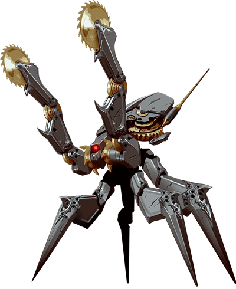
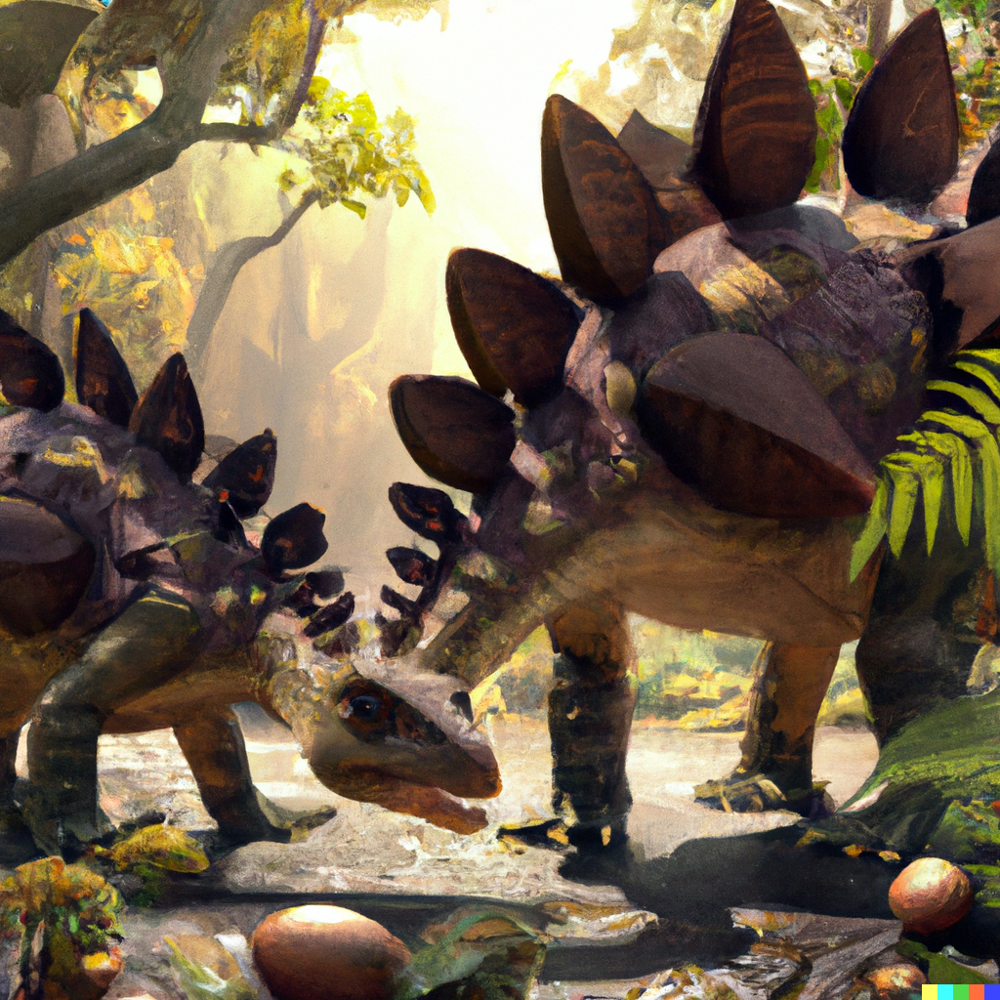

# Seventh Session

## Return of the Automatons

### Summerday +294 hours

### Dramatis Personae

- Benjamin, a 4th-level Elf Ranger
- CoralKing, a 4th-level Gnome Monk
- Orky, a 4th-level Half-Elf Paladin
- Steve, a 4th-level Halfling Rogue
- Viker, a 4th-level Elf Druid

#### From the journal of Dame Orky

Gundren is so happy to see us! He wants to return to Phandalin and then take us along to Wave Echo Cave.
Gundren was in King Grol’s chamber and grabs his map. Steve finds 3 healing potions, 220 sp, and 160 electrum hidden under a filthy mattress.
King Grol had black armor and a black sword, which Calmul says is made of [Adamantium].
Gundren recognizes the sword and armor as Sildar’s, who he says will probably want it back. For the time being, I take the chain mail and Viker takes the sword.

There is a large beast trapped in the castle. Benjamin wants to open the door. I do not!
Benjamin starts digging and we see a paw digging from the other side! Its head comes out and we see that it’s an Owl Bear. 
Now it’s completely out, sees us, meanders over, and starts snacking on the remains of a goblin. A few of us go to explore the room it came from. 
We move 30 ft toward a different corridor and attempt to go around the Owl Bear, which starts growling at us. Steve tries to sneak around the Owl Bear, but
his Stealth roll fails. So, he uses Luck but fails again. He is forced to step carefully back and move through another corridor. The Owl Bear stops growling and turns back to it's Goblin.
We follow Steve. We can still hear growling and shuffling but it gets fainter. Viker, who is waiting outside the castle, sees the Owl Bear run off.
I stay back to keep distance, everyone else enters the room.

The room is a silo that extends far up into darkness. Benjamin and CoralKing see a jagged ledge that used to be a second floor. 
Back from the ledge, nearly hidden, is a chest. Benjamin manages to get up to that ledge. Steve climbs up a rope that Benjamin throws down.
Steve uses a crow bar to pry the chest open. It has coins, 2 scrolls, and a potion bottle. 
Steve takes the coins (120 gp and 90 electrum). He gives Benjamin a scroll and Viker the other scroll, along with the potion.
Viker can identify the scrolls.

Steve takes a cursory look around and sees that there’s not much left in the rest of the castle. As we join Viker we hear a weird crashing sound in the forest. 
Viker identifies the potion as healing and the scrolls are Silence and Revivify. Since we found the 3 healing potions with Gundren, we now have 4.
We also now hear a clicking sound like the ones the automatons made when they chop up a body.
Viker and Benjamin go to investigate the sound. They find a clearing with 2 Stegosauruses, one on the ground. 
The automatons are trying to reach it, but the other Stegosaurus is whipping around with its tail, defending it.
We can also see a clutch of eggs by the fallen Stegosaur.

Meanwhile, Steve, CoralKing, and Orky are hearing the noises. The automatons turn toward us like they might attack. So, well, we roll Initiative:

#### Turn 1

1. Benjamin uses Hunter’s Sense. They are Constructs, vulnerable to Acid. They are immune to Lightning, Poison, Cold, Fire, Radiant, and attacks from Piercing/Slashing non-magical weapons. We find all this out later, Benjamin only has time to shout out "Use magical weapons!".
2. I approach the closest Construct and swings my Infused Greatsword, missing.
3. Viker uses her new Longsword and hits, doing 5 damage.
4. Steve hides.
5. CoralKing attacks the other Construct with an unarmed strike and a bonus strike. He hits with one and deals 7 damage.
6. A Construct attacks me and hits. It deals 9 points of damage after 3 attacks. A second one Lightning Bolts CoralKing with (luckily) 4 points of damage. The 3rd one attacks the Stegosaurus and hits all 3, one critically. It deals a lot of damage. The stegosaurus staggers but attacks back. Because its tail spikes are mostly piercing, it deals little damage.

#### Turn 2

1. Benjamin tries to communicate to the Stegosaurus that we are going to help them. He attacks a Construct with his Quarterstaff, missing.
2. I attack again and do 8 damage. (18 to hit)
3. Viker uses her spirit totem (Bear) as a Bonus action, giving everyone 9 temporary hit points. She swings her sword and hits, dealing 8 damage.
4. Steve makes an unarmed strike and misses.
5. CoralKing makes an unarmed strike and crits, dealing double damage (7).
6. I get messed up by the Constructs and do 20 damage in return. Viker gets hit once and takes 3 damage. The 3rd one attacks the Stegosaurus.

#### Turn 3

1. Benjamin misses.
2. I Disengage and moves behind the Construct to flank it with Viker and gain Advantage. Then, I cast Searing Smite as a Bonus action (extra 1d6 fire damage + my enemy must take a constitution save)
3. Viker misses her attacks.
4. Steve hits the construct critically and does 3 damage.
5. CoralKing hits one headbutt and does 5 damage.
6. The Constructs hit CoralKing 1/6 times with their flanked advantage on him, lucky! He gets 9 points of damage. I get bit for 7 points of damage. One of the Constructs shoots 2 bolts of Lightning at another damaged Construct and heals it 34 HP! The Stegosaurus attacks and does 15 damage.

#### Turn 4

1. Benjamin moves and heals me for 9 HP while a Construct gets an Opportunity attack on him but misses.
2. I hit and deal 22 damage! However, the extra flames don't seem to have an effect.
3. Viker disengages and moves to the 3rd construct (it is the most damaged since it keeps getting hit by the Stegosaurus) to cast a Shillelagh cantrip as a Bonus action which gives her wooden staff magical damage.
4. Steve hits a Construct with an Unarmed attack and does 2 points of damage.
5. CoralKing uses Step of the Wind (which disengages from the 2nd Construct as a bonus action) to move and flank the 1st Construct with me and attack. He hits and does 8 damage.
6. The 2nd construct moves closer to me and attacks. They hit twice and deal 10 points of damage but only 4 stick. Remember that every hit is reduced by 3 because of my armor and feat!
A critical hit is also done by the 1st construct and does 22 points of damage, 19 sticks. The 3rd one attacks Viker and does 7 points of damage. The Stegosaurus flanks and hits a construct for double damage! That Construct is down!

#### Turn 5

1. Benjamin heals me for 9 points!
2. I swing on the 1st construct, do 14 damage, and it goes down! So, a fully healed construct is still up.
3. Viker hits the 2nd construct (the one remaining) and deals 3 damage.
4. Steve hits the construct and does 2 damage.
5. CoralKing moves closer to the remaining construct using his Flurry of Blows and hits once. He does 5 damage.
6. The 2nd construct heals the 1st one and revives the 3rd one. The Stegosaurus knocks the 3rd one over again.

#### Turn 6

1. Benjamin heals the downed Stegosaurus for 12 points.
2. I hit with the Greatsword and do 14 damage to the 1st construct.
3. Viker hits it so the Construct is back down.
4. Steve misses a dagger throw.
5. CoralKing does 11 damage to the remaining construct with a flurry of blows!
6. The construct heals his friend 13 and the other 17. The Stegosaurus hits with advantage and drops one. The other Stegosaurus moves and misses a whack on the 1st construct.

#### Turn 7

1. Benjamin misses but is now flanking the Construct.
2. I hit the 17 HP Construct and do 15 damage.
3. Viker hits the damaged Construct and knocks it over again. She also hands Steve her Longsword while keeping her Shillelagh.
4. Steve swings on the 1st construct with the Longsword and lands a critical hit for 19 damage! We should have given him the Longsword sooner!
5. CoralKing uses his Flurry of shinkicks with 1 hit and 1 crit for 15 damage.
6. 1 construct gets 21 HP and the other one gets 14 HP. The Stegosaurus hits the 21 for 15 damage. The other Stegosaurus swings and misses.

#### Turn 8

1. Benjamin misses a swing with his staff.
2. I knock the one on 5HP down.
3. Viker drops a Construct.
4. Steve moves to the Contruct with 14 HP and misses a swing.
5. CoralKing flanks the last Construct and uses his Flurry of attacks. He hits once, deals 7 damage, and it drops! As it falls apart, the magic ring and a black, decayed finger fall out of it!!!

The Stegosaurs turn toward us, not knowing if they need to defend themselves against us. We back off, slowly. Benjamin and Viker speak soothingly to the animals. It turns out the female was the one up defending
while her mate took a lot of Lightning bolts. We leave the Druid and the Ranger to communicate.

The Constructs have a single large, jeweled eye in the center of their face, and are made of [Adamantium]. As we remove the eyes we can see the life fade from them. We all gather up as much of their material as we can and stuff it into our backpacks. We go back to our group at the castle and take a long rest.

#### 1,520 XP for each player

[Adamantium]: ../game/magic-items.md#adamantium
