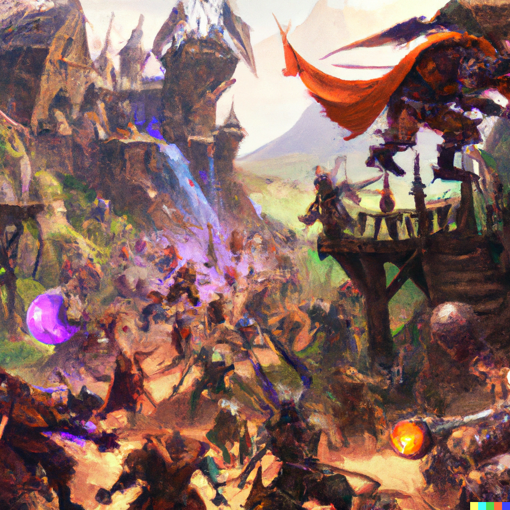

# Sixth Session

## Attack on Cragmaw Castle

### Summerday +270 hours

### Dramatis Personae

- Actias Aureus, a 4th-level Otherkin Warlock
- Benjamin, a 4th-level Elf Ranger
- Calmul Rhoqiroth, a 3rd-level Dragonkin Artificer
- CoralKing, a 4th-level Gnome Monk
- Geral Bryn, a 4th-level Human Fighter
- Orky, a 4th-level Half-Elf Paladin
- Steve, a 4th-level Halfling Rogue
- Tasbros, a 4th-level Elf Sorcerer
- Tysnera, a 4th-level Elf Wizard
- Viker, a 3rd-level Elf Druid
- Wulrif, a 4th-level Human Warlock

**From the journal of Dame Orky**

Thus begins the smiting of Evil:

*Initiatives & First Turn:*

1. Benjamin comes in the west-side door and opens a door to attack a pack of Goblins.
2. Coral King attacks Goblin A with a strike and hella misses.
3. Steve shoots his Short bow, crits Goblin D and kills it.
4. Calmul blasts Goblin E with his musket for another kill.
5. Tysnera casts Firebolt on a Goblin but misses.
6. Viker casts Frost Bite on Goblin dealing 3 damage and Disadvantage on its next attack.
7. Wulrif Hexes and Edrich Blasts a Goblin, killing.
8. Actius Edrich Blasts Goblin B and downs it.
9. Geral swings on Goblin C and deals 6 damage.
10. Tasbros damages Golbin AA Goblin with a Psychic effect.
11. Goblins attack Benjamin and deals 8 points of damage, same on CoralKing, who Fades Away as a Reaction.

*Turn 2*

1. Benjamin get hit by some sort of creature with tentacles, tail and lots of range, taking 19 damage. (I think it’s a Displacer beast-nope!)
2. Benjamin uses his Hunter's Sense to discover the creature is Resistant to Bludgeoning, Piercing, and Slashing with nonmagical weapons. A hit by the tentacles allows it to drag you into its area even though we still can’t see all of it.
3. Benjamin gets messed up and heals himself.
4. Here we find out that it’s a Grick Alpha.
5. CoralKing attacks a damaged Goblin with a hit and kills it.
6. Steve ducks and comes in from behind and kills a Goblin.
7. Calmul shoots at a Goblin and misses.
8. Tysnera casts Firebolt and misses.
9. Viker kills a Goblin.
10. Wulrif attacks the Hexed Goblin and kills it.
11. Actius Eldritch Blasts, hits, and deals 9 damage to a Goblin, killing it.
12. Geral hits a Goblin and rocks him.
13. I hit and kill the last Goblin, then move toward the Grick.
14. Tasbros moves toward the Grick.
15. The Grick slithers along the walls and encounters us. It attacks Steve with tail and tentacles, missing.

*Turn 3*

1. 2 Goblins and 4 Hobgoblins come in behind the Grick with 8 more from the Front.
2. A Goblin misses Benjamin and 2 Hobgoblins too.
3. Tasbros gets hits once and gets 7 points of damage.
4. Benjamin disengages and steps back.
5. CoralKing moves and attacks the Grick with his hands in a flurry and hits once. Damage is 3 points.
6. Steve disengages, hides behind Orky, and attacks a Goblin. He deals 16 damage and kills a goblin.
7. Calmul shoots a goblin and kills it with a crit.
8. Tysnera casts Melf’s Acid Arrow against the Grick and misses. But still does 5 splash damage.
9. Viker kills a Goblin.
10. Hobgoblin misses 2 attacks on CoralKing.
11. Wulrif casts something against Grick, it makes a wisdom save, it failed. It takes 21 damage. It immediately slithers away.
12. Actius removes earth under the Hobgoblin Leader's feet. It makes a saving throw and fails, falling prone. (He gets disadvantage, and everyone else gets advantage on him).
13. Geral misses an attack on something.
14. Orky hits the hobgoblin and does 15 damage and it looks hurt!
15. Tasbros casts sleep on all of the remaining Goblins.
16. The Grick moves forward again and attacks Tasbros. He casts Mirror Image and the tentacles hit one of the duplicates. The tail hits another duplicate. If a tentacle would have hit, it would have taken a bite as well. Luckily, Tasbros did pretty well!
17. The Hobgoblin attacks Tasbros and misses. It hits Viker and deals 7 points of damage. Another one deals another 7 points of damage. Another one misses Tasbros and Steve. Another one misses Orky.
18. The Hobgoblin Leader gets up from prone.
19. The Hobgoblin Leader attacks CoralKing and misses.
20. A Hobgoblin tries to shove CoralKing and succeeds, knocking CoralKing prone.

*Turn 4*

1. Benjamin hits a Hobgoblin and deals 10 points of damage.
2. CoralKing high kicks the Hobgoblin Leader and deals 8 damage.
3. Calmul shoots a Goblin and kills it
4. Tysnera casts Sleep on 3 goblins (lowest hit points first).
5. Viker throws an Ice Knife at the Grick and hits, doing 12 damage.
6. The Hobgoblin Leader attacks Geral and hits twice, doing 23 damage.
7. Wulrif hits the Grick with an Eldritch Blast and does 13 damage.
8. Actius misses.
9. Geral has advantage on the Captain and misses. He heals 14 HP.
10. Orky channels a Vow of Enmity and hits the Hobgoblin Leader, doing 14 damage.
11. Tasbros casts Ray of Frost, doing 5 damage and reducing speed by 10 on the Hobgoblin.
12. The Grick attacks Tasbros and misses with the tail. It hits with a tentacle and does 12 damage. Then it drags Tasbros in for a bite with the beak, doing another 11. Tasbros is not dead, but also not doing well.
13. 2 Goblins attack Viker and both hit, for 8 damage.
14. 1 Hobgoblin attacks CoralKing and misses.
15. Benjamin attacks a Hobgoblin and makes a Critical Hit, doing 14 damage and killing it.
16. CoralKing attacks the Hobgoblin Leader with a headbutt. He misses.
17. Steve sneak attacks the Hobgoblin Leader, doing 14 damage. The Leader goes down!!!
18. Calmul shoots the Grick and hits! He does 12 damage and takes it down!!!
19. Tasbros is busy dying.
20. Viker heals Tasbros with Cure Wounds for 8 HP, saving him.
21. Wulrif Eldritch Blasts one of the Goblins but misses.
22. Actius hits a Hobgoblin for 12 damage.
23. Geral moves to the remaining Hobgoblin and misses.
24. Orky moves to the Hobgoblin, swings, and misses.
25. The Hobgoblin attacks Geral and misses.

*Turn 5*

1. Benjamin attacks a Goblin with his short sword and hits. It dies.
2. CoralKing misses a throw and loses his javelin.
3. Steve shoots Hobgoblin with his Short Bow and kills it.
4. Calmul shoots a Goblin with his Musket and kills it.
5. Tysnera casts something and misses.
6. Viker misses with her scimitar.
7. Wulrif casts Eldritch Blast and misses.
8. Actius attempts the same and finally hits! The last Goblin is toast!

Magically the castle clears and we hear noises, so we move towards a back room to make a stand since it only has one entrance. Benjamin was able to tell us that a couple of monsters are coming.

Tasbros takes a Healing potion, as does Viker. Actius blows a hole in the back of the room so we can escape if we need to.

First Turn:

1. Benjamin shoots his Longbow and misses.
2. CoralKing holds his action – meaning he waits until someone attacks him.
3. Steve stabs a Goblin with a dagger and kills it.
4. Calmul shoots a Goblin and misses.
5. Tysnera casts Firebolt on a Goblin and kills it.
6. Viker casts Frostbite on a goblin, who makes his Saving Throw.
7. Wulrif misses something.
8. Geral cheers everyone on, granting bonus Hit Points.
9. Orky kills a Goblin.
10. Tasbros puts 2 Goblins to Sleep.
11. CoralKing uses his attack as he is approached and misses.
12. Goblins miss Steve and me, who are at the front.

*Turn 2*

1. Benjamin shoots at a Goblin and misses.
2. CoralKing shin kicks a Goblin and deals 7 damage, killing it!
3. Steve misses something.
4. Calmul misses something else.
5. The Wolf ridden by a Bugbear moves outside to attack us from behind. An unseen attacker hits Actius and knocks him unconscious. A crossbow bolt is seen in his back.
6. Tysnera casts Mage Armor on herself.
7. Viker casts something and misses.
8. Wulrif hides behind the outside tree and actively investigates the area, finding the Drow.
9. Geral is searching for the Drow outside and just misses with a 14 Perception check.
10. The other Bugbear heads outside with the Wolf-rider around the side of the building. The Wolf breaths frost on Geral, who Saves, taking 8 HP (half) damage.
11. An enemy Shaman Magic Missiles Orky for 12 damage.
12. A Bugbear attacks Geral and misses.
13. Orky Lays on Hands to Actius, healing him of the Poison, but still prone.
14. Tasbros uses Ray of Frost but only deals 2 damage.
15. Steve stabs a Goblin and kills it.

*Turn 3*

1. Benjamin shoots a Hobgoblin with his Longbow and does 10 damage.
2. CoralKing kicks a Goblin and misses.
3. Steve takes out a fresh Hobgoblin.
4. Calmul shoots the Drow and hits for 7 damage!
5. The Wolf recharges its breath weapon and misses Geral by an inch. The bugbear hits Geral, who only takes 4 damage. The Drow also misses.
6. Tysnera casts Hold Person on the Bugbear Chief, who Saves.
7. Viker heals Geral.
8. Wulrif Hexes the Drow but misses with Eldritch Blast.
9. Actius gets up and casts Eldritch Blast but misses.
10. Geral uses Commander's Strike on Orky to hit the Bugbear Chief. She swings and does 21 damage! Geral uses Action Surge and hits, doing 5 more damage.
11. A Bugbear attacks Orky and misses both swings. The Bugbear Chief riding the wolf swings at Geral and hits once, doing 12 damage.
12. Orky hits the Bugbear Chief with Searing Smite and deals 21 damage.
13. The Hobgoblins attack Steve and do 11 damage.

*Turn 4*

1. Benjamin shoots the Bugbear and deals 14 damage. Kills him?
2. CoralKing attacks a Goblin and hits. He does 6 damage and kills him.
3. Steve takes out a Hobgoblin.
4. Calmul shoots the Drow for 14 damage.
5. The Wolf attacks me and hits, doing 15 damage, reduced by 3 because of my Heavy Armor Master feat.
6. Tysnera casts Melf’s Acid Arrow on the Wolf, doing 24 damage!
7. Viker heals Geral by 9 hit points and everyone else gets 3 from her Unicorn totem.
8. Wulrif hits the Drow with a spell, doing half damage of 10 hit points due to a successful saving throw.
9. Actius hits the Drow and deals 10 damage.
10. Geral uses Commander's Strike on Orky to hit the Wolf for 25 damage!
11. The Hobgoblin Leader attacks Orky and deals 15 damage, minus 3. CoralKing takes 3 Magic Missiles to the face from the Shaman and gets 11 damage.
12. Orky hits the Wolf and does 19 damage.
13. Tasbros hits and does 18 damage on the Wolf. It finally goes down!
14. A Hobgoblin goes down on an attack of opportunity.
15. Steve takes out a Goblin on an attack of opportunity.

*Turn 5*

1. Benjamin does 15 damage on the remaining Bugbear Leader.
2. Coral King attempts a hit.
3. Calmul shoots the Bugbear and deals 5 damage.
4. The Drow disappears through a portal.
5. Tysnera casts Sleep on the forest where the Drow disappeared, but nothing happens.
6. Viker heals Geral.
7. Actius tries to hit the Bugbear.
8. Geral uses Commander's Strike on Orky to deal 25 damage to the Bugbear Leader.
9. I do 21 damage on the Bugbear leader.
10. Tasbros casts Ray of Frost on a goblin for 4 damage.
11. Goblins attack Steve and CoralKing, missing.

*Turn 6*

1. Benjamin drops the Bugbear leader with his Longbow!!!
2. CoralKing kicks the Goblin in front of him and does 13 damage, killing it.
3. Steve annihilates a Goblin.
4. Calmul misses a Hobgoblin.
5. Tysnera cast Sleep on 3 Goblins, downing them.
6. Viker uses Ice Knife on the Hobgoblin and deals 9 damage, killing our final foe!!!

Benjamin sends his Pterodactyl to scout and it senses a monstrosity locked in an area. The Southeast tower is heavily barricaded with snuffling and growling inside. Even the door is barricaded by rocks.

We finally find Gundren Rockseeker, tied up in the Southwest room. With him is his map, which shows the way to **Wave Echo Cave**, a place that makes magic items.

**2,600 XP**

