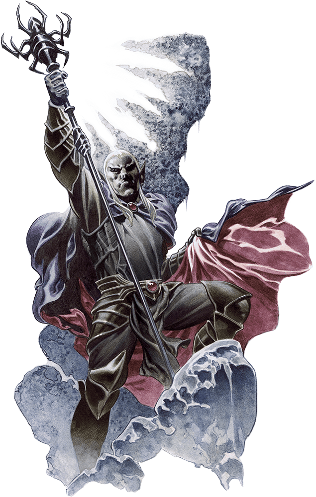

# Tenth Session

## Death and Spiders

### Summerday +360 hours

### Dramatis Personae

- *Benjamin*, a 5th-level Elf Ranger
- *Calmul Rhoqiroth*, a 5th-level Dragonborn Artificer
- *CoralKing*, a 5th-level Gnome Monk
- *Geral Bryn*, a 5th-level Human Fighter
- *Orky*, a 5th-level Half-Elf Paladin
- *Steve*, a 5th-level Halfling Rogue
- *Tasbros*, a 5th-level Elf Sorcerer
- *Tysnera*, a 5th-level Elf Wizard
- *Viker*, a 5th-level Eladrin Druid
- *Wulrif*, a 5th-level Human Warlock

#### From the journal of Dame Orky

We are still in the cave. *Steve* saw there were some things embedded in the ooze we just exploded. He investigates and finds 20 gp. The whole cave seems magical and there’s a strange draft. There also sounds like a surf sounds, crashing every 2-3 minutes, to the North/Northeast. *Tasbros* declares his desire to chase the magic. We all decide to head North – toward some stairs. We ask *Steve* to check for traps:

- His vision blurs for a bit (rolls a 2) and cannot see any traps.
- *Wulrif* investigates the stairs. The stairs seem solid and well-designed.
- *Steve* uses Luck
- *Tysnera* doesn’t find anything other than the stairs seem to be made for Dwarves

We head down the stairs and find ourselves in a large cavern with some ledges, tables, and dozens of warrior skeletons. It looks like a battle occurred here a long time ago, but they smell. Some gray ghoulish creatures start to rise and approach us. They don’t lurch, but move quicker.

Round 1

1. *Wulrif* Hexes the first creature and does 13 damage (AC 13)
2. *Benjamin* detect their weaknesses. They are immune to poison & charm. Resistance to necrotic damage. Resistance to being turned. Tougher ones are ghasts and easier ones are ghouls.
3. *Tasbros* casts scorching ray (2nd level) on 3 fresh ghasts and uses meta magic. He hits them each for 13 damage.
4. *Geral* tells *Benjamin* to fire his bow! He hits a damaged ghast that *Wulrif* hit for 15 damage. *Geral* hits it again with his bow and does 8 damage, killing it!
5. *CoralKing* is at the back of the pack. He moves forward through us and throws 2 darts for 15 damage.
6. *Viker* uses frostbite and does 5 damage.
7. *Calmul* moves into the room to shoot and hits a critical shot! That means 16 damage to a damaged ghast. That one is killed.
8. The ghasts attack now:
a. The ghasts move forward to attack *Calmul*, Orky, *Geral*, and *CoralKing*.
b. They miss *Calmul*, Orky, and *Geral*.
c. They critically hit *CoralKing* and *Geral* claims protection. They miss!
d. We all have to make a constitution saving throw. Orky got poisoned, which gives her disadvantage on her attacks.
9. *Tysnera* casts Fireball and hits every creature with 36 HP damage. They are all killed!

*CoralKing* picks up all of his darts while we move through the room, east into the next room. There are more skeletons, but nothing moving. *Geral* decides, after a heated debate between *Tasbros* and *Tysnera*, to backtrack and enter the room south of here. This room is full of bunks and there are bones of orks and Dwarves, that are being gnawed on by ghasts and ghouls. When they see us enter, they attack.

Round 1

1. *Tysnera* holds her action
2. *Calmul* hits a ghast for 19 damage.
3. *Steve* hides behind someone and sneak attacks the damaged ghast, killing it.
4. Orky moves and attacks a ghast twice, killing it.
5. *CoralKing* hits a ghoul and uses three unarmed attacks and one hit for 6 damage.
6. *Geral* hits the damaged ghoul for 22 damage, killing it.
7. *Viker* casts ice knife and hits a ghoul for 10? Damage.
8. Now the Undead fight back:
a. They all surround Orky and hit her twice for 20 damage.
9. *Tasbros* casts Firebolt on a ghast and does 7 damage to it.
10. *Benjamin* moves forward to attack the ghast and does 19 damage, killing it!
11. *Wulrif* shoots one ghoul and kills it.
12. *Tysnera* finally feel prepared to act and hits it for 12 damage.

Round 2

1. *Calmul* shoots the remaining ghoul and does 13 damage.
2. *Steve* uses a sneak attack and kills it!

*Tysnera* detects all kinds of magic in this cave. We all take a short rest and decide to take the southern hallway to move east into a room where we find a storeroom full of kegs. We realize it’s a dead end. So, we move west toward the large room we know is full of bugbears.

*Wulrif* uses mage hand and gust to open the door, but it doesn’t open because it’s barricaded. *Benjamin* gives it a super hard kick and manages to barely kick it in. We see 10 bugbears and a very large one in the back.

Round 1 - Surprise

1. *Steve* hits the first bugbear and does 14 damage.
2. *Benjamin* hits the same one twice and does 29 damage, bringing it down.
3. *Viker* moves into the room, uses ice knife, misses, and Teleports back out of the room.
4. *Wulrif* marks the big one and throws him into the wall using eldritch ray behind him for 17 damage.
5. *CoralKing* throws 2 darts at the marked bugbear for 12 damage.
6. *Geral* holds his action
7. *Tasbros* casts Fireball and the bugbears make their saving throws. So, they get hit for 14 damage each.
8. *Tysnera* casts Fireball and the bugbears make their saving throws again. So, they all take 16 damage, which drops them all except the big one and the marked one.
9. *Geral* takes his action to ask *Benjamin* to shoot his bow. He hits the marked one for does 13 damage. *Geral* hits the same one and drops it.
10. *Calmul* shoots at the bugbear and misses.
11. Orky Teleports to the leader, and attacks him twice for 16 total damage.

Round 2

1. *Steve* misses an attack
2. *Benjamin* shoots at the leader and missed the first. He tries again and hits, doing 12 damage, killing it.

Now we hear a voice say “oh, that’s a shame. I guess I have to deal with you now.” *Wulrif* detects thoughts and gets nothing. We hear: “what brings you here anyway?” *Wulrif* responds “We are here for some treasure.” And it responds “Well, you should find another place for that. You’ll find nothing but death here. I know what I’m looking for, do you?” We say “What are you looking for?” No response. “We’re here for *Gundren*’s brother.” The voice says “We have him.”

We all make saving throws + DEX. We need a 16 to make it. A Fireball detonated in the middle of the room. *Geral*, *Viker*, Orky,  and *Tysnera* failed, taking 34 damage. Next, we are in the middle of a yellow-green fog. We all have to use a constitution saving throw. Those who roll 15, make it. *Geral* and *Wulrif* failed.

We see a Drow and a human run out of room and 4 spiders run into the room. Orky gets an opportunity of attack and delivered 15 damage.

Round 3

1. *Steve* makes a death saving throw and misses.
2. *Benjamin* uses hunter’s mark on the damaged Spider and shoots twice and kills it.
3. *Viker* uses healing word and everyone gets healed 5 HP.
4. The spiders go now:
a. One hit Orky for 4 HP damage, reduced from 7.
5. *Wulrif* blasts a Spider back and does 17 damage.
6. *CoralKing* moves forward to attack the damaged Spider, flanking Orky. He rolls a crit and does 28 damage and kills it!
Everyone in the room has to make a saving throw + CON on the start of their turn, if they started in the fog at the beginning of their turn (15 makes it). No one has failed so far.
7. *Tasbros* casts dispel magic and rids the room of the poison fog.
8. The spiders make a web around Orky, but she managed to fight her way out of it.
9. *Tysnera* uses magic missile and does 3 damage to one and 5 to another.
10. *Calmul* ?
11. Orky kills the most damaged Spider.

Round 4

1. *Benjamin* uses healing spirit on *Viker* for 8 HP.
2. *Viker* uses a potion of healing in her backpack, she drinks it and gains HP.
3. The giant Spider missed an attack on Orky.
4. *Wulrif* takes a potion out of *Calmul*’s backpack and gains 6 HP.
5. *CoralKing* hits the Spider 3 times for 20 HP
6. *Geral* asks Orky to hit the Spider and she kills it!
7. *Tasbros* burns the web out of the doorway.
8. *Tysnera* moved forward a little and holds her action.
9. *Calmul* heals *Steve* for 10 HP.
We decide to take some time to heal up. *Viker* heals *Steve* for 20 HP. *Benjamin* heals a lot of people. *Viker* heals Orky and *CoralKing* for 7 and 10 HP. And so on…

We ask *Steve* to sneak around the corner where we saw someone run away. He peaks around and doesn’t see anyone. We follow him in pursuit. We end up following the source of magic and *Tysnera* notices footsteps. We end up at fully-sealed double doors that we cannot see a way to penetrate. *Tasbros* remembers that he can cast “Knock” and we blow the door open. We see a Drow and a wizard, Glassstaff.

Round 1

1. *CoralKing* attempts to enter the room and a bunch of tentacles spring up from the floor.
a. *Wulrif* uses a Counter spell and disintegrates them.
b. He dashes to the wizard.
2. The rest of us make DEX saving throws and those who make it, take 14 damage. We all used various methods to make the throws.
3. *Steve* hits a Drow?
4. A Drow sends a flame and *CoralKing* makes a saving throw and fails. He takes 9 damage.
5. *Tasbros* casts Chromatic Orb on the wizard for 31 damage, killing him.
6. *Wulrif* eldritch blasts the Drow onto the star space, doing 19 damage.
7. *Tysnera* uses magic missile and they get absorbed into a special spot.
8. *Viker* casts moonbeam and the Drow uses a counterspell to block it.
9. Orky casts Hold Person and the Drow succeeds on it’s wisdom saving throw.
10. *Benjamin* tries to shoot and misses.
11. *Calmul* shoots at it and misses.
12. *Geral* moves in 30 ft and tells *Benjamin* to shoot. He shoots the Drow for 21 damage. Geral uses his action surge and hits it for 3 damage.

Round 2

1. *CoralKing* hits twice for 13 damage.
2. The Drow tries to go invisible and *Wulrif* counters his spell, so he remains visible.
3. *Steve* hits him and does 20 damage and knocks him down.
4. We pause the gameplay here.

The Drow, *Nezznar the Black Spider*, has Elven Chain Mail and a Staff of the Spider. The human, *Sildar's* erstwhile friend *Iarno Glasstaff*, has a Staff of Defense. The Bugbear leader had a Sentinel Shield.

#### 4,400 XP
