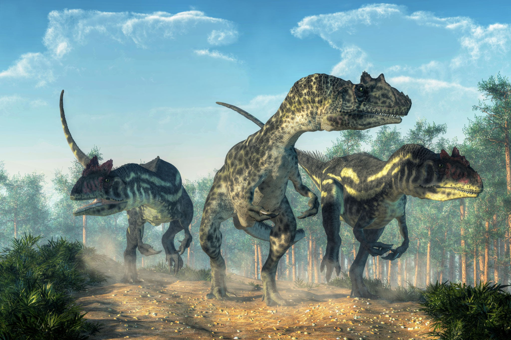

# Third Session

## Wildlife Problems

### Summerday +80 hours

### Dramatis Personae

- *Actias Aureus*, a 2nd-level Tiefling Warlock
- *Benjamin*, a 3rd-level Elf Ranger
- *Calmul Rhoqiroth*, a 2nd-level Dragonborn Bard
- *CoralKing*, a 3rd-level Gnome Monk
- *Geral Bryn*, a 3rd-level Human Fighter
- Orky, a 3rd-level Half-Elf Paladin
- *Steve*, a 3rd-level Halfling Rogue
- *Tasbros*, a 2nd-level Elf Sorcerer
- *Tysnera*, a 2nd-level Elf Wizard
- *Viker*, a 2nd-level Eladrin Druid
- *Wulrif*, a 3rd-level Human Warlock

The party finally makes it to **Phandalin**. *Sildar* leads the group to the **Stonehill Inn**, where they set about procuring lodgings. *Sildar* pays the
party the 50 gold pieces and sets off in search of his friend, *Iarno Glasstaff*.

The group then drops off the supplies to **Barthen's Provisions**, where they get paid and briefly chat with *Barthen*.

*Yeemik* the Goblin is causing a bit of a stir, so they head to the **Townmaster's Hall** next, where they encounter *Harbin Wester* and his group of *Dwarven Mercenaries*.
*Harbin* offers them the use of the jail in the basement, and after a few tense moments with the Dwarves *CoralKing* decides
to stay with *Yeemik* to ensure no shenanigans.

*Harbin* offers a bounty of 100gp if the party will clear out the Orcs harrassing travelers on the **Triboar Trail** to the East.
The group considers it. *Geral* asks where a healer might be found and *Harbin* replies that someone occasionally tends the **Shrine of Luck**.

No one is at the **Shrine of Luck**, so *Tasbros* and *Tysnera* decide to do their meditations there while the rest of the party rests at the **Stonehill Inn**.

*Tysnera* and *Tasbros* encounter the returning *Sister Garaele*, injured and the worse for wear. *Sister Garaele* is looking for *Bojangle's Spellbook*,
and the last entity that might know it's location is *Agatha the Banshee*, who haunts the ruins of **Conyberry**. She offers three potions of healing plus
her services upon their return, and says that if *Agatha* is approached correctly, she may be amenable to answering questions.
*Sister Garaele* offers a silver comb as a gift for *Agatha*.

After conferring and restocking provisions, the group sets off on the **Triboar Trail**, intending to speak to *Agatha* and clear out the Orcs.

Making camp, they are beset by a pack of 8 vicious Allosaurs!

The Allosaurs blitz the party, jumping and shredding with claws and teeth. The party spellcasters scramble up trees for cover,
and *Orky*, *Geral*, and *CoralKing* hold the center.  *Actias* and *Wulrif* cast potent curses and *Eldricth Blasts*, *Calmul* breathes
poison and provides critical blessings to *Orky*, and *Geral* makes a couple of key saves with his shield as well as inspiring *Orky*
to heroic feats with her now-flaming Great Sword. *Steve* and *Benjamin* shoot arrows and *Viker* saves the life of the unfortunate *Tysnera* who has
been taken into the jaws of an Allosaur after she and *Tasbros* expended all of their potent combat spells.

Triumphant after an epic battle, the party heals up and considers their next action.

#### 700 XPs
