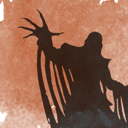

# Twelfth Session

## Fungus Among Us

### Summerday +387 hours

### Dramatis Personae

- *Actias Aureus*, a 5th-level Tiefling Warlock
- *Benjamin*, a 6th-level Elf Ranger
- *Calmul Rhoqiroth*, a 6th-level Dragonkin Artificer
- *Geral Bryn*, a 6th-level Human Fighter
- *Steve*, a 6th-level Halfling Rogue
- *Tasbros*, a 6th-level Elf Sorcerer
- *Tysnera*, a 6th-level Elf Wizard
- *Viker*, a 6th-level Elf Druid

> The Naga stares unblinking with piercing golden eyes.
>
> "The Wizard's spirit will reform and must be satisfied, or it will continue to haunt the mine.
> But the greatest threat is the creeping doom near the old entrance."
>
> *Orky* is strangely entranced by the greenish flames of the **Spell Forge**.
>
> "Yes, it is fighting against corruption. Perhaps ..."
>
> *Orky* slumps to the ground.
>
> "Do not fear for her, I will guide her spirit where we need go."
>
> *CoralKing* resolutely sits down next to her, saying nothing.
>
> "You will need the items on the table. Farewell."

The group finds a Mace of Disruption and a Dragon Breastplate. Taking a short rest, *Viker* attunes to the Mace as the
party heals and prepares. *Geral* slips off his sturdy Scale Mail and dons the Breastplate.

Outside the room, there is a cry and a thudding on the doors.

*Calmul* has been attacked by a flock of Stirges. His Steel Guardian dispatched one of the creatures, but three are now embedded
in his scaly hide, gorging on blood. *Calmul* falls to the ground as *Geral* runs to pull the things off of him. The party
dispatches the rest. *Benjamin* heals *Calmul* from the brink of death.

*Wulrif* is nowhere to be seen.

> "He is ... delving into the occult mysteries of this place," says *Actias*.

No further explanation is forthcoming.

Revived, re-equipped, and resolute, *Geral* leads the group. The **Spell Forge** lies on a Dwarven-carved platform amidst a large natural cavern,
stairs leading down to the living rock. There lie quarters for the Artificers and Wizards of ages past, with a further tunnel leading south. The party approaches the doors.

> Dust, ash, walls blackened by fire, and heaps of debris beneath the sagging ceiling show that this room was damaged by a destructive blast.
> The furnishings -- tables, chairs, bookshelves, beds -- are charred or splintered, but otherwise well preserved.
> A scorched iron chest stands near the foot of one of the beds.

*Steve* stealthily creeps into the room, searching for traps. Bringing out his Thieves' Tools, he carefully picks the lock, nods once in satisfaction, then creeps back out.
*Tasbros* concentrates for a bit and opens the chest with his Mage Hand.

Inside the chest are heaps of copper, silver, and electrum coins from an ancient age, as well as 3 huge diamonds and a finely wrought wooden pipe with platinum filigree.

A shadowy form rises from the floor. It speaks in grave whispers.

> "Your presence is offensive to me, your life forfeit. My treasures are mine alone, not yours to plunder!"
>
> *Geral* says, "We do not seek to disturb you, only rid this place of its invaders. How may we help you find peace?"
>
> "It is true that I fell defending this place from the Orcs and their Shaman. I summoned the Guardian before I died,
> so the **Spell Forge** would not be defiled after my passing. Yet defiled this place remains!"
>
> "I have sworn an oath to protect this place," says *Geral*. "We have slain the restless spirits of your attackers."
>
> "Indeed?" it muses. "I see that you speak truth. Yet a creeping doom remains."
>
> "Well then, we shall dispatch that as well. What would you have us do with your treasures?"
>
> "I care not for the coinage, only that the flute remain undisturbed. I see you have a Wizard amongst you. 
> I learned mighty spells in life but no longer have need for my accoutrements of learning.
> You may take these things in exchange for a token of your success against the Unnamed."
>
> "We will be back", says *Geral*.
>
> "We will see," it says, disappearing.

*Tysnera* eagerly inscribes from the Spellbook of *Mormesk the Magnificent*:

- Cantrips: Acid Splash, Friends, Lightning Lure, Mage Hand
- 1st: Charm Person, Detect Magic, Magic Missile, Tasha's Caustic Brew
- 2nd: Detect Thoughts, Intellect Fortress, Melf's Acid Arrow, Suggestion
- 3rd: Fear, Slow, Summon Fey, Summon Shadowspawn
- 4th: Confusion, Evard's Black Tentacles, Summon Elemental
- 5th: Cloudkill, Summon Draconic Spirit

The party continues on.

> Dense carpets of weird fungi cover large sections of the floor in this cavern. The growth includes puffballs a foot across, weird shelf fungus growing on stalagmites,
> and large stalks and caps a good five feet tall. Some of the puffballs glow with an eerie green phosphorescence.

*Tasbros* has a thought. Motioning the party back, he aims a Fire Bolt at one of the puffballs.

The resulting blast singes his eyebrows.

> "We can't cast any Fireballs in there", *Tasbros* says. *Geral* nods glumly.

Further travel into the cavern reveals the air is filled with choking spore clouds. The party looks to *Geral* who nods. Everyone makes a dash for the exit.

The trap is sprung!

> Emerging from the weird fungal carpets, two giant-sized Skeletons dripping with greenish slime stand up to block the exit.
> Behind the party, four huge mounds of sticky black sludge pulsate as they crawl from the floor and ceiling to block the tunnel the party just came through.
> Swarming along the stalagtites are at least eight blobs of what look to be chaotic molten stone.
> In the far back corner of the cavern, a horrifying undead fungal abomination sends pulses of eldritch power towards the party.

Writhing black tentacles burst from the ground, attempting to envelop the party. Everyone except *Tasbros*, *Tysnera* and *Viker* manage to dodge aside.

Fast on the draw, *Benjamin* sends two quick arrows into the Ooze Master, but they do little except corrode in its substance.

*Calmul* carefully aims his Musket center-mass on a Gray Ooze and fires. The resulting sharp stab of Psychic pain leaves him breathless. *Calmul*'s Steel Defender intercepts a black waving pseudopod meant for him.

*Geral* looks around at the party, desperately searching for weapons that will harm their attackers. He puts away his sword and takes out his hand axes, moving to draw the four Black Puddings away from the spellcasters
while *Benjamin*, *Viker*, and *Actias* engage the attackers to the front.

*Steve* hides and looks for an opportunity.

*Viker* shimmers and disappears from the grasp of a tentacle, reappearing with a pop of displaced air next to the Ogre Skeletons. She attacks with her Mace of Disruption.

*Actias* casts Bane on the Ogre Skeletons.

*Tasbros* frees himself from the Black Tentacles.

A deadly greenish Cloudkill erupts in the middle of the party. Everyone but *Actias* manages to leap aside; *Geral* is trapped between the Black Tentacles and Cloudkill.

*Benjamin* summons a Guardian Beast, sending it to attack the Black Puddings alongside *Calmul*'s Steel Defender. They take heavy damage in return.

*Geral* attacks the Ogre Skeletons alongside *Viker*; a huge club swing, thanks to *Actias*' Bane, barely misses pulping him against the wall.

*Steve* hits a Black Pudding with a club.

*Viker* does heavy damage on an Ogre Skeleton, barely missing getting pulped in return (again due to Bane).

*Actias* lies unconscious in the deadly Cloudkill.

*Tasbros* attempts Dispel Magic on the Cloudkill, but fails.

*Tysnera* frees herself.

The Black Puddings destroy the Guardian Beast and Steel Defender, turning their attention to the party. *Benjamin* gets badly mauled, nearly dying, but manages to get Healing Spirit up just in time to save himself.

*Calmul* Repairs his Steel Defender.

*Geral* intercepts Black Pudding attacks on *Benjamin*.

*Steve* pulls *Actias* out of the CloudKill.

*Viker* invokes her Unicorn Totem and heals *Benjamin* and *Actias* from the brink of death, along with the rest of the party.

*Actias* wakes up and casts a spell on himself, then rushes amongst the Oozes triggering attacks and repercussions.

*Tasbros* tries Chromatic Orb at the Ooze Master, to no effect.

*Tysnera* casts a Lightning Bolt which she curves around *Actias*, *Geral*, and *Benjamin*. It electrocutes the Grey Oozes but splits the Black Puddings!

An Ogre Skeleton misses pulping *Tasbros* due to Bane.

*Benjamin* casts Healing Spirit again.

*Tysnera* casts Dagger Ward on *Calmul*'s Steel Defender, which then rushes at the eight smaller Black Puddings, shredding them.

After a few more rounds of desparate battling, *Viker* Fey Steps over to the Undead Ooze Master and strikes it with her Mace of Disruption. It explodes!

#### 6,000 XP
