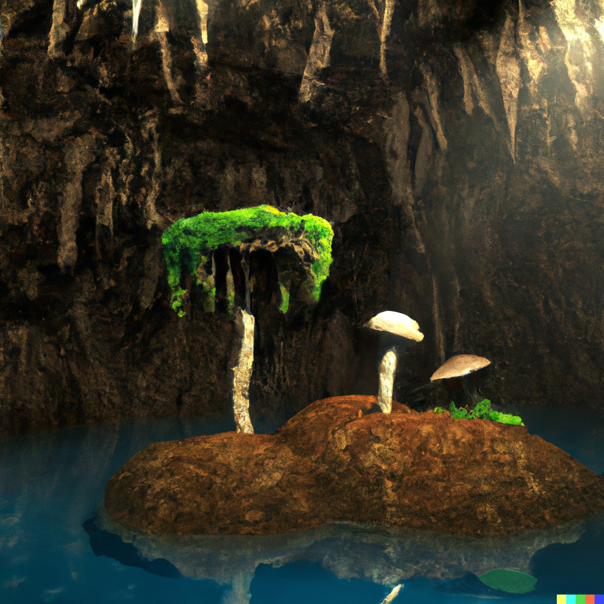
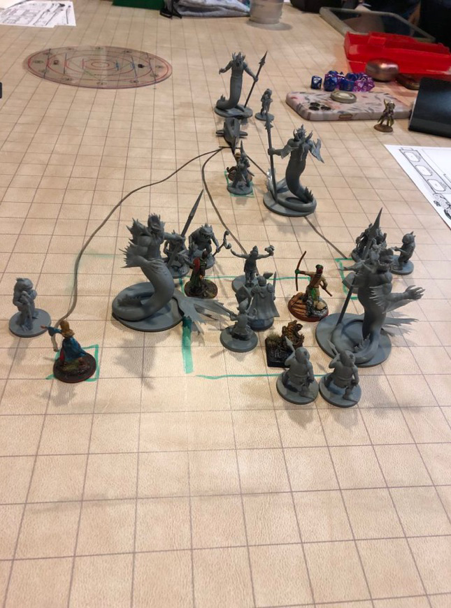

# Twentieth Session

## The Darklake

### Dramatis Personae

- *Avren Varan*, a 9th-level Half-Elf Bard
- *Benjamin*, a 10th-level Elf Ranger
- *Calmul Rhoqiroth*, a 9th-level Dragonborn Artificer
- *CoralKing*, a 10th-level Gnome Monk
- *Geral Bryn*, a 9th-level Human Fighter
- *Orky*, a 10th-level Half-Elf Paladin
- *Steve*, a 10th-level Halfling Rogue
- *Tasbros*, a 10th-level Elf Sorcerer
- *Tysnera*, a 10th-level Elf Wizard
- *Viker*, a 10th-level Eladrin Druid

### Summerday +852 hours

#### From the journal of Dame Orky

*Wulrif* nearly dies when he reverts back to his normal form. I use Lay On Hands to give him 50 HP and bring him back to consciousness. Then, we all take a long rest.

We discovered an island with mushrooms on it. It seems steep, maybe the top of a stalagmite. I look around to see if we’re safe. I notice some strange but small things rustling around in the mushrooms. The mushrooms are around 60 feet high.

We hear music and singing in a hauntingly beautiful soprano. We see an inverted mushroom cap and a Half-Elven woman holding a lute and playing. *Geral* goes to the shore nearest her craft.

> "Hello, do we know you?"
>
> "No, I don't think so."
>
> "Do you know where we are?”
>
> "**Darklake**, eastern shore, probably near **Sloobludop**, though the currents make it hard to tell”.
>
> "Do you hear that rustling?"
>
> "Could be bats, Stirges -- hopefully not Ixitxachitl."
>
> "What are -- what you just said?"
>
> "Fiendish little bloodsuckers, look like small manta rays with fangs and poison-barbed tails." She shudders.

*Calmul* looks around wildly for something to hide under. Seeing nothing of use, a cloud of clockwork machines begin constructing a tent.

> "Can you guide us out of here?"
>
> "Sure."
>
> "I am *Geral* and this is *Orky*."
>
> "Pleased to make your acquaintance! I am *Avren*, a Bard by avocation." She makes an elaborate, graceful bow without falling out of her craft. "I collect lore and knowledge from the **Underdark**. You look lost."
>
> "We are indeed, and seeking a way out of here. How did you get here?"
>
> "A waterfall deep in the **Neverwinter Wood**."
>
> "Oh," says *Geral*, disappointed. "I suppose you don't go back the same way."
>
> "No," *Avren* replies with a tinkling laugh. "I normally meet someone friendly, trade with them, and take one of the trails out, usually through **Gracklstugh**. That's about 8-10 cycles from here, as the raft wanders."
>
> "Who lives in **Gracklstugh**?"
>
> "Duergar, Deep Gnomes, and Mountain Dwarves. Stay away from *Themberchaud's* Lair and **The Keepers of the Flame**."
>
> "*Themberchaud*?"
>
> "The Wyrmsmith of **Gracklstugh**. An ancient Red Dragon of unlimited appetite, though **The Keepers of the Flame** know how to satiate him," *Avren* says darkly.
>
> "How do you find your way?"
>
> "Oh, sometimes you can be friendly with the Kuo-toa, as long as you don't look like an easy victim. They are a bit mad, but know how to navigate **Darklake**, and they enjoy my music. They live in **Sloobludop**, and worship the Sea Mother."

*Avren* is full of useful information about the mushrooms of the **Underdark**, telling us which ones make water, wine, food, and other things.

We remember that we are here to hunt Fiends for the *Society of Brilliance* and discover how they are getting into the **Underdark**. We decide to take a cycle and fashion some more secure rafts. That cycle goes well! The team makes food and water from the mushrooms. *Avren* points out some mushrooms with orange and red stripes and says they are called “The Devil’s Mushrooms”, making a really strong red liquor that the Duergar like. *Calmul* busts out a still in a cloud of small, whirring, magical devices. No one is brave enough to drink the final product. We end up with 2 wine skins of the stuff, which *Avren* says will be worth a lot in **Gracklstugh**.

*Benjamin* decides to explore and finds 3 octopodes in the tops of the tree-like mushrooms *Avren* calls Zurkhwood. One of them floats off ... in fear? Another is chewing on a Stirge. I like that one. *Steve* attempts to catch it and but somehow it detects ultra-sneaky *Steve* and escapes. Now, all 3 are gone.

These are the occupants of the rafts:

Canoe 1 (2 people) - *Steve* and *Benjamin*

Canoe 2 (2 people) - *Tysnera* and *Viker*

Raft (10 people) - Me right in the middle, *Calmul* + Steel Defender, *CoralKing*, **Tasbros**, *Geral*, *Actias*, and *Wulrif*.

*Avren’s* Mushroom (1 person) - *Avren*

*Viker* decides to morph into a Shark to tow the rafts. She takes off at 35 MPH, knocking us over. *Tysnera* falls out of the raft. *Geral* cuts the rope from *Viker*, while *Wulrif* telepathically tells *Viker* that we lost *Tysnera*. After 10 minutes, *Tysnera* is back in her raft. We work out a way to tell *Viker* if things go wrong. She takes off again. We are really moving!

Sometime later, *Viker* smells prey, tainted with Fiendish overtones. Suddenly, large and small fishy-scaly things swarm our rafts!

> "Kuo-toa, not the friendly kind!" *Avren* shouts.
>
> "What are the big Uglies?" *Geral* asks.
>
> "Merrow! Servants of the *Deep Father*!" *Avren* replies.

Round 1

1. *Benjamin* uses Hunter's Sense on the Merrow. They are Monstrosities tainted by Fiends, and have no weaknesses. Worse, they are immune to being Charmed or Frightened.
2. *Tasbros* casts Lightning Bolt, blasting the Merrow in front of us.
3. *CoralKing* uses 2 unarmed strikes and 1 hit (AC 15) for 7 HP on another Merrow swarming the Raft.
4. I move toward the damaged Merrow casting Thunderous Smite, and strike twice doing 50 HP damage on my first strike and 13 on my second one, for 63 HP total damage!
5. *Geral* attacks a Kuo-toa, hitting it for 10 damage. He uses Commander's Strike on me to hit the same one for 16 HP more.
6. *Steve* attacks using his Hand Crossbow, and misses.
7. *Calmul* stabs a Merrow with his Rapier, and commands his Steel Defender to attack one of the Kuo-toa. They do 19 HP damage.
8. *Viker* eats one of the Kuo-toa as it was casting a spell, doing 21 HP damage.
9. A Kuo-toa throws a net over *Geral* but *Tysnera* uses Protective Wings as a reaction to cause the net to miss. Another attempts to throw a net over *Calmul’s* Steel Defender. The last one nets *Avren* and she is now restrained. I get hit by a Hold Person spell and become paralyzed.
10. *Avren* throws the net off of her.
11. *Tasbros* gets attacked by a Kuo-toa with a Mancatcher polearm and is grappled.
12. *Tysnera* casts Banishment on 2 of the Merrow and they disappear.
13. A Merrow spears *Viker* with it's Harpoon and does 14 HP damage, then starts reeling her in.

Round 2

1. *Benjamin* uses his Longbow to shoot some of the Kuo-toa. He does 23 HP damage.
2. *Tasbros* casts Blindness and Deafness on a Merrow but it fails.
3. *CoralKing* uses his Staff of Striking to hit for 20 HP damage.
4. I take a Vow of Enmity and hit the Merrow in front of me twice, doing a total damage of 38 HP damage.
5. *Geral* hits a Kuo-toa, doing 21 HP damage.
6. *Steve* attacks the Merrow in front of him and does a ton of damage.
7. *Calmul* shoots the Merrow with his musket.
8. *Viker* is still grappled, but does 20 HP damage to the Kuo-toa Archpriest she's chewing on.
9. *Calmul* is netted by a Kuo-toa.
10. The Kuo-toa Archpriest casts Mass Cure Wounds on all the creatures we damaged?!?
11. *Avren* casts Thunder Wave and hits 3 Kuo-toa (including the Archpriest), doing 18 damage to them and driving them away.
12. A Kuo-toa attempts to net *Tysnera*, but *Geral* hamstrings it with an attack of opportunity as it tries to get past him, sticking it in place. Yay!
13. *Tysnera* casts Fireball and does 37 HP damage to a Merrow and bunch of Kuo-toa. Yay!
14. The Kuo-toa with *Tasbros* stuck in it's polearm pulls him underwater. Boo!

Round 3

1. *Benjamin* shoots the Merrow in the head and does 22 HP damage.
2. *Tasbros* doesn't escape and didn't get a chance to hold his breath, so he is starting to drown.
3. *CoralKing* moves to the back of the raft and attacks one of the Merrow with his Staff of Striking, doing 25 HP damage. He also uses Flurry of Blows for 8 HP more damage.
4. I move to the nearest Kuo-toa with a Mancatcher and attack it twice, doing 33 HP damage, killing it.
5. *Geral* slays a Kuo-toa near him and *Tysnera*.
6. *Steve* Sneak Attacks a Merrow, doing a ton of damage to it.
7. *Calmul* shoots the Merrow again, doing 17 HP damage. His Steel Defender does an extra 6 HP damage to the Kuo-toa near him.
8. *Viker* wriggles out of the Merrow's harpoon and does some more damage chewing on the Archpriest.
9. *CoralKing* gets tangled in a net. Another Kuo-toa swims toward *Avren* and attacks her.
10. *Avren* stabs it with her rapier for 17 HP damage.
11. *Tysnera* casts magic missile at the Merrow, doing 12 damage. That kills it!

Round 4

1. *Benjamin* shoots the Kuo-toa Archpriest and does some damage.
2. *Tasbros* is still being held underwater by the Kuo-toa with the Mancatcher pole-arm and drowning.
3. *CoralKing* attacks a Kuo-toa with some unarmed strikes and does 14 damage.
4. I cast Haste on *CoralKing* and he attacks the Kuo-toa again, doing 11 HP damage, killing it!
5. *Geral* hits the Kuo-toa in front of him doing 10 HP damage.
6. *Steve* Sneak Attacks the Kuo-toa in front of *Geral*, doing 56 HP damage, obliterating it!
7. *Calmul* shoots the 2 Kuo-toa attacking *Avren*, doing 7 HP damage on one and 13 on the Archpriest.
8. *Viker* is no longer entangled and spits out the Archpriest to attack the Kuo-toa holding *Tasbros* underwater. BIG CHOMP! And *Tasbros* is saved!
9. The Archpriests that *Viker* was chewing on and attacking *Avren* decide to skedaddle.
10. *Avren* holds her action.
11. *Tysnera* holds her action.
12. *Tasbros* bursts to the surface, *Viker* eats the Kuo-toa and comes back to the surface to tow us away quickly before the banished Merrow pop back. This gives us enough time to take a short rest.

We keep going along and we see more Kuo-toa. They start swimming parallel to us, hailing us in Undercommon, which *CoralKing* and *Avren* understand.

<!-- markdownlint-disable MD033 -->

> "Why did your people attack us?" asks *CoralKing*.
>
> "That was not us! Those were blasphemers who follow the *Deep Father*!" replies the Kuo-toa.
>
> "Who are you?" asks *CoralKing*.
>
> "I am *Ploopploopeen*, Archpriest of *Blibdoolpoolp*. We are the true followers of the *Sea Mother* and we will reward you if you help us fight these blasphemers. You look like you are trying to get up to the surface. We can help you get there."
>
> "Ask them why they want our help," says *Viker*. *CoralKing* translates.
>
> "We are the defenders of our faith," replies *Ploopploopeen*. "Long have the inhabitants of **Sloobludop** lived in harmonious service to the will of the *Sea Mother*. But recently, my own daughter *Bloppblippodd* experienced a powerful vision of
> *Leemooggoogoon* the *Deep Father*, proclaiming him our new god. Her power has increased greatly, and many of our people have been swayed to her cause. We are split in two, fighting among ourselves. The followers of the *Deep Father* have been
> making an increasing number of offerings on his Altar -- sacrificing and then casting bloody chum into the waters of the **Darklake**, where it is consumed by ... something."

*CoralKing* gets the sense that they are telling the truth, but he can’t read their unblinking eyes and fishy expressions too well.

> "What do we get for helping you?" asks *CoralKing*.
>
> "We can show you the way to **Gracklstugh** by safe paths."
>
> "What is your plan?"
>
> "We will pretend to offer you to the followers of the *Deep Father* as a sacrifice, to mend our breach. Then, when you are at their Altar, we will attack."
>
> "What?!" says *Viker*, when *CoralKing* translates. *Geral* minutely shakes his head.
>
> "We will not give up our weapons," says *CoralKing*.
>
> "They will not care. They believe the *Deep Father* is irresistible. They will not expect you to fight back."

#### 3,000 XP Each
