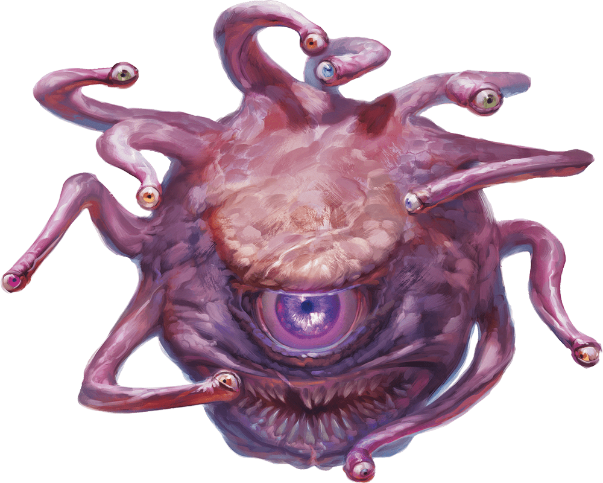

# Twenty-Fifth Session

## The End of the Beginning

### Dramatis Personae

- *Actias Aureus*, a 10th-level Tiefling Warlock
- *Avren Varan*, a 10th-level Half-Elf Bard
- *Benjamin*, a 12th-level Elf Ranger
- *Calmul Rhoqiroth*, a 12th-level Dragonborn Artificer
- *CoralKing*, a 12th-level Gnome Monk
- *Geral Bryn*, a 12th-level Human Fighter
- *Orky*, a 12th-level Half-Elf Paladin
- *Steve*, a 12th-level Halfling Rogue
- *Tasbros*, a 12th-level Elf Sorcerer
- *Tysnera*, a 12th-level Elf Wizard
- *Viker*, a 12th-level Eladrin Druid
- *Wulrif*, an 11th-level Human Warlock

### Summerday +1108 hours

#### From the journal of Dame Orky

We approach the next room and feel our items lose their magic. We move slightly closer and *Geral* sees a Beholder floating about 40 feet off the ground, pinning us in the baleful glare of the central eye. We also see Constructs skittering around in the back of the room. Flesh Golems form a wall protecting the Beholder.

> "It's a shame you broke my toys, did you bring me new ones?" a Telepathic voice echoes in our heads.
>
> "Where is *Droki*?" asks *Geral*.
>
> "Scurrying down his usual rat hole to the Monolith." The huge head nods and indicates a small hole in the wall.
>
> "How do we get through the hole?"
>
> "You don't. Unless you have a shrinking potion."
>
> "Do you have a shrinking potion?"
>
> "I can make one, but I'll need something for my trouble. Also, a drop of blood from each of you."
>
> "Your name in my Book of Shadows, if you die, I'll bring you back to life." says *Wulrif*.
>
> "I'd like to see this book." says the Beholder.

*Wulrif* feels there is an extra attachment to his book. We take a short rest while the small Clockworks come by to take a drop of our blood. The Beholder busies itself in its corner, Telekinetically manipulating a cauldron and various ingredients.

 A little while later ...

> "Your potions are ready. Don't get them mixed up, they are not labeled," giggles the Beholder.
>
> "What happens if we get them mixed up?" asks *CoralKing*.
>
> "Well, they're tailored to your genetics, so it might not be a problem. Or it might be a big problem. I don't know, I'm not a geneticist."
>
> We carefully take our own potions to quaff.
>
> "One last thing, you'll need a dimensional pocket to put your extra mass in. I don't know if you have one, but you'll need one. Otherwise, you may not like what happens when you revert to your normal size."
>
> A horrible chuckle.

 *Calmul* eventually realizes that he has the ability to build one! He nearly disappears into a fog of animated tools and constructs, and we can see him grasping nearby objects as the object manifests. It’s a metal, folding contraption thing that expands and contracts in strange directions and has lots of gears on it.

We drink our potions and shrink, watching puddles of reddish-pinkish-brown slime drain away into *Calmul's* metal box. We are now 6" high, and the air is strangely thick. *Benjamin* and *Wulrif* work together to track *Droki*, but the tunnels are long and confusing. After 8 hours of progress, *Benjamin* loses the trail and takes a guess as to which way we should travel. *Geral* gives *Benjamin* some Inspiration and he eventually recovers the track. We start to feel tingly after a long time of traveling. Then, we find ourselves in a larger area and start to see rocks orbit us. We realize that we are growing in size. We quickly get *Calmul* to open the Box of Holding so we can gain our original forms with our original mass.

We feel a bit out of sorts, funny tastes and twinges throughout our bodies. We are in a large cavern with a series of stepped pyramids, the Monolith on the central, highest mound. We see a bunch of Drow and Driders and, looking expectantly at us, *Mistress Ilvarra*.

> “See M’lady, here they are.” says *Droki*.

We are immediately faced with the blaring noise of a Shrieker, alerting every creature in this cavern of our presence.

Round 1

1. *Benjamin* casts a spell to damage 4 Drow by 1 HP and the Shrieker, killing it. The shrieks thankfully fade.
2. *CoralKing* Teleports to the top of the highest mound and swings at the nearest Drow with his staff, doing 27 HP damage.
3. *Tasbros* casts a Fireball but gets Counterspelled.
4. *Tysnera* casts Fireball at 5th level and lands 42 HP damage to the Drow, staggering them.
5. *Viker* casts Firewall and does 18 HP damage on 5 Drow Elite Warriors.
6. *Wulrif* uses 2 Sorcery points and Quickens Sickening Radiance on the Drow, followed by Eldritch Blast on *Mistress Ilvarra*, which pushes her backwards 10 feet.
7. *Calmul* shoots a Drider with his musket, because he doesn't like giant Spider-things.
8. I move forward 20 ft, cast Searing Smite, and ready my action. If I am attacked within 5 ft, I will counterattack twice with my Great Sword. A Drow Elite Warrior obliges me and I slip his strikes, countering for 31 HP damage.
9. *Droki* sneaks up behind *Wulrif* and backstabs him for 57 HP damage! *Droki* then disappears in a globe of Darkness. The enemies move in to surround me and *Benjamin*. They do 38 HP damage to me and a significant amount to *Benjamin*. They attack *Viker* for 20 HP damage. *Geral* is attacked and so is *CoralKing*, who gets hit for 22 HP damage.
10. *Avren* casts Dispel Magic and the Darkness goes away!
11. A Priestess casts Mass Cure Wounds on their forces. *Mistress Ilvarra* Dispels *Viker*’s Wall of Fire, which is burning up her warriors. I get 26 HP damage and so does *Tysnera*. Simultaneously, tentacles and noxious green fumes erupt around us, holding us in place and choking us for a ton of damage.
12. *Steve* nimbly skips out of the way of the Black Tentacles and Cloudkill and backstabs *Droki*, avenging *Wulrif* and doing significant damage.
13. *Geral's* Shield of Alertness warded him from the spells, so he charges and provokes 3 attacks of opportunity while moving to attack *Droki* 3 times. He uses Action Surge to hit him again, doing 30 HP damage.

Round 2

1. *Benjamin* shoots the Drider *Calmul* shot, because he also doesn't like giant Spider-things.
2. *CoralKing* Shadow Steps onto the opposite side of the Monolith and attacks one of the Drow Mages, killing him and incidentally dispelling the Cloudkill, because you can't hold a Concentration Spell when you're dead.
3. *Wulrif* tries his best, but fails to hit *Droki* back with *Eldritch Blast*.
4. *Tasbros* struggles in the Black Tentacles and casts Sunbeam using his Metamagic, damaging a line of Drow as far as the Priestesses for 32 HP damage each.
5. I turn around, declare a Vow of Enmity on the Drow Elite Warrior attacking me, and swing at him. I do 31 HP and he dies. I quickly move and attack another Drow at the edge of the tentacles, doing 19 HP damage.
6. *Tysnera* casts Fireball, doing 28 HP damage to a bunch of Drow.
7. A Drow Elite Warrior attacks *CoralKing*, doing 31 HP damage. Some Drow Crossbowmen attack *CoralKing* and miss, but hit *Geral* for 5 HP. *Geral* Saves against the poison.
8. *Avren* moves out of the Black Tentacles and casts Dispel Magic again, getting rid of them!
9. *Mistress Ilvarra* casts something extremely nasty at *Tasbros*, who successfully Counterspells it!
10. *Steve* attacks *Droki* and misses.
11. *Viker* casts Daylight, covering the entire battlefield. All the Drow and Driders immediately flinch and are Disadvantaged! She also attacks a Drider and does 9 HP damage.
12. The surviving Drow Mage casts Lightning Bolt and hits *Benjamin*, *Tasbros*, and me.
13. The Driders attack *Viker* and do serious damage.
14. *Geral* kills one of *Viker*'s attackers.

Round 3

1. *Benjamin* shoots *Droki* with his bow and does 14 HP damage.
2. *CoralKing* strikes *Droki* with his staff and does 46 HP damage.
3. *Tysnera* casts Fireball on *Droki* and *Mistress Ilvarra*, doing 35 HP damage. That takes *Droki* out.
4. *Calmul* shoots a Drider for 7 HP.
5. *Tasbros* summons a Draconic Spirit which attacks *Mistress Ilvarra*, taking her out.
6. *Wulrif* casts a Quickened Witch Bolt on the remaining Priestess, killing her. He casts Eldritch Blast on the remaining Mage, hitting him 3 times for 40 HP. He completely flies off the mound and dies a horrific death.
7. *Viker* heals *Wulrif* for 70 HP, reviving him from the brink of death!
8. The 2 remaining Drow Elite Warriors touch the Monolith and disappear.
9. *Avren* casts Mass Cure Wounds on us for 20 HP each.
10. I barely avoid getting hit by the Driders. *Tasbros* Dragon Spirit interposes and takes 19 HP from a Drider. I do 40 damage on a Drider.
11. *Geral* directs a Commander's Strike on me to hit the Drider and we kill one.
12. I finally do significant damage on another Drider.

Round 4

1. *Benjamin* sprints up to where *Droki* is before a Drider can drag him away.
2. *Wulrif* Eldritch Blasts the Drider near Benjamin, knocking it back.
3. *Tasbros* uses his Dragon Spirit to attack the Drider attacking him and misses. He then uses Chromatic Orb on it, doing 15 HP damage.
4. *Steve* uses a Sneak Attack with his crossbow for big damage on *Tasbros* Drider.
5. I move up to *Droki*, throw my manacles to *CoralKing* and direct him to cuff our prisoner. He does so.
6. *Tysnera* Magic Missiles a Drider for guaranteed damage.
7. *Avren* shoots a Drider 9 HP damage.
8. *Geral* does Commander's Strike on *Wulrif* to Eldritch Blast a Drider. He and *Geral* do 28 HP.

Round 5

1. *Wulrif* does 22 HP damage to a Drider.
2. *Viker* uses Ice Knife and freezes a Drider in place.
3. *Geral* runs down to the Drider and does 11 HP damage.
4. *Tasbros* uses Ray of Frost.
5. *Viker* does 28 HP damage on a Drider, killing it.
6. *CoralKing* turns and throws a dart at the remaining Drider for 12 HP damage.
7. *Benjamin* shoot the Drider and kills it!

I pull out my dark religious symbol gifted to me from the Dragon. It is strongly drawn to the Monolith, leaping out of my hand and merging with it. The Monolith heals a crack, there's a flash, and we find ourselves in a maze. A confusing blur, twisting in unknown directions, and then ...

> We're in a giant shuddering space, filled with clanking and the smell of machinery. We see enormous industrial Smelters, and a huge armored form standing amidst a circle of a dozen slain **Templar**.
>
> He's clad in blackened, tarnished Adamantium Plate draped with the smoking remnants of a **Templar's** White and Red tabard. Glowing red orbs contemplate us from the eye slits of his helmet. He's holding a huge sword which reeks with the stench of death.
>
> "**I SACRIFICED MY FRIENDS TO SUMMON YOU!!!**" screams the armored form.
>
> "**I AM *BAPHOMET*, LORD OF MAZES, AND YOU WILL ALL DIE!**"

*Wulrif* attempts Telekinesis to lift up the screaming guy, but fails. I recognize him as a Death Knight, a fallen Paladin, doomed to state the act that turned him. We realize that we are somehow in **[Neverwinter]**.

Round 1

1. *Steve* sneaks away and Hides from the big scary things.
2. *Wulrif* uses Eldritch Blast on the Death Knight.
3. *Avren* does 17 HP damage to *Baphomet*. She uses her Bardic Inspiration on *CoralKing*.
4. *CoralKing* Shadow Steps to the Death Knight and uses 2 staff strikes, doing 23 HP damage. He tries a Stunning Strike, but it fails.
5. *Benjamin* uses his Hunter’s Sense on *Baphomet*. He is resistant to lightning, cold, and fire.
6. The Death Knight continues to scream his sins and attempts to attack *CoralKing*.
7. *Tysnera* attempts to Banish *Baphomet* and the Death Knight, but fails.
8. *Tasbros* uses Level 4 Confusion on the Death Knight and succeeds! His Draconic Spirit attacks *Baphomet*.
9. *Geral* attacks *Baphomet*.
10. I cast Blinding Smite and attack *Baphomet* twice, doing 47 HP damage.
11. *Viker* hits *Baphomet* for 13 HP damage.
12. *Calmul* moves away and shoots *Baphomet*.

Round 2

1. *Steve* hits *Baphomet* once for 20 HP.
2. *Wulrif* casts Witch Bolt for 12 HP damage on *Baphomet*.
3. *Avren* strikes *Baphomet* with her rapier again, doing 13 HP damage.
4. *CoralKing* hits the Death Knight with his staff and a Flurry of Blows, for 25 HP damage.
5. *Benjamin* hits *Baphomet* for 11 HP damage.
6. The Death Knight moves toward us and casts Destructive Wave, but is Counterspelled by *Tasbros*.
7. *Tysnera* Counterspells a Maze directed at me by *Baphomet*.
8. *Tysnera* casts Evard’s Black Tentacles on the Death Knight, doing 10 HP damage.
9. *Tasbros* burns through *Baphomet*'s Fire Resistance with Fire Bolt.
10. *Geral* hits *Baphomet* for 25 HP damage.
11. I cast Blinding Smite again and deal 54 HP damage to *Baphomet*.

Round 3

1. *Wulrif* Quickens Eldritch Blast and then casts another Eldritch Blast, for 36 HP damage each, sending *Baphomet* back to where he came from!
2. *Avren* shoots the Death Knight for 30 HP. Nice shot!
3. *CoralKing* uses Flurry of Blows for 8 HP damage.
4. *Benjamin* does 24 HP damage.
5. The Death Knight is still confused, luckily!
6. *Tysnera* blasts it with Magic Missile, and the armor falls to the ground!

We search the remnants and take the sword, an Unholy Avenger. The Crusaders come down running to see the mess and do magical forensics of our battle. They bring us, under polite guard, upstairs to the **Armory** of **[Neverwinter]** and the *Commandant of the Crusaders*.

> "How did you come to be in my city?" asks the *Commandant*.
>
> "We don't rightly know, we were in a maze and then we were here." replies *Geral*.
>
> "And then we fought the *Lord of Mazes* and sent him back to the Abyss." says *Wulrif*, helpfully.
>
> The *Commandant* eyes *Wulrif*.
>
> "You seem to have a fallen **[Templar]**," I add.
>
> "Yes, that's a matter for the ... other ... Paladins to decide. By the way, where is his sword?"
>
> "We have it," I reply.
>
> "You're going to want to take that to the **[Magisterium]**, and soon. I understand that Death Knights can be ... persistent."
>
> "M'lord?," asks *Geral*. "You have some prior knowledge?"
>
> "I'm no lord," replies the *Commandant*. "Rising through the ranks of the [Crusaders] is based on merit, not birth. And you seem familiar to me."
>
> "*Major Geral Bryn*, retired, at your service, sir."
>
> "Ah, yes, I remember you now. You were the one involved in that incident with the Aboleths. I'm glad to see you're still alive."
>
> "Sir."
>
> "And I see your Armorer is still with you. I'm glad you're alive too, *Sergeant Calmul*."
>
> "Burn it with fire," replies *Calmul*.
>
> "Indeed," muses the *Commandant*, speculatively. "I'm sure the **[Magisterium]** will be interested in your story. I'll have a squad escort you there to deal with your ... prisoner."
>
> "Prisoner?" asks *Geral*.
>
> "Yes," chuckles the *Commandant*. "*Lord Varkosian* will certainly come out of that sword for Round Two, in about twenty hours, if I'm not mistaken."
>
> "Then we'd better hurry," says *Geral*.
>
> "Dismissed," says the *Commandant*, with a twinkle in his eye.
>
> "With all due respect, sir, we're not in service anymore." says *Geral*.
>
> "Oh, the forms will be ready for your Recommissioning at your Investiture, I imagine." The Commandant stands and smiles, then snaps off a textbook salute. "I won't hold your noble rank against you."

Our escorts snap to attention when we leave the *Commandant's* office. We wind our way out of the hulking **Armory**, *Calmul* in some sort of reverie, analyzing the guns and machinery defending the fortress. We are escorted to an
express elevator Topside, opening into the famous **[Hanging Gardens]**. *Benjamin* and *Viker* look around in delight as we are escorted to the shining crystal towers of the **[Magisterium]**.

The Initiates politely but firmly ask that we remain in the lobby. *Tasbros* and *Tysnera* are escorted into the inner sanctum, the Unholy Avenger in *Tysnera's* Bag of Holding.

> "Enter," intones a voice formally, the room dark except for the Examiner's table and glowing crystal orb. Seven robed figures sit in a semicircle around the table, their faces hidden in shadow.
>
> "What are we doing here?" asks *Tasbros*.
>
> "We have brought the Unholy Avenger," says *Tysnera*.
>
> "How shall we deal with this artifact?" asks the voice.
>
> "We should destroy it," says *Tysnera*.
>
> "Destruction of an artifact is a serious matter," says the voice. "What is your reasoning?"
>
> "It is a weapon of evil, and it is cursed," says *Tysnera*.
>
> "Destruction would require the fires of an Ancient Red Dragon, or access to the Deep Underdark. Do you have such access?"
>
> "We should cleanse it," says *Tasbros*.
>
> "How would you cleanse it?" asks the voice.
>
> "We would need to find a way to release the soul of *Lord Varkosian* from the sword," says *Tasbros*.
>
> "That would be a matter for the **[Templar]**," says the voice. "Do you have any other suggestions?"
>
> "We could suppress the magic of the sword," says *Tysnera*. "You have an Anti-Magic Field, don't you?"
>
> "We do," says the voice. "But that would not be a permanent solution."
>
> "We will consult with our friends," says *Tysnera*.
>
> "Very well," says the voice. "We will keep the sword suppressed until you return."
>
> "Thank you," says *Tysnera*. They turn to go.
>
> "Wait," says the voice. "We have a question for you."
>
> "Yes?" asks *Tysnera*.
>
> "We have seen the traces of your battle with *Baphomet*. That was a skillful use of Mana."
>
> "Thank you," says *Tasbros*.
>
> "We would like to offer you the position of *Magister*. You would be required to teach others your techniques. It comes with a stipend, and you would be granted access to the **Library**."
>
> *Tasbros* and *Tysnera* look at each other.
>
> "We will consider your offer," says *Tysnera*.

Twenty-four hours later, we are in **St. Paul's Cathedral**, staring at the dizzying spiral that is the **[Ledger of the Peerage]**. *Geral* is resplendent in his new uniform, and *Calmul* is wearing a new set of Crusader Armor. *Tasbros* and *Tysnera* are in the robes of the **[Magisterium]**, *Wulrif* in a new set of clothes. *Avren* sparkles in a silken many-hued dress, humming and taking note of the spectacle for later recounting. My armor is buffed and polished.

> "Where are *Benjamin* and *Viker*?" asks *Geral*.
>
> "Fussing over a Dragon's egg," I reply.
>
> "CoralKing?"
>
> "Not his thing," I commiserate. "He's off with *Steve*. They send their regards."
>
> "Oh," says *Geral*.
>
> "Game time," I say. "You look great, by the way."
>
> He nods and smiles. "You too."
>
> Squaring his shoulders, *Geral* and *Calmul* stride confidently to the base of the **[Ledger of the Peerage]**.
>
> *Marchioness Lyanna Alagondar*, the ruling Temporal Lord of **[Neverwinter]**, is standing there, flanked by the *Commandant of the Crusaders* and the *Legate of the Apostolic See*.
>
>The *Marchioness* acknowledges their arrival, and a golden orb floats over to *Geral*, pulsing. He nods gravely. The orb touches his finger, turning red, then soars to the top of the **Ledger**, which pulses golden.
>
> "*Major Geral Bryn*, retired, is now made *Baron of Cragmaw*," intones *Marchioness Alagondar*. "All privileges and responsibilities are granted to him and his legal heirs."
>
> "*Major Geral Bryn*, retired, I formally reactivate you to the rank of Colonel of the Crusaders," says the *Commandant*. "You are to assume command of the 349th Guards Regiment and proceed forthwith to Cragmaw in performance of your duties."
>
> *Geral* salutes the *Commandant*.
>
> "*Sergeant Calmul Rhoqiroth*, you are mustered to the rank of Master Gunnery Sergeant of the Crusaders. You are to assume responsibility for the armaments and defenses of **Cragmaw Castle** and environs."
>
> *Calmul* swishes his tail and puffs his crest. The *Commandant* salutes him.
>
> "*Lord Colonel Geral Bryn*, *Baron of Cragmaw*, I request and require your service to defend the peoples of the March," intones *Marchioness Alagondar*.
>
> *Geral* kneels and swears his oath. The *Legate* taps him on each shoulder with the Holy Sceptre, and he rises.
>
> He turns and nods to us, smiling wistfully. Then he and *Calmul* march out of **St. Paul's**, flanked by the Honor Guard of the 349th.

#### 30,000 XP Each

[Neverwinter]: ../background/neverwinter.md
[Hanging Gardens]: ../background/neverwinter.html#level-7
[Ledger of the Peerage]: ../game/peerage.md
[Templar]: ../game/apostolic-see.md#templar
[Magisterium]: ../game/magisterium.md
[Crusaders]: ../background/neverwinter.md#military
