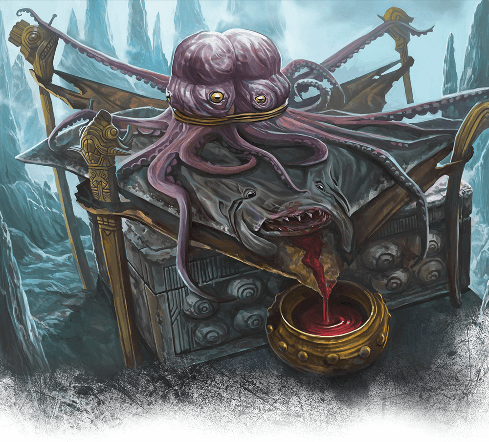

# Twenty-First Session

## End at Sloobludop

### Dramatis Personae

- *Actias Aureus*, a 9th-level Tiefling Warlock
- *Avren Varan*, a 9th-level Half-Elf Bard
- *Benjamin*, a 10th-level Elf Ranger
- *Calmul Rhoqiroth*, a 9th-level Dragonborn Artificer
- *CoralKing*, a 10th-level Gnome Monk
- *Geral Bryn*, a 9th-level Human Fighter
- *Orky*, a 10th-level Half-Elf Paladin
- *Steve*, a 10th-level Halfling Rogue
- *Viker*, a 10th-level Eladrin Druid
- *Wulrif*, a 9th-level Human Warlock

### Summerday +924 hours

#### From the journal of Dame Orky

*Wulrif* doesn’t trust our companions, so he uses magic to read their minds. As best as he can tell, they are telling the truth. *Geral* uses *Avren* to see if there is any natural substance she knows of that we can use to protect ourselves from the psychological awe-generation powers used by the deep father (*Leemooggoogoon*). The creatures we are following said they worship the Sea Mother to protect themselves. They said she values regurgitation of goods as the highest gift we can offer to her. The creatures mention *Blibdoolpoolp* has the form of a human female with the head and claws of a lobster.

We see the cavern change shapes as we move through it. We see fluorescent patches very high in the cave and also floating on the water. We approach **Sloobludop** via docks and we can see the shrine of the Sea Mother. The Kuo-toa get out of the water and start chanting. *Geral* leads our crew and we follow onto the land, single-file, surrounded on all sides by Kuo-toa. The statue we see is 9’ tall and made from a sort of wood. It absolutely reeks of decomposing fish and is covered in the same.

*Ploopploopeen* invites us into his hovel and screams something to the other Kuo-toa. *CoralKing* translates to us that he is explaining not to injure his guests and explains why we are there. He tells us that someone will be here soon to accept us. *Geral* offers his original sword as a gift to the statue. She accepts it. *Wulrif* gives up his tentacle rod and she accepts it. *Actias* regurgitated a ruby he consumed and it was accepted. *CoralKing* has nothing to offer, but he demonstrates a respectful backflip, and immediately vomits. The crowd stirs uncomfortably, showing his offering was not accepted.

We are escorted to the altar of the deep father. It consists of a manta ray splayed out with 2 Octopodes on top and tentacles decoratively arranged. Everything is seeping blood and the entire altar reeks of blood and decay. They carry in this dwarf who we can tell is about to be sacrificed and I start to feel furious. I don’t have anything to help him though. Just when I can see *Geral* is about to step in, while the high priestess hovers a dagger above the dwarf’s heart, we see *Ploopploopeen* strike the high priestess, his daughter.

Round 1

1. *CoralKing* is readying his action so that once 3 people in our group attacks, he will take his action.
2. *Calmul* readies his action until someone attacks our group. After he is attacked, he infuses my sword with 1d4 lightning damage.
3. *Wulrif* suddenly Polymorphs into a Tyrannosaurus Rex, throwing everyone back. He then bites at the high priestess, but misses. He swipes his tail and hits a Kuo-toa, doing 17 HP damage.
4. *Avren* casts greater invisibility and bardic inspiration, going invisible.
5. The high priestess casts a spell and a bunch of spirit creatures appear, doing necrotic 17 HP damage to *Wulrif*, *Geral*, and *Avren*. *Geral* only gets half damage though. *Ploopploopeen* attacks his daughter again but misses. A couple of Kuo-toa attack *Wulrif*. The high priestess casts magical weapons that do 13 HP damage and 27 HP damage. *CoralKing* uses shadow step on a priest and does 33 HP damage.
6. I cast Crusader’s Mantle and make a vow of enmity on the high priestess.
7. *Steve* sneaks to the back of the line and attacks a priest, doing 28 HP damage.
8. *Viker* summons a scorpion and it attacks the priest that *Steve* attacked earlier. She does 27 HP damage.
9. *Actias* casts thunderous step and hits 6 Kuo-toa.
10. Benjamin tried to rush past the Kuo-toa, but failed
11. *Geral* pushes the priestess with his shield, and pushes the sacrifice as far away as he can.

Round 2

1. *CoralKing* hits the priest twice with his staff, doing 42 HP total damage. I start to see how powerful *CoralKing* can be! He is impressive!
2. *Calmul* casts a spell and flies 40 feet up.
3. *Wulrif* bites the priestess and does 49 HP damage to her. He whips his tail and misses another Kuo-toa.
4. *Avren* moves toward the priestess and stabs her with her rapier and does 7 HP damage to her.
5. The priestess damages *Geral*, *Wulrif*, *Avren*, from her ongoing spell and escapes from her grapple. Her father attacks her and a priest casts mass cure wounds, making every enemy heal 25 HP. *Steve* gets paralyzed. All of a sudden a bunch of Kuo-toa start attacking each other. The ones doing the attacking seem to be moving out of our way to attack the others. So, I think we can suspect which ones are on our side now.
6. *Ploopploopeen* casts mass cure wounds, healing 15 HP on every friend.
7. I move next to the priestess and hit her twice with my great sword, doing 32 HP damage.
8. *Actias* misty steps next to her and attacks her with his sunblade, doing 31 HP damage, killing that awful woman.
9. Benjamin moves and finds the weaknesses of the Kuo-toa, the priests can see invisible things. They are slippery and escapes grapples. They are vulnerable to sunlight. Their shields are also sticky and if you swing on them, striking them with your weapon, it stays in the shield.
10. We realize that we accidentally sacrificed the priestess and the water near us bubbles and 2 monsters heads rise from the lake with one body. It has rage in its eyes and growls. Then, most of the Kuo-toa all fall to the ground. The ones who gifted the sea goddess avert their gaze. *Geral*, *Wulrif*, and *Actias* all instinctively know to avert their gaze. Everyone else miraculously survives the gaze attack.
11. *Geral* screams at all of us to run! We see a bunch of sea serpents appear next to the giant creature. They look like the ones that attacked us on the rafts.
12. *Wulrif* finds out this guy is demogorgon, the prince of demons and he tells the rest of us telepathically that this is a god and we need to leave immediately. Our group and the good Kuo-toa run away from the water. *Viker*’s scorpion attacks some of the Kuo-toa running by.
13. *Steve* comes out of his paralysis and readies his action to jump on *Wulrif*’s back when he runs by.
14. *Viker* turns into a bat and flies above the T-Rex.
15. *Wulrif* comes out his polymorph to teleport *Geral* and the dwarf.
16. We all flee.

Someone opens a marshy portal that the Kuo-toa run through. We hear immense destruction behind us while we struggle through the marsh. *Avren* Polymorphs into an Owlbear and throws *Actias* on her back as she runs. The Duergar thanks us and introduces himself. He tells us he can lead us out of here. *CoralKing* wants to deduce if this guy is telling the truth. He seems genuinely grateful and helpful. I grab a sticky shield as I run.

#### 10,000 XP Each
