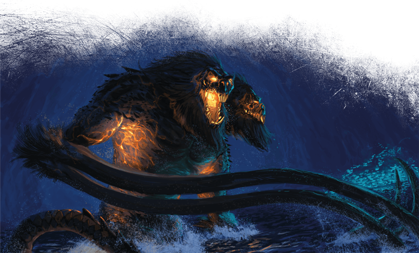

# Twenty-First Session

## End at Sloobludop

### Dramatis Personae

- *Actias Aureus*, a 9th-level Tiefling Warlock
- *Avren Varan*, a 9th-level Half-Elf Bard
- *Benjamin*, a 10th-level Wood Elf Ranger
- *Calmul Rhoqiroth*, a 9th-level Dragonborn Artificer
- *CoralKing*, a 10th-level Gnome Monk
- *Geral Bryn*, a 9th-level Human Fighter
- *Orky*, a 10th-level Half-Elf Paladin
- *Steve*, a 10th-level Halfling Rogue
- *Viker*, a 10th-level Eladrin Druid
- *Wulrif*, a 9th-level Human Warlock

### Summerday +924 hours

#### From the journal of Dame Orky

*Wulrif* doesn’t trust our companions, so he uses magic to read their minds. As best as he can tell, they are telling the truth. *Geral* uses *Avren* to see if there is any natural substance she knows of that we can use to protect ourselves from the psychological awe-generation powers used by the Deep Father (*Leemooggoogoon*). The creatures we are following said they worship the Sea Mother to protect themselves. They said she values regurgitation of goods as the highest gift we can offer to her. The creatures mention *Blibdoolpoolp* has the form of a human female with the head and claws of a lobster.

We see the cavern change shapes as we move through it. We see fluorescent patches very high in the cave and also floating on the water. We approach **Sloobludop** via docks and we can see the shrine of the Sea Mother. The Kuo-toa get out of the water and start chanting. *Geral* leads our crew and we follow onto the land, single-file, surrounded on all sides by Kuo-toa.

> A nine-foot-tall statue stands here. Its body is roughly carved from some kind of wood in the shape of a humanoid female, its head and forearms formed from the severed head and claws of a giant albino crayfish. These parts are lashed on with strands of gut, and emit an overpowering stench of rotting shellfish. Shells, brightly colored stones, mushrooms, and rotting fish are piled at the statue’s feet and strung in garlands around its neck. Four stern Kuo-toa slowly circle the statue, alert and on guard, while a few others mill about, gazing up at the statue and bowing repeatedly while chanting.

*Ploopploopeen* invites us into his hovel and screams something to the other Kuo-toa. *CoralKing* translates to us that he is explaining not to injure his guests and explains why we are there. He tells us that someone will be here soon to accept us. *Geral* offers his original sword as a gift to the statue. She accepts it. *Wulrif* gives up his tentacle rod and she accepts it. *Actias* regurgitated a ruby he consumed and it was accepted. *CoralKing* has nothing to offer, but he demonstrates a respectful backflip, and immediately vomits. The crowd stirs uncomfortably, showing his offering was not accepted.

We are escorted to the altar of the Deep Father.

> The idol to *Leemooggoogoon* the Deep Father consists of a large hide cut roughly in the shape of a manta ray and stretched out on cords between two support poles. A dead, splayed-out manta ray is pinned to the center of the hide. Two dead octopuses are draped across the top, their tentacles pinned and artfully arrayed, their heads tied together and painted with red and blue pigments. The idol reeks of decay, and the broad stone altar below the idol is stained dark with blood.
>
> The archpriest of the Sea Mother steps forward across the span of the altar toward the Kuo-toa waiting for him there. “The time has come,” he says, “for us to acknowledge your divine vision and welcome it. I have brought these as offerings.” He gestures toward all of you, standing within a circle of guards behind him. “Will you not accept them?” “You are wise, father,” the younger archpriest replies. “I accept your offering in the name of the Deep Father. May their blood nourish and strengthen him!” A burbling cheer goes up from the surrounding Kuo-toa, their fists raised in the air.

They carry in this Duergar who we can tell is about to be sacrificed and I start to feel furious. I don’t have anything to help him though. Just when I can see *Geral* is about to step in, while *Bloppblippodd* hovers a dagger above the Duergar's heart, *Ploopploopeen* strikes her!

Round 1

1. *CoralKing* is readying his action so that once 3 people in our group attacks, he will take his action.
2. *Calmul* readies his action until someone attacks our group. After he is attacked, he infuses my sword with 1d4 lightning damage.
3. *Wulrif* suddenly Polymorphs into a Tyrannosaurus Rex, throwing everyone back. He then bites at the high priestess, but misses. He swipes his tail and hits a Kuo-toa, doing 17 HP damage.
4. *Avren* casts greater invisibility and bardic inspiration, going invisible.
5. The high priestess casts a spell and a bunch of spirit creatures appear, doing necrotic 17 HP damage to *Wulrif*, *Geral*, and *Avren*. *Geral* only gets half damage though. *Ploopploopeen* attacks his daughter again but misses. A couple of Kuo-toa attack *Wulrif*. The high priestess casts magical weapons that do 13 HP damage and 27 HP damage. *CoralKing* uses Shadow Step on a priest and does 33 HP damage.
6. I cast Crusader’s Mantle and make a Vow of Enmity on the high priestess.
7. *Steve* sneaks to the back of the line and attacks a priest, doing 28 HP damage.
8. *Viker* summons a scorpion and it attacks the priest that *Steve* attacked earlier. She does 27 HP damage.
9. *Actias* casts thunderous step and hits 6 Kuo-toa.
10. Benjamin tried to rush past the Kuo-toa, but failed
11. *Geral* pushes the priestess with his shield, and pushes the sacrifice as far away as he can.

Round 2

1. *CoralKing* hits the priest twice with his staff, doing 42 HP total damage. I start to see how powerful *CoralKing* can be! He is impressive!
2. *Calmul* casts a spell and flies 40 feet up.
3. *Wulrif* bites the priestess and does 49 HP damage to her. He whips his tail and misses another Kuo-toa.
4. *Avren* moves toward the priestess and stabs her with her rapier and does 7 HP damage to her.
5. The priestess damages *Geral*, *Wulrif*, *Avren*, from her ongoing spell and escapes from her grapple. Her father attacks her and a priest casts Mass Cure Wounds, making every enemy heal 25 HP. *Steve* gets paralyzed. All of a sudden a bunch of Kuo-toa start attacking each other. The ones doing the attacking seem to be moving out of our way to attack the others. So, I think we can suspect which ones are on our side now.
6. *Ploopploopeen* casts Mass Cure Wounds, healing 15 HP on every friend.
7. I move next to the priestess and hit her twice with my great sword, doing 32 HP damage.
8. *Actias* Misty Steps next to her and attacks her with his Sunblade, doing 31 HP damage, killing that awful woman.
9. Benjamin moves and finds the weaknesses of the Kuo-toa, the priests can see invisible things. They are slippery and escapes grapples. They are vulnerable to sunlight. Their shields are also sticky and if you swing on them, striking them with your weapon, it stays in the shield.

> Another sound rises above the burbling cries of the Kuo-toa. The dark surface of the water farther out bubbles and begins to foam. A thick, oily tentacle bursts forth, followed by another. Then two monstrous heads break the surface, both resembling hideous, angry baboons with wickedly curved tusks. Both heads are attached to a single torso, and the monster’s red eyes burn with bloodlust and madness. The creature rising from the Darklake must stand thirty feet tall or more, with water cascading down its back and shoulders. Upon reaching its full height, the great demon throws back both its heads and roars!

<!-- markdownlint-disable MD029 -->
10. We realize that we accidentally sacrificed the priestess as most of the Kuo-toa fall to the ground in awe. The ones who gifted the Sea goddess -- *Geral*, *Wulrif*, and *Actias* -- all instinctively know to avert their gaze. Everyone else miraculously survives the Gaze attack.
11. *Geral* screams at all of us to **Run!** We see a bunch of Merrow appear next to the giant creature. They look like the ones that attacked us on the rafts.
12. *Wulrif* recognizes this as *Demogorgon*, and he yells telepathically that this is a Demon Prince and we need to leave immediately! Our group and the allied Kuo-toa run away. *Viker*’s scorpion is Beguiled and attacks some of the Kuo-toa running by.
13. The Hold Person on *Steve* drops and he jumps on *Wulrif*’s back when he runs by.
14. *Viker* turns into a bat and flies above the T-Rex.
15. *Wulrif* drops Polymorph to Dimension Door himself, *Geral*, *Steve*, and the Duergar away.
16. We all flee. I grab a Kuo-toa sticky shield as I run.

A Kuo-toa opens a marshy passage out of **Sloobludop** and we all run through. We hear immense destruction behind us as we struggle through the swamp. *Avren* Polymorphs into an Owlbear and tosses *Actias* onto her back as she runs.

Much later, the Duergar thanks us and introduces himself as *Hemeth*. He tells us he can get us passage into **Gracklstugh**. *CoralKing* uses Insight to see if this guy is telling the truth. He seems genuinely grateful and helpful.

#### 10,000 XP Each
