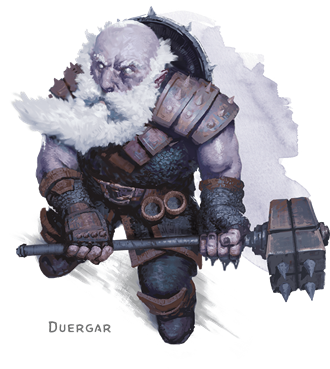
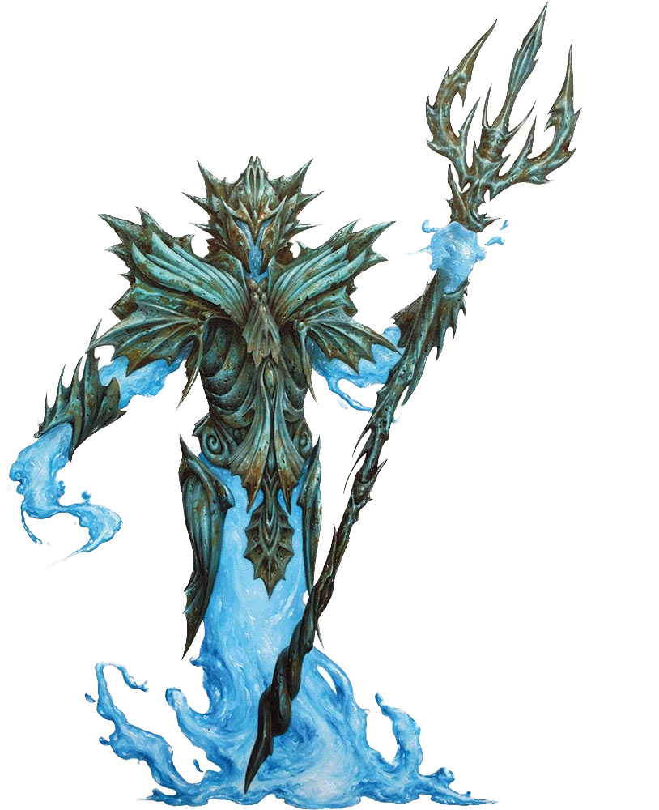
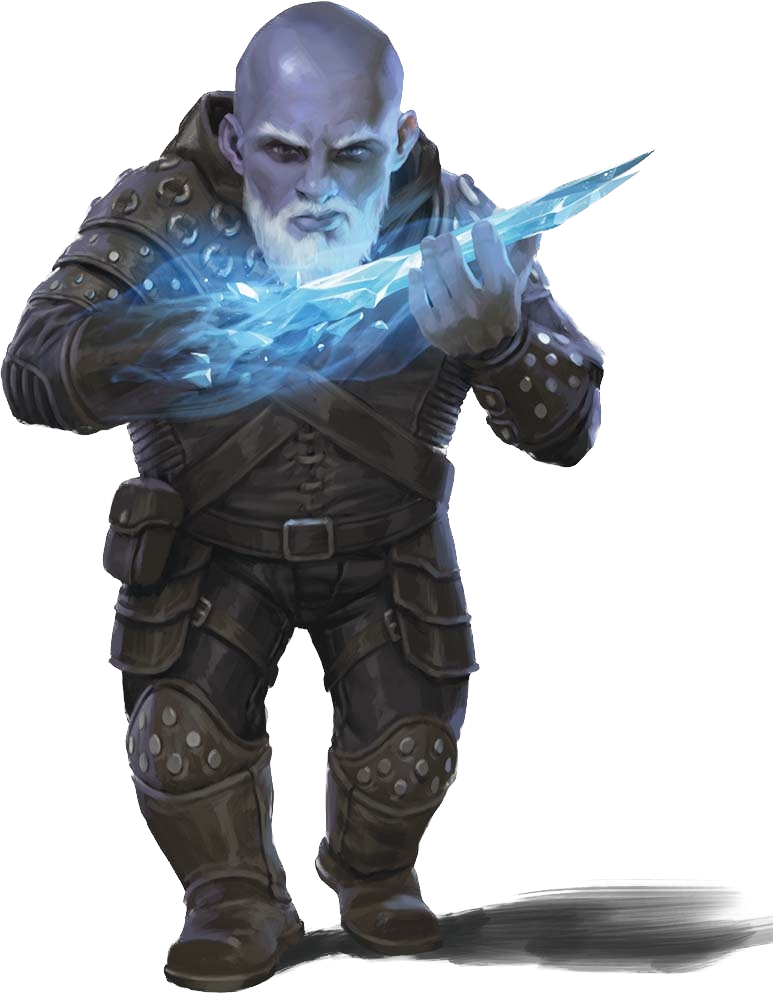
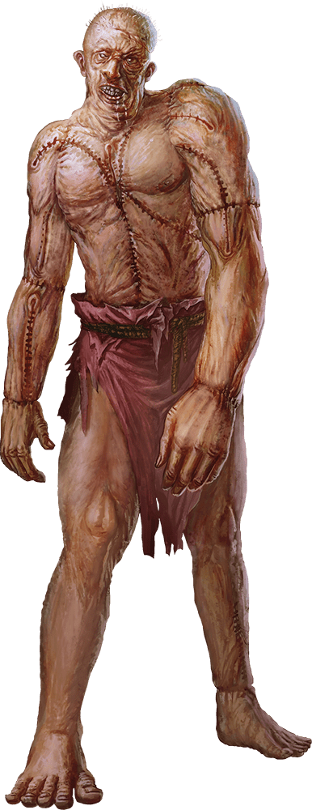

# Twenty-Fourth Session

## The Beginning of the End

### Dramatis Personae

- *Actias Aureus*, a 10th-level Tiefling Warlock
- *Avren Varan*, a 10th-level Half-Elf Bard
- *Benjamin*, a 12th-level Wood Elf Ranger
- *Calmul Rhoqiroth*, a 12th-level Dragonborn Artificer
- *CoralKing*, a 12th-level Gnome Monk
- *Geral Bryn*, a 12th-level Human Fighter
- *Orky*, a 12th-level Half-Elf Paladin
- *Steve*, a 12th-level Halfling Rogue
- *Viker*, a 12th-level Eladrin Druid
- *Wulrif*, an 11th-level Human Warlock

### Summerday +1084 hours

#### From the journal of Dame Orky

The city appears very smoky and black. Some of our group wakes up coughing and have a level of Exhaustion. Each day, we must avoid **Grackle lung**. I heal my team as they succumb.

The group heads to the armory for some armor. We stock up and head to **The Whorlstone Tunnels**. We have 4 visible giant-sized Stone Guard to escort us.

We approach the tunnels and see a fissure in the granite below the docks. It’s about 5 feet wide, but very tall. We enter the tunnel and the ceiling seems to be climbing as we continue. The tunnel is very wet and dimly-lit -- it is **Faerzress-Suffused**, and dampens any Divination spells or Teleportation abilities as well as adds Wild Magic surges.

We hear chittering outside of our vision range. I see a carpet of writhing insects that are shying away from *Actias*’s Sunblade. As they move away, we see bones that are completely stripped of flesh. There is some white fur left on some bones that *Viker* recognizes as matching the hide of the satchel she just bought. One of our familiars notices a trickle of water coming down the wall. The cavern widens out and we see a ramp that continues forward and a second that leads up a level. It appears that we have entered something’s dwelling. *Wulrif* sends his familiar up to investigate with *Steve* and they see a mouth that appears in the stone wall, asking what we are doing in its owner’s workshop. *Steve* freezes in amazement that he was seen. We respond that we are looking for a Derro by the name of *Droki*. *Geral* asks who its master is. It responds that its master is busy right now.

*Geral* walks up, takes one of his rations, and tries to feed the mouth. He is unsuccessful. Then, a giant wave-like creature appears with Plate Mail over his shoulders and a weapon in its hands. *Geral* responds that we are looking for the master. It remains stoic and blocks our way. *Benjamin* wants to use Hunter’s Sense on this thing, so he moves forward and analyzes it. *Wulrif* follows to protect him. *Benjamin* tells us that it is a Water Elemental Myrmidon, resistant to acid, piercing, slashing, immune to poison, petrification, or being knocked prone. It has no weaknesses.

*Geral* notices via Blindsight that he is being surprise attacked by something invisible, but is of course, immune due to Sentinel. He alerts us. Invisible Derro appear behind *CoralKing*, *Wulrif*, and *Actias*. All of whom are surprised. *Wulrif* is attacked 3 times and takes 27 HP bludgeoning and 8 HP psychic damage (he backlashes the other 8HP of psychic damage). *Actias* takes 43 HP damage. *Geral* gets hit for 36 HP damage. He hits back three times and misses.

<!-- markdownlint-disable MD033 -->

Round 1

1. *CoralKing* readies his action.
2. *Steve* misses a strike.
3. *Benjamin* attacks the nearest Derro with his Shortsword and does 10 HP damage.
4. I ready an action. When I am attacked, I cast Searing Smite and attack twice with my Greatsword, but miss.
5. *Geral* swings three times and misses.
6. *Calmul* attempts to hit a Derro, but misses.
7. *Viker* casts Faerie Fire, in a way that hits 2 Derro. We can now see 2 Derro outlined with a dim light. Then, 5 other Derro become visible that have strange energy blades.
8. *Actias* uses Hexblade’s curse and attacks with his Sunblade and Dancing Sword, doing 25 HP damage.
9. *Steve* gets attacked for 24 HP damage. *Benjamin* just dodges the giant flame. I get hit for 20 HP damage, but react and hit the creature for 61 HP damage, killing it. *CoralKing* gets hit for 20 HP damage, but reacts and hits the creature for 27 damage, killing it. *Geral* gets stabbed 3 times.
10. *Wulrif* Hexes the nearest Derro and attacks with Eldritch Blast but misses.
11. *Avren* casts Dispel Magic and dispels the Invisibility on one of the creatures closest to me.
12. Suddenly these gross monster-like creatures come out of the darkness that look like they are sewn-together deceased body parts. *Steve* gets hit for 23 HP damage.
13. *Wulrif* gets hit twice for 25 HP damage. *Actias* uses Armor of Hexes and uses it to avoid a hit.

Round 2

1. *CoralKing* takes 2 blind swings in front of him and does 32 HP damage to the creature.
2. *Steve* hits the invisible creature near *Geral* and does 24 HP damage.
3. *Benjamin* shoots at the Derro behind him and hits.
4. I move to *Wulrif*, take a Vow of Enmity, and swing twice at the Derro near *Wulrif* and *CoralKing* doing 41 HP damage.
5. *Geral* kills a Derro.
6. *Calmul* does 13 HP damage on a Derro near him.
7. *Viker* heals *Wulrif* for 13 HP. She heals everyone else for 12 HP.
8. *Actias* attacks the cursed Derro for 51 HP damage.
9. *Steve* is pushed off the edge by an Undead and takes 7 HP damage.
10. *Wulrif* casts Eldritch Blast twice and kills one. He also aims for the Water Elemental Myrmidon and does 9 HP damage, throwing it back.
11. *Avren* casts Mass Cure Wounds for 13 HP on everyone injured.
12. One of the Undead attacks *Geral* and misses.

Round 3

1. *CoralKing* moves up to one of the Undead and hits its knees furiously for 44 HP damage.
2. *Steve* stabs at the Undead and does 30 HP damage.
3. *Benjamin* uses Hunter's Sense on the Undead and finds out they are Flesh Golems immune to  Lightning, Poison; Bludgeoning, Piercing, and Slashing from non-magical Attacks that aren't Adamantine. They have an aversion to fire.
4. I move to the Derro near *Actias* and hit twice for 49 HP damage, killing it.
5. *Geral* attacks the Golem with his sword three times, doing 42 HP damage. He also uses his Second Wind to give himself 19 HP.
6. *Calmul* shoots the Golem twice with his Musket and does 19 HP damage, killing it!
7. *Viker* speaks a Healing Word for 20 HP on *Geral* and everyone else gets an additional 12 HP.
8. *Actias* moves forward and hits the Golem for 2 HP damage. He uses his Dancing Short Sword and does 9 HP.
9. One Derro shoots *Viker*, another shoots *Geral* for 20 HP damage. The Water Elemental Myrmidon stabs *Geral* once, doing damage.
10. *Wulrif* spends 2 sorcery points and shoots the Water Elemental Myrmidon with Eldritch Blast, pushing it back.
11. *Avren* shoots the Golem with her Shortbow, doing 5 HP damage and enraging the beast.
12. The Golem goes berserk and attacks the Derro, killing it.

Round 4

1. *CoralKing* runs up the ramp and attacks a Derro for 28 HP damage, killing it.
2. *Steve* Sneak Attacks the Golem for 60 HP damage, killing it.
3. *Benjamin* casts Hunter’s Mark and hits it for 12 HP damage.
4. I move toward the remaining Derro, throw my Hammer at it and do 18 HP damage, killing it.
5. *Geral* approaches the Water Elemental Myrmidon and uses Commander's Strike on *Steve* to shoot it. *Geral* hits it for 9 HP damage.
6. *Calmul* shoots the water creature.
7. *Viker* moves her Healing Spirit near *Geral* and heals him for 32 HP damage. Everyone else gets 12 HP.
8. *Actias* casts Bane on it.
9. *Geral* gets hit twice.
10. *Wulrif* Eldritch Blasts the creature and does 57 HP damage, killing it.

I retrieve my hammer.

> A voice says, "*Droki*, your friends are here!"

The players have decided to pause here and take up the fight next session.
