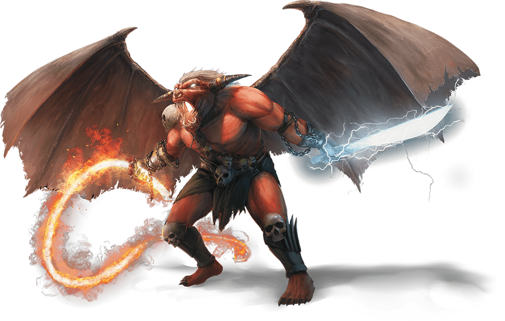

# Twenty-Second Session

## City of Blades

### Dramatis Personae

- *Avren Varan*, a 9th-level Half-Elf Bard
- *Benjamin*, an 11th-level Elf Ranger
- *Calmul Rhoqiroth*, a 10th-level Dragonborn Artificer
- *CoralKing*, an 11th-level Gnome Monk
- *Geral Bryn*, a 10th-level Human Fighter
- *Orky*, an 11th-level Half-Elf Paladin
- *Steve*, an 11th-level Halfling Rogue
- *Tasbros*, a 10th-level Elf Sorcerer
- *Tysnera*, a 10th-level Elf Wizard
- *Viker*, an 11th-level Eladrin Druid

### Summerday +940 hours

#### From the journal of Dame Orky

We are in the swamp listening to **Sloobludop**’s destruction; we no longer have it within our sight. The Duergar, *Hemeth*, asks us if we can get out of here and we all enthusiastically agree. The Duergar settlement is called **Gracklstugh**.  He said they will arrest us for being foreigners if we enter through the gates. He suggests we try the lake shore. It should take us an hour. *Geral* asks what we need to know about *Hemeth*’s people. They don’t trust most people. They said they follow the laws absolutely and always keep their word, when most don’t. He said they will trade with Drow if they follow the rules. *Geral* asks if there are rules we need to be aware of.

1. Don't assault the Stone Guards.
2. Everyone is responsible for their own actions.
3. Starting a fight is illegal.
4. Stay in the **Darklake District**.
5. Execution is the punishment for breaking the rules.

*Geral* asks if they have libraries with texts. *Hemeth* responds “not to outsiders”.

We make it to the river and there is a pile of cattails and reeds. The koa-tao dive underwater and return with 4 mushroom rafts. They exclaim for us to wait while something big in the water passes by. Then, they clear us to enter the rafts again.

I am heavy with my armor, so *CoralKing* and some Koa-toa get put with me in 1 raft.
*Avren*, *Benjamin*, and *Calmul* are in another one.
*Tysnera*, *Tasbros*, and *Viker* in the next.
*Geral*, *Hemeth*, *Steve* and *Calmul*’s steel defender in the last one.

> After hours of tense navigation, you glimpse an orange glow in the distance. Soon you hear faint metallic echoes, growing louder as you come closer.
>
> Firelight illuminates massive columns with structures built around their bases. The cold air of the **Underdark** is becoming warmer even at this distance, and you can now see a variety of piers made from zurkhwood, stone, and plain rock jutting out along the edge of a huge cavern.

We thank *Hemeth* for his help. He returns *Geral*’s axe and returns thanks, saying we could do business in the future, as the town blacksmith.

> A wave of heat slams against you as an acrid smog rises to choke the air out of your lungs. The Darklake spreads out beyond a jumble of buildings and streets, reflecting the lights of countless fires burning across the city within hollowed-out columns and stalagmites.
>
> Though the streets are crowded, you move easily within the surging throng of buyers, merchants, and slaves. You aren’t the only outsiders here, as you spy Drow, Svirfneblin, Derro, Orcs, and other races in the crowds. The shouting of people blends with the sound of distant hammering to create a constant, distracting din.

We make our way to the nearest bazaar and everyone in our group loads up on basic necessities. As we finish up our shopping, a giant two-headed gray monster approaches the city, bursting through the gates and attacks the citizens.

Round 1

1. The giant attacks me twice with his club, doing 34 HP damage.
2. *Benjamin* finds the weaknesses of this giant. He is normally a stone giant, but the second deformed head means something else. They are stealthy but no resistances. He also casts Hunter’s Mark on it.
3. *Tysnera* said “whatever, I cast Magic Missile, I don’t care!” She casts 5, so 15 missiles hit the giant, doing 12 HP total.
4. *CoralKing* uses Shadow Step to move opposite me, near the giant. He hits him twice with the staff and gets double damage on one hit. He does 35 HP damage.
5. *Geral* does 10 HP damage on a hit and asks me to hit, which I do 27 HP damage.
6. *Calmul* shoots his musket, doing 20 HP damage. His steel defender misses.
7. *Avren* shoots her brand new bow
8. *Tasbros* casts a gem Dragon spirit, which makes 2 attacks and 15 HP damage.
9. The giant’s mutated head swells up with bloodlust and attacks me, *Geral* reacts and hits him for 10 HP damage. I lose 35 HP on the first hit and 18 HP on the second hit.
10. *Steve* sneak attacks and hits for 35 HP damage.
11. *Viker* heals me for 18 HP.
12. I cast Crusader’s Mantle.

Round 2

1. *Benjamin* shoots the giant mutated face for 13 HP damage.
2. *Tysnera* attempts to banish him but fails. She feels like he should have been banished, but something kept him here.
3. *CoralKing* hits the giant with his Staff of Striking twice and it does nothing. He looks very confused, since it worked the first time.
4. *Geral* tries to hit him with his magic sword and it does 18 HP damage.
5. *Calmul* shoots the giant twice with his musket and they miss. His steel defender does 5 HP damage.
6. *Avren* shoots him with her bow, but it bounces off and does no damage.
7. *Tasbros* uses a fire-adept spell and takes half damage, 14 HP. He uses Chromatic Orb? and does 13 HP damage.
8. The giant seems to heal, turn around, and hits *Tasbros*’ giant twice. *Geral* uses an opportunity attack for 12 HP damage. I do the same and do 29 HP damage.
9. *Steve* does 31 HP damage and the giant dramatically falls to the ground, shaking the earth? Underterra.

Another giant, who looks normal, comes up to look at the body and sighs. More of the huge Duergar appear from the market and talk to the giant. Via *CoralKing*, we learn that they discuss us killing his rogue kind. The giant requests he drag the body back to his home. The giant tells us in Common for saving society from worse damage. *CoralKing* asks why he attacked us. He said he was convening with “the stone”, grew 2 heads, went mad, and ran away. He said if he had only been knocked unconscious, we might have been able to find out what was wrong with him. We all look at each other like “Oops”, while the body is dragged away.

In Common, the Duergar Stone Guard tell us they would like a word with us. We all put our weapons away, while *Tasbros* hesitates. 3 Stone Guards surround him in suspicion. They tell *Geral* to ask *Tasbros* to stand down before he is executed. *Geral* and *Tasbros* comply. *Geral* explains that we are trying to find our way back to the surface. The Stone Guard command us to go with them. We comply. They march us into a fortress and *Calmul* recognizes Cannons on the battlements. *Benjamin* knows Duergar can enlarge to giant size and turn invisible. So, he knows that there are probably more Duergar around us that we don’t see. They can also see other invisible entities.

They lead us into the dungeon, and we all get a long rest, while we all say “WTF?!?” We are finally taken to a dark office and meet with a large female Duergar.

> After waiting a long while in a dungeon cell carved out of impressively thick stone, you are taken to a dark office and met by an imposing female gray Dwarf. She is fully armored and bears an insignia you have not seen on any other Duergar. She is flanked by two Stone Guards who remain by the door.
>
> “I am Captain *Errde Blackskull*, Commander of the Stone Guard,” she says, giving each of you a calculating look. “Let me start by saying you are worth nothing here in Gracklstugh. Most of those in my command would sell you off in a heartbeat as the cheapest manual labor. However, I’ve learned to make much better use of adventurers like you.”

I ask what she is going to do with us. She said we have a few options. She can just let us go, or ask for our help tracking a thief, *Droki*, a Derro. She advises us not to go to a strange location, debasing ourselves. She also requests us to find the source of corruption and report back to her. She said she will give us maps to **Blingdenstone**, a friendly Deep Gnome colony if we keep our side of the bargain. If not, she will sell us to slavery. She tells us that Derro are degenerate, insane, some of whom are useful and stay in dark lake. They are more magic resistant, but not the same abilities. They only move in packs, because they are weak in packs. *Droki* has been able to sneak in and out of town, stealing secrets, and they have no idea how, since he is operating alone. She said she will outfit us with gear to complete our mission.

Awhile later, a Stone Guard presents us with gold badges and said if we present these to the other Stone Guard, he will let us pass. He also said a group of Drow are asking for a large party, fitting our description. *Droki* is a spy for the Council of Savants, which are an evil rebel group. We are outfitted and take our badges. We are escorted out of the fortress as *Calmul* notices more cannons and the guard are carrying pistols with 7 barrels.

We are now in the **Darklake District** and *Geral* suggests we start at a common area. ****Gholbrorn's Lair**** is the tavern that outsiders can stay in. It’s underneath the docks as we were told. We head there and find a cave system, with a tavern standing on 4 pylons.

As we enter, *Avren* attempts to listen about *Droki* and all she hears about how dangerous the **Underdark** has become. Even the animals and flora seem agitated about a change in the air. Isolated settlements have been attacked by demons. *Tysnera* approaches the inn keeper and asks about *Droki*, a Derro. He said he hasn’t seen any Derro nearby and they usually attack outsiders like us. *Avren* casts detects thoughts and she senses most people are grateful that they made it here. They had a tough journey here and some want to go further but aren’t sure they will make it safely. Suddenly, 2 Orcs jump up and attack each other. We watch in horror as they are separated and they seem to be confused as to why they were fighting in the first place.

I assist *Tasbros* in a religious sense to find that several demon lords could cause this type of madness. We are far from where it happened last, but we have seen this phenomena twice now. 1 wouldn’t be sufficient to cause this wide-spread issue. One called the Maze Lord, which thrives in environments that are maze-like such as the **Underdark**, is known of.

We decide to head East, into the slums of **Gracklstugh**, where the Derro live. *Avren* changes her into a Derro and uses her Disguise kit to turn some people

Group 1 - *Avren*, *Viker*, *Steve*, and *Tasbros* leave in various disguises to infiltrate the Derro.

Group 2 - Meanwhile, the rest of us question guards to see if anyone can help us. The first guard we question doesn’t know anything. He tells us the East Wing is where the more wealthy are, and the West is the slum.

Group 1 notices everyone around is acting severely insane. The Derro look the group’s way, but don’t attack. They seem to be preoccupied. *Avren* looks for a gathering place and doesn’t find one. No one is selling anything, there is no graffiti or propaganda, like these beings are barely sentient.

*Avren* reports back to Group 2 that she cannot find anything and we should head to the West side. We rest at the inn again and head to the West Wing.

After we arrive, Group 1 disguises themselves again. They head in and see a ton of people muttering like the West end, but *Avren* barely sees a tunnel that is emitting a fog from behind some scrap.

Group 2 questions a guard and said he doesn’t know how *Droki* gets by them. However, he said *Droki* always seems to get through on 1 shift, the 3rd shift. He said they come on duty in 8 hours.

Group 1 proceeds into the tunnel and sees fungi everywhere, a very high ceiling height (somewhat < 60’ high), a weird magic feeling that represses magic users, and water dripping from the ceiling. They continue on and hear a voice in her mind: “Hello there, you’re not Derro. I know you’re looking for Derro and they have been corrupting my cave. Are you going to get rid of the Derro?” *Tasbros* replies “what’s it worth to you?” and he says “nothing, you have nothing I want. *Avren* said “have you heard of *Droki*?” and he says “yes, he is further in my cave. Are you going to take him out?” *Viker* responds “why can’t you get him out?” and he did not answer. *Viker* goes to grab Group 2 while Group 1 tries to track down the location of *Droki* by telepathy.

We discuss and can’t find a way in to help Group 1, so I hand her my manacles in case she finds *Droki*. I mention to *Geral* that we might be able to bring this information back to the chief to get an army to head in and get *Droki*.

We decide to cast *Viker*’s Daylight spell on her manacles and we walk very quickly through the growing crowd of Derro to the cave.

Group 1 hears lots of screeching and finally see *Viker* and the rest of the group follow into the cave. We join up and attempt to find *Droki*. *Viker* leaves her Daylight spell at the bottleneck of the cave, to keep the Derro out.

In our minds, we see a figure bent over some symbol drawn on the ground with darkness surrounding it. We understand this as the figure we need to find. We suddenly find a large red creature that I immediately recognize as a Balor demon with an ox face, horns, large wings, a huge sword, and a fire whip.

Round 1

1. The creature Teleports near us and whips us, doing 15 HP damage. Another hit does 16 slashing and 10 lightning damage. *Steve* gets hit for 13 HP damage and pulled back with the whip.
2. *CoralKing* Shadow Steps behind *Droki* and hit him with his staff, doing 27 HP damage. And uses his stunning strike, but misses.
3. The Derro attacks *CoralKing* back and does 65 HP damage. He Teleports behind the group.
4. Everyone within 30 ft of *Calmul* gains 6 HP in health.
5. I cast Crusader’s Mantle
6. *Avren* hits the Balor with her rapier and only 3 HP hits.
7. *Viker* uses Primal Savagery on the Balor and does 20 HP damage. She also casts her spirit totem.
8. *Geral* moves over to the Derro and hits hit twice, doing 21 HP damage.
9. *Benjamin* moves away from the Balor, provoking an opportunity attack of 25 HP damage. He casts Hunter’s Mark and shoots a lightning arrow and a magic arrow, doing 31 HP damage.
10. *Steve* is entangled, and attempts to break free, but fails.
11. *Tasbros* casts Haste on me.

Round 2

1. The Balor whips us again and does 10 HP damage. He attacks me and does 23 slashing damage and 14 lightning. A second hit does 22 slashing, and 16 lightning damage.
2. *CoralKing* does 28 HP damage and a stunning strike misses.
3. The Derro hits *CoralKing* for 23 HP damage, Teleports next to *Benjamin* and does 24 HP damage.
4. *Calmul* gets hit but shoots and misses.
5. *Tysnera* tries to use Hold Person but fails.
6. *Avren* casts Mass Heal Wounds for 23 HP.
7. *Viker* moves 30 feet away from the Balor, summons a giant scorpion, and uses Healing Word on me for 31 HP and 11 HP on everyone else. Her scorpion does 20 HP damage to the Derro.
8. *Geral* runs to the Derro and hits him with menacing strike for 13 HP.
9. *Benjamin* finds it has no weaknesses but is resistant to stuff.
10. *Tasbros* attempts to cast Confusion, but the Balor saves.

Round 3

1. The Balor hits me for 19 slashing damage and 12 HP lightning damage. Also, everyone gets 7 HP fire damage.
2. *CoralKing* Shadow Steps behind the Balor and uses his Staff of Striking for 30 HP damage and uses stunning strike but misses.
3. *Droki* Teleports into darkness and *Calmul* becomes blind. He gets hit for 25 HP and 33 HP total.
4. We hear a grunt from the direction of *Calmul*
5. I move to the Balor, cast Blinding Smite, and hit the Balor twice, doing 103 HP damage.
6. *Avren* uses Mass Cure Wounds on *Calmul*, *CoralKing*, me, *Steve*, Steel Defender, and *Benjamin* for 20 HP.
7. *Tysnera* does 22 HP acid damage
8. *Geral* asks me to hit the Balor for 31 HP and he hits him for 14 HP. He also does another 10 HP damage.
9. *Tasbros* summons Bigby’s Hand and uses grasping hand, but instead adds chaos. We all take 2 HP necrotic damage.
10. *Benjamin* summons a Velociraptor and his attack does 10 HP damage.
11. *Viker* approaches and uses her Mace of Disruption, doing 25 HP damage. She Fey Steps away.

Round 4

1. Everyone takes 6 HP fire damage. I get hit and knocked down. *Viker* gets 21 HP of slashing damage and 10 HP lightning damage.
2. *CoralKing* moves to the Balor and uses his Flurry of Blows. He hits once for 5 HP damage.
3. The darkness disappears from our sight range and *Tasbros* gets 10 HP damage from a flying arrow, but avoids being poisoned.
4. *Calmul* stands up and moves away from the Balor. He misses 2 shots with his musket.
5. *Avren* casts Thunder Clap and moves to attempt to find *Droki*.
6. *Viker* does 23 HP damage with the Mace of Disruption, and the Balor explodes in death. Some of us take another 45 HP damage and some take 90 HP, including me. I start to feel the pull of the afterlife. The Steel Defender and the Velociraptor die dramatic deaths. *Viker* casts Mass Cure Wounds for 19 HP and she uses her Mace's Light Aura while moving toward the Derro.

*Benjamin* tries to track down this *Droki*. The Darkness disappears, so he is trying to escape. *Viker* quickly tries to get Daylight back up while *Benjamin* finds a track mark. We know that the Derro has left the cave.

#### 10,000 XP Each

