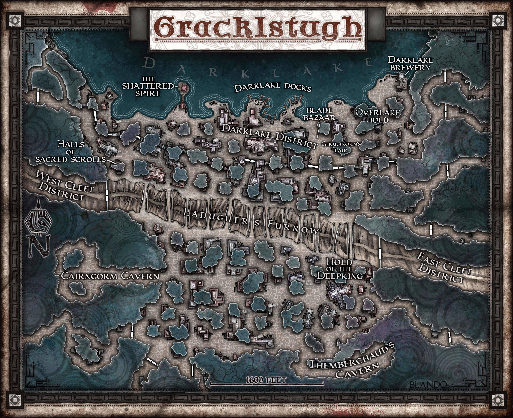

# Twenty-Third Session

## Knives in the Underdark

### Dramatis Personae

- *Benjamin*, a 12th-level Wood Elf Ranger
- *Calmul Rhoqiroth*, an 11th-level Dragonborn Artificer
- *CoralKing*, an 11th-level Gnome Monk
- *Geral Bryn*, an 11th-level Human Fighter
- *Orky*, an 11th-level Half-Elf Paladin
- *Wulrif*, a 10th-level Human Warlock

### Summerday +1012 hours

#### From the journal of Dame Orky

After our fight we are in the cave and the sphere of darkness continuing *Droki* has dissipated. We go back through the **West Cleft District** gates to **Gholbrorn's Lair**, the tavern under the docks. We take a long rest and *Geral* gives an inspiring speech. The innkeeper is a Duergar and speaks Common. *Geral* asks if he has any surface food such as eggs. The innkeeper chuckles and said yes, for a price. He also has bacon. *Geral* orders eggs and bacon. We eat while *Geral* asks him if he knows anything about Droki’s whereabouts. He responds just that he lives in the **West Cleft District**. We decide to head back to the **West Cleft District** and time our arrival so that the new guard shift is on.

We hear a mob approaching us on our path. *Wulrif* tries to Detect Thoughts. He sends his familiar 60 feet in the air to get a better view. They seem angry and insane. I cast Daylight in the center of our group. *Wulrif* fails to pick up thinking creatures not seen by us. Eventually, the mob moves around us and onward. We continue. *Geral* asks whats going on. The guard responds that they’ll be put down soon. Then we hear a slaughter. We go through the gate and *Calmul* notes Cannons on every tower that swivel in any direction.

As we approach the gate, *Geral* asks if they saw the Derro come by here. He said they don't let groups more than 5 through at a time. *Wulrif* asks if they saw *Droki*. He said if they had seen him, he would be arrested or dead. *Wulrif* tells the guard *Droki* is a magic user and that we are going to be operating in this region to find him. The guard understands.

- Group 1 - *CoralKing* and *Wulrif*
- Group 2 - Me, *Geral*, *Calmul*, *Wulrif*’s Familiar, and *Benjamin*

Group 2 staggers ourselves 10 ft apart inside the city gate (leading away from the gate), about 40 ft away from the gate.

Group 1 walks outside of the gate and we all wait. We don’t see him go by for a full cycle. We regroup back at the inn, rest, and *Geral* asks if he has seen any strange happenings at all recently. He responds yes that he kicked some people out yesterday that were saying strange things. He said he doesn’t pay much attention though.

We decide to go to the **Overlake Hold** and interrogate the prisoners. We ask to question them. We are led to them and we see some Orcs, Gnomes, and Dwarves. None of them are doing anything odd. *Geral* questions the Gnomes and asks them what happened last cycle. They said “You've heard it too?” and he replies “I’ve seen it and what it does to people.” They say "Oh, you have the gift too?” and they start discussing a lady. He seems to be following the desire of a female presence. She comes in his dreams and he sees her every night since he “accepted her.” and he drones on about her for some time.

*Wulrif* takes over and feels a presence in his mind. He feels warm, light, and wonderful. He feels like he’s about to be blessed if he accepts it. *Wulrif* rejects it and is kicked out.

*CoralKing* takes over and questions the Gnomes. He questions them and he said they got mad. *Wulrif* checks the Dwarves and we get the same thing.

*Geral* questions the Orcs and asks how long they have been down there. He asks if they got invitations to join a woman in some blissful…and they respond in a weird face before he finishes his sentence. They just seem to be interested in violence, in the spirit of violence. They said they don’t deserve to be down here because they killed a couple of Dwarves. They claim to have not started the fight and were defending themselves from stupidity. They seem to know about the corruption and want us to put in a good word for them to be removed from prison because they were fighting the corruption.

We go to the main office of the Duergar Captain and explain what happened with *Droki* and the Balor. She said it doesn’t sound like him if he is creating a dark spell. We explain about the Orcs in the prison and they offer to have **The Keepers of the Flame** interrogate them.

*Geral* asks if they have anything to capture a magic user because of the magic dampening properties of the city. She suggests we consult **The Keepers of the Flame**, which *Geral* is hesitant to do. So, he asks if she suggests a specific contact within the Keepers. She said *Gartokkar* would probably speak with us. We ask where to find them and she said the Wyrmsmith’s Chambers.

We head there and look for *Gartokkar* and we hear a bizarre language none of us speak. Their minds are also closed to *Wulrif*.

> As the Duergar priests lead you to a building carved from the stone just outside a huge cave entrance, the ground trembles slightly, and a thunderous voice echoes against every wall.
>
>“*Gartokkar*,” the voice calls as a reptilian behemoth comes into view, it scales the color of lava, its bright yellow eyes glowing in the shadows of the cave before coming into the light. “You didn’t say I was having surfacers for dinner today.”
>
>The Dragon chuckles at his own wit. His massive body gives the distinct impression that he is overweight, indicating eating habits that don’t bode well.
>
>“Foreigners,” the Duergar priest says with great reverence, “meet the Father of Flame, the Everburning, and the Foundry’s Heart — *Themberchaud*, the Wyrmsmith of **Gracklstugh**.”

He waddles onto this massive pile of coins and we follow him.

> “Now leave us. Anyone invisible will be burned to a crisp.”

The Duergar priest reluctantly backs out. *Themberchaud* said he needs us to find out what issues are occurring among his staff. He said he knows of *Geral* and **Phandalin**. We explain how we got here and that we are just trying to get out. We explain that we are currently working on hunting down *Droki* and the spreading corruption. He asks more about the issue with *Droki*. He said he recognizes the description of the female as *Zuggtmoy*, the Queen of Fungi, and that she spreads her word via the Myconids. He tells us he has never heard of her spreading to mammals and especially Fey. He tells us to go to the Captain with his information.

He turns to *Wulrif* who feels an extremely strong mind connect with him to ask why we are here. *Wulrif* replies, explaining about the Koa-Toa summoning *Demogorgon*. *Themberchaud* is very interested about the Stone Giant that attacked us in the city. He telepathically enters my mind and interrogates me about what I’ve seen. I explain about the Smiling One who summoned the Purple Worm and how we ended up falling down his hole. *Themberchaud* tells me we should find the name of the Smiling One and deliver it to him as their kind have been quarreling since before Paladins existed. I then explain about the encounter with the Stone Giant and he keeps asking about his hands. I don’t remember anything particular about his hands.

*Themberchaud* says his Keepers are hiding something from him and he wants us to figure out what it is. He says his Right Hand will give us gold badges. One of them gives me an unholy fragment of an elder god's symbol and tells me I will find it useful. They warn me I alone can neutralize it -- any others will be corrupted. They say the god was called *Laduguer* as in **Laduguer’s Furrow**, that splits the city in twain.

We told *Gartokkar* that we are searching for something they are hiding. He denies it and said he serves his master faithfully. Something seems to glow in his hands as he tells us not to cross him or his type again.

*Geral* asks if he knows anything about the corruption going around lately. *Gartokkar* replies the Prince of Demons has been seen, the servants of *Zuggtmoy* have been more active, and she seems to have crossed the blood-brain barrier into more species. We ask about *Droki* and *Gartokkar* says he seems to be a minor spy, but a large problem for them. We mention *Droki* summoned a Balor and uses magic. He says *Droki* has taken something very valuable from **The Keepers of the Flame** and they are desperate to return it. He finally admits *Droki* took a Dragon’s egg. We ask if he knew that *Themberchaud* was missing an egg and he reminds us that *Themberchaud* doesn’t lay eggs. We discern that *Themberchaud* isn’t aware that his egg has gone missing. The *Gray Ghosts* are named as the culprits. They have been tracking *Droki* and we ask for any leads they have. He thinks *Droki* is a Drow. He thinks he has been using tunnels underneath the docks that are guarded by some things that are killing his scouts and infecting any others with *Zuggtmoy*’s mind spores. He says we can probably survive **The Whorlstone Tunnels** as we have a Paladin and a Druid.

*Geral* explains that we will go there and attempt to retrieve the egg and ask for any map they have. *Gartokkar* said it’s controlled by the Maze Lord and they don’t have any tools for us. He mentioned about Shadowblades, the feared line of Drow House Assassins.

We head back to the Captain of the Stone Guard and relay what we learned. She said the *Zuggtmoy* are annoyed by light, but won’t cower away from it.

We agree to head to **The Whorlstone Tunnels**.

#### 10,000 XP Each
